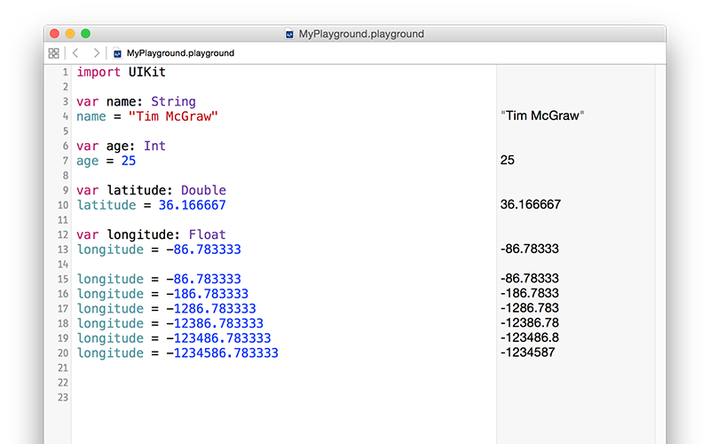

# Типове Данни 

Има доста видове данни и Swift се справя с тях индивидуално. Вече се сблъска с един от най-важните типове, когато зададе текст да е стойността на променлива. В Swift това се казва `String` (низ) - буквално низ от знаци.

String могат да бъдат дълги (например милион букви или повече), къси (например 10 букви) или дори празни, няма значение: те винаги са String в очите на Swift, и работят по един и същи начин. Swift знае, че `name` трябва да съдържа в себе си String, защото му зададе String, когато го създаде: "Tim McGraw". Ако редактираш кода си по този начин, ще спре да работи: 

    var name
    name = "Tim McGraw"

В този случай Xcode ще ти даде грешка със съобщение, което засега няма да има особен смисъл за теб: "Type annotation missing in pattern (Липсва анотация за тип в образеца)". Това означава "Не мога да разбера какъв тип данни е `name`, тъй като не ми даваш достатъчно информация".  

На този етап имаш две възможности: или създай собствена променлива и й задай начална стойност на същия ред код, или използвай така наречената анотация на тип, при която ти казваш на Swift какъв тип данни променливата може да съдържа, дори и да не й зададеш стойност веднага.  

Вече видя как първата опция работи, така че нека преминем към втората: анотация на тип. Знаем, че `name` ще бъде String, така че може да кажем на Swift това, като напишем две точки и `String`, ето така: 

    var name: String
    name = "Tim McGraw"

В реални проекти - а не в playgrounds - това работи, защото Swift знае какъв тип данни `name` ще съдържа в бъдеще. Playgrounds са малко особени, така че ще получиш съобщение за грешка. 

**Забележка:** Някой хора обичат да слагат интервал преди и след две точки - `var name : String`, но така е неправилно.. би следвало да пропуснеш да им го споменеш в учтива компания.  

Поуката тук е, че Swift винаги иска да знае какъв тип данни всяка променлива или константа ще съдържа. Винаги. Не можеш да го пропуснеш и това е хубаво нещо, защото предоставя нещо наречено типова безопасност - ако кажеш "това ще съдържа string", а после се опиташ да му зададеш заек, Swift ще откаже.   

Веднага може да го пробваме, като представим още един много важен тип данни, наречен **Int** (integer - цяло число). Int са цели числа, като 3, 30, 300, или -16777216. Например:

    var name: String
    name = "Tim McGraw"

    var age: Int
    age = 25
    
Този код декларира една променлива да е String, a другата да е Int. Забележи как `String` и `Int` започват с главна буква, докато `name` и `age` не - това е стандартна кодова конвенция в Swift. Кодова конвенция е нещо, което няма значение за Swift (можеш да пишеш имената си както си искаш!), но има значение за другите програмисти. В този случай, типовете започват с главна буква, а променливите и константите - с малка.  

След като имаме променливи от два различи типа, можеш да забележиш типовата безопасност в действие. Опитай се да напишеш това: 

    name = 25
    age = "Tim McGraw"
    
В този код се опитваш да зададеш Int на променлива от тип String и String на променлива от тип Int - и, за радост, Xcode ще даде грешки. Може да си мислиш, че това е педантично, но всъщност е доста полезно: така обещаваш, че променлива ще държи в себе си само един тип данни и Xcode ще го наложи в хода на работа.  

**Преди да продължим, изтрий тези два реда код, които дават грешка, иначе нищо занапред няма да работи!**

## Float (число с плаваща запетая) и Double (двоен)

Нека погледнем още два типа данни, наречени `Float` и `Double`. Това е начина на Swift да съхранява дробни числа, като 3.1, 3.141, 3.1415926, и -16777216.5. Има два типа данни за това, защото имаме възможност да изберем колко точност искаме, въпреки че през повечето време това няма значение, така че в официалната документация на Apple се препоръчва винаги да иползваме `Double`, тъй като е с най-висока точност. 

Напиши това в playground: 

    var latitude: Double
    latitude = 36.166667

    var longitude: Float
    longitude = -86.783333
    
Можеш да видиш как двете числа се появяват в дясно, но погледни внимателно, защото има малко несъответствие. Казахме, че `longitude` трябва да е равно на -86.783333, но в резултата пише -86.78333 - липсва едно 3 в края. Е, може да си помислиш "дали изобщо едно 0.000003 има значение между приятели?", но този пример доста умело демонстрира какво казах малко по-рано за точността.  

Тъй като playground се актуализират докато пишем, можеш да опиташ няколко неща и да видиш точно как `Float` и `Double` се различават. Напиши това: 

    var longitude: Float
    longitude = -86.783333
    longitude = -186.783333
    longitude = -1286.783333
    longitude = -12386.783333
    longitude = -123486.783333
    longitude = -1234586.783333
    
Тук добавяме все повече числа преди десетичната точка, докато пазим еднакъв брой числа след нея. Ако погледнеш в панела с резултата, ще забележиш, че като добавяш повече числа преди точката, Swift премахва числа след нея. Това се случва, защото има лимитирано пространство, в което може да съхранява твоето число, така че избира да съхранява по-важната част - да несъответства с 1,000,000 е нещо голямо, докато да несъответства с 0.000003 е доста по-малък проблем.

Смени `Float` с `Double` и ще видиш как Swift отпечатва правилното число всеки път:

    var longitude: Double

Това се случва, защото, отново, `Double` има двойна точност спрямо `Float` и не е нужно да съкращава числото ти, за да се помести. Double все пак имат лимити - ако пробваш с огромно число, като 123456789.123456789, ще видиш как бива закръглено до 123456789.12345679.

## Boolean (булев)

В Swift има вграден тип данни, който може да съхранява дали дадена стойност е истина или не, наречена `Bool`. Bool нямат място за "може би", а само за абсолютни стойности: вярно или невярно. Например: 

    var stayOutTooLate: Bool
    stayOutTooLate = true

    var nothingInBrain: Bool
    nothingInBrain = true

    var missABeat: Bool
    missABeat = false 

## Мъдро ползване на анотация на тип

Както научи, има два начина да кажеш на Swift какъв тип данни една променлива ще съдържа: да зададеш стойността, когато създаваш променливата, или да използваш анотация. Ако имаш избор, първата опция винаги е за предпочитане, защото кода изглежда доста по-чисто. Например: 

    var name = "Tim McGraw"
    
е за предпочитане пред"

    var name: String
    name = "Tim McGraw"
    
Това е вярно за всички типове данни:

    var age = 25
    var longitude = -86.783333
    var nothingInBrain = true
    
Тази техника се нарича **подразбиращ се тип**, защото Swift може да загатне какъв тип трябва да използва за променлива, като погледне какъв тип данни се опитваш да зададеш. В случай на числа, като -86.783333, Swift винаги ще зададе `Double`, а не `Float.  

В името на пълнотата следва да добавя, че е възможно да зададеш тип данни и самата стойност едновременно, ето така: 

    var name: String = "Tim McGraw"

