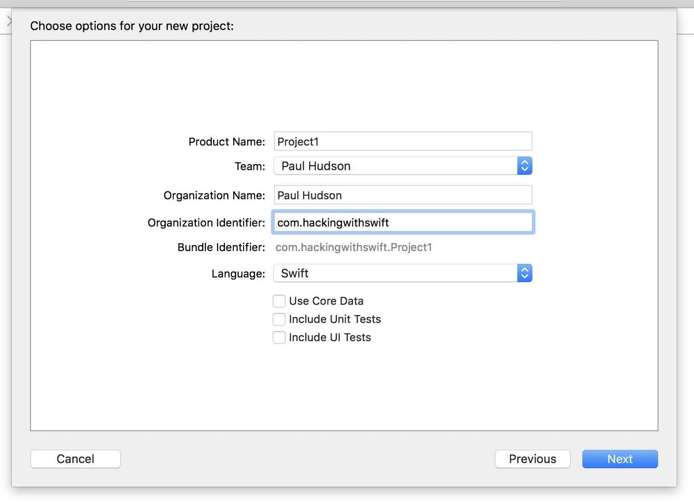

# Vorbereitung

In diesem Projekt erstellst Du eine Applikation mit der Anwender durch eine Liste von Bildern scrollen und eines zur Ansicht wählen kann. Es ist absichtlich einfach gehalten weil Du unterwegs noch Vieles lernen wirst. 
Also schnall Dich an - es wird ein langer Weg!

Starte Xcode und wähle dort "Create a new Xcode project" auf dem Willkommen-Dialog. Wähle darin "Single View App" aus der Übersicht und klicke [Next]/Weiter. Als Produktname gib "Projekt1" an und stelle "Swift" als Sprache und "Universal" bei den Geräten ein.

Eine der Angaben die Du machen sollst ist der "Organisation Identifier" (Firmenkennzeichen). Das ist ein eindeutig auf Dich und Deine App verweisende Bezeichnung. Es bietet sich an Deine persönliche Website in umgedrehter URL-Hierachie zu schreiben. Ich würde z.B. **com.hackingwithswift.project1** verwenden. Hier muß eine gültige Angabe gemacht werden, wenn Du planst die App auf ein Gerät zu installieren. Wenn wir im Simulator bleiben, reicht auch ein **com.example**.

**Wichtiger Hinweis:** Einige der Projekt-Vorgaben bei Xcode haben die Optionen "Use Core Data" (Verwende Core Data), "Include Unit Tests" (Erzeuge Unit Tests) und "Include UI Tests" (Erzeuge User Interface Tests). Bitte entferne all diese Optionen/Häkchen für dieses und für fast alle unsere weiteren Projekte in dieser Reihe. Es gibt eine Ausnahme, bei der das aber eindeutig beschrieben sein wird.

Nun klicke erneut [Next]/Weiter und Xcode fragt wo das Projekt abgelegt werden soll - Dein "Desktop" ist eine gute Wahl.
Danach zeigt Dir Xcode das lauffähige Beispiel, das es für Dich erstellt hat. Das erste was wir nun machen ist Sicherstellen, daß Alles wie beschrieben vorbereritet wurde - als lassen wir es einmal unverändert laufen.

Wenn Du ein Projekt laufen läßt, wählst Du aus, welches Gerät der iOS Simulator Deiner App gegenüber vorgeben soll. Du kann aber auch ein konkretes Gerät anschliessen und es dort laufen lassen. Diese Wahlmöglichkeiten findest Du im Menü "Product > Destination". Dort findest Du z.B. iPad Air, iPhone 8, usw.

An das Menü kommt man auch schneller. Oben links im Xcode-Fenster ist der Start/Stop-Knopf. Rechts daneben sollte dein Projektname und ein Gerätename stehen. Dort kannst Du auf den Gerätenamen klicken und ein Anderes wählen.

**Für's Erste wähle bitte iPhone 8 und starte mit dem |> Start-Dreieck oben links.** Damit wird der Code kompiliert. Das wandelt Dein Programm in Anweisungen um, die das iPhone abarbeiten kann. Und dann wird damit der Simulator gestartet.
Wie Du siehst, zeigt unsere "App" vorerst nur einen leeren, weissen Bildschirm. Das ändern wir gleich.

Du wirst zukünftig sehr oft Projekte Starten und Stoppen. Da gibt es drei grundsätzliche Dinge die Du wissen solltest:

- Du kannst dein Projekt auch mit der Tastenkombination Cmd+R starten. Ganz so wie mit dem Play-Knopf.
- Du kannst es stoppen mit Cmd+. während der Maus-/Tastatur -Fokus bei Xcode ist.
- Wenn Du Änderungen an der laufenden App gemacht hast, kannst Du erneut Cmd+R drücken. Dann fragt Dich Xcode, ob es erst die laufende App stoppen soll. Das solltest Du bejahen und "Do not show this message again" anwählen. Dann geht es zukünftig schneller.

Bei diesem Projekt geht es um die Auswahl und Anzeige von Bildern, also sollten wir ein paar importieren. Lade Dir die Dateien für dieses Projekt von Github herunter (<https://github.com/twostraws/HackingWithSwift>), und schaue in das Verzeichnis "project1-files". Dort findest Du ein weiteres Verzeichnis "Content", das Du nun vom Finder nach Xcode draggst, direkt unter den Eintrag "Info.plist".

**Hinweis:** Einige sehr forsche Zeitgenossen haben versucht, das Verzeichnis direkt aus dem Browserfenster nach Xcode zu draggen. *Das funktioniert nicht*. Du musst es zuerst als ZIP-Datei herunterladen, entpacken und dann nach Xcode importieren.

Es erscheint ein Dialog, der fragt, wie die Dateien hinzugefügt werden sollen. Aktiviere "Copy items if needed" und wähle "Create groups". **Wichtig: Wähle nicht "Create folder references", sonst funktioniert Dein Projekt nicht mehr.**

Klicke [Finish] und ein gelbes Verzeichnis namens Content sollte erscheinen. Falls es blau angezeigt wird, hattest Du dem import falsch eingestellt und Du wirst große Probleme haben, diese Tutorial erfolgreich weiterzuführen.

**WIRKLICH WICHTIG:** Bei einigen Versionen von Xcode kam es zu einem folgenschweren Fehler beim Hinzufügen von Dateien. Vielleicht hat Dich dieser Fehler bereits betroffen.
Er wirkt sich darin aus, daß zwar Dateien als hinzugefügt erscheinen, aber Xcode fügt sie *nicht* auch beim Build-Vorgang hinzu, so als wären sie nie da gewesen.

Lass uns mal ausprobieren, ob auch Dein Xcode dieses Problem hat. Wähle eines der Bilder im Projekt-Navigator aus (z.B. "nssl0033.jpg"). Dann drücke Alt+Cmd+1 um den Datei-Inspektor im rechten Bereich von Xcode zu öffnen. Prüfe dort unter der Überschrift "Target Membership", ob neben Deinem Projekt-Namen ein Häkchen gesetzt wurde. Falls nicht, ist der Fehler akut.

**Wenn Xcode diesen Fehler aufweist**, gibt es zwar eine einfache Lösung: Alle importierten Dateien auswählen, den Inspektor öffnen und dort das Membership-Häkchen manuell setzen. **Leider musst Du das dann für alle weiteren Imports wiederholen, bis der Fehler über einen Update behoben wurde.**

