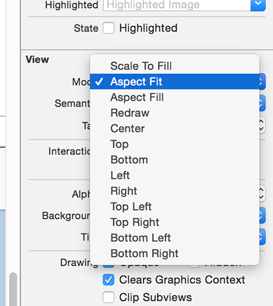

# Abschließende Verbesserungen: hidesBarsOnTap und Sicherheitsränder

Wir haben nun einen Stand der Applikation der alle geplanten Funktionen erfüllt. Es gibt aber noch zwei Dinge, die wir besser/schöner lösen sollten:

Zum Einen ist Dir vielleicht aufgefallen, daß unsere Bildanzeige den Inhalt verzerrt, um vollflächig zu erscheinen. Das ist kein Fehler, sondern das Standardverhalten der Klasse `UIImageView`.
Zum Beheben brauchen wir nur ein paar Mausklicks: Wähle Main.storyboard, dort den Image View im Detail View Controller. Öffne den Attribute Inspector – das ist die Fläche rechts, relativ weit oben – der vierte von insgesamt sechs Inspektoren, links neben dem Lineal-Symbol.
Und wenn Du nicht ewig danach suchen willst, drücke einfach Cmd+Alt+4.

Die Verzerrung wird vom Video Modus hervorgerufen, der standardmäßig auf “Scale to Fill” steht.
Ändere das ab auf “Aspect Fit”. Die Verzerrung sollte nun behoben sein.

Der Vollständigkeit halber: 

- “Aspect Fit” paßt die Bildgrösse so an, daß Alles zu sehen ist.
- “Aspect Fill” versucht Alles auszufüllen, was das Bild entweder in der Höhe oder Breite überlappen läßt. Dann solltest Du auch “Clip To Bounds” aktivieren.

Die zweite Anpassung, die wir machen wollen, erlaubt die Bildanzeige wirklich vollflächig, ohne daß auch der Navi-Balken angezeigt wird. Dazu hat der `UINavigationController` die Property `hidesBarsOnTap`. Wenn das auf `true` gesetzt wird, können Anwender den Balken mit einer Berührung aus- und wieder ein-blenden.

Aber Vorsicht! Wenn wir das auch aktiviert haben, wenn unsere Tabelle der Bildnamen sichtbar ist, klappt dort die Auswahl nicht mehr. Also dürfen wir es nur während der Detailansicht aktiv haben und später wieder inaktiv setzen.

Wir kennen ja bereits die Methode `viewDidLoad`, die bei jedem View Controller gerufen wird nach dem Laden seines Layouts. Es gibt noch eine Reihe Weiterer:

-  `viewWillAppear` vor der Anzeige
-  `viewDidAppear` danach 
-  `viewWillDisappear` vor dem Entfernen/Verschwinden vom Bildschirm 
-  `viewDidDisappear` danach 

Wir werden mit `viewWillAppear` und `viewWillDisappear` unsere Klasse so umbauen, daß die Property `hidesBarsOnTap` des Navigation Controllers nur auf `true` steht, solange die Detailansicht sichtbar ist.

Öffne DetailViewController.swift und füge folgende zwei Methoden direkt unter dem Block der Methode `viewDidLoad` ein:

    override func viewWillAppear(_ animated: Bool) {
        super.viewWillAppear(animated)
        navigationController?.hidesBarsOnTap = true
    }

    override func viewWillDisappear(_ animated: Bool) {
        super.viewWillDisappear(animated)
        navigationController?.hidesBarsOnTap = false
    }

Hier gibt es ein paar wichtige Dinge zu beachten:

- Wir verwenden `override` bei diesen Methoden, weil sie bereits von der Oberklasse `UIViewController` mit einem Standardverhalten implementiert wurden. Wir wollen aber unser eigenes Verhalten. Falls wir das Schlüsselwort vergessen, wird sich ggf. Xcode melden.
- Beide Methoden haben einen Aufrufparameter – ob der Vorgang animiert sein soll, oder nicht. Derzeit interessiert uns das nicht, wir reichen es einfach an `super` durch. Bei grundsätzlich jeder Methode, die wir überschreiben, wollen wir sicherstellen, daß auch die Methode der Klasse, von der wir geerbt haben (`super`) aufgerufen wird. Das sollte möglichst zu Beginn geschehen.
- Und wieder verwenden wir die Property `navigationController`, die gesetzt sein sollte, weil wir den View ja selbst auf den Stack des Navigation Controllers gelegt haben. Aber syntaxtisch ist es immernoch ein Optional und wir brauchen den `?`-Operator.

Wenn Du nun die App wieder laufen läßt, kannst Du das Bild auswählen, es wird unverzerrt und vollflächig dargestellt und per Tap kannst Du den Nav-Balken aus- und wieder einblenden.

Die dritte Änderung ist zwar klein, aber wichtig. Wenn Du Dir andere Apps ansiehst, fallen Dir graue Pfeile nach Rechts auf. Die nennt man *Disclosure Indicator* und sie laden die Anwender ein, sich per Tap tiefer liegende Detail-Informationen anzusehen.

Es braucht nur ein paar Klicks im Interface Builder, um das auch in unsere Übersicht einzubauen. Öffne Main.storyboard und wähle die Table View Cell aus (die, die unter “Prototype Cells” das Wort “Title” stehen hat)

Der Table View enthält eine Zelle, diese einen Content View und der wiederum ein *Label* namens “Title” – da kann man schnell durcheinanderkommen. Es ist deshalb einfacher, das Auswählen in der Dokumentübersicht zu machen – wähle das Element mit der Bezeichnung “Picture”, den Identifier, über den wir es wiederverwenden wollten.

Wenn das selektiert ist, schau im Attributes Inspector nach “Style: Basic”, “Identifier: Picture”, usw. Dort steht auch “Accessory: None” – ändere das bitte um in “Disclosure Indicator”. Das aktiviert den grauen Pfeil.

Auch die vierte Änderung ist wieder klein, aber wichtig: Wir wollen oben im Navigationsbalken eine Überschrift platzieren. So wie View Controller alle optionale Properties für `storyboard` und `navigationController` haben, gibt es auch ein Property namens `title` (Überschrift). Dieses wird automatisch vom Navigation Controller ausgelesen und oben angezeigt.

Füge in der Klasse `ViewController` in `viewDidLoad()` direkt unter der Zeile `super.viewDidLoad()` folgendes ein:

    title = "Sturm-Betrachter"

Diese Beschriftung wird auch automatisch vom “Zurück”-Knopf verwendet, damit die Anwender wissen, wohin sie zurückkehren.

Auch im `DetailViewController` für unsere Detailansicht *könnten* wir etwas Vergleichbares einbauen, aber statt eines festen Textes wie z.B. “Bildanzeige”, schlage ich vor, wir zeigen hier den Bild-Dateinamen an. Füge also dort bitte unter `super.viewDidLoad()` ein:

    title = selectedImage

Da sowohl `title` wie auch `selectedImage` optionale Zeichenketten sind, brauchen wir sie nicht erst entpacken und erneut packen, sondern sie können einander direkt zugewiesen werden. Und wenn nichts ausgewählt wurde, zeigt der Nav-Balken auch nichts an.

## Große Überschriften in iOS 11

Die nun beschrieben Anpassung ist nur verschönernd und nicht notwendig, aber es passt hier gut hinein und Du kannst selbst entscheiden, ob es Dir gefällt.

Mit iOS 11 hat Apple seine Design Richtlinien überarbeitet, unter anderem die Empfehlung zu *grösseren Überschriften* in den Navigations-Balken. Der Standard ist die Schriftgröße, die wir bisher verwenden. Aber mit wenigen Anpassungen können wir der Designrichtlinie folgen.

Füge zuerst folgendes an den Code in `viewDidLoad()` in ViewController.swift:

    navigationController?.navigationBar.prefersLargeTitles = true

Das ermöglicht die Anzeige von Überschriften in größerer Schrift für alle Views, die vom Navigation Controller verwaltet werden. Mit Cmd+R siehst Du auch gleich den Unterschied: “Sturm-Betrachter” wird nun deutlich grösser angezeigt und auch die Bildnamen in der Detailansicht. Beachte auch, daß nun die Größe und Position nicht mehr statisch bleiben, sondern sich beim Herein-/Rinausbewegen etwas dehnen und verkleinern.

Apple empfiehlt große Überschriften nur dort wo es Sinn macht. Meist bei der ersten und zentralen Ansicht Deiner App. Die bisherige Anpassung erlaubt nun allen Views die große Anzeige.

Wenn wir in unserer App den anderen Views keine grossen Überschriften erlauben wollen, kann das jeder View selbst tun über folgende Anpassung im jeweiligen `viewDidLoad()` (z.B. in DetailViewController.swift):

    navigationItem.largeTitleDisplayMode = .never

Das war Alles – die grösseren Überschriften sollten sich nun wie erwartet verhalten.

## Und was ist mit dem iPhone X?

Das iPhone X führte als erstes einen nicht rechteckigen Bildschirm ein, was uns vor interessante Probleme stellt. Insbesondere die abgerundeten Ecken können aussen platzierte Texte unlesbar machen oder Bedienelemente unsichtbar/unerreichbar. Auch der neue Home-Indikator spielt eine Rolle.
Apple stellt uns zwar weiterhin einen vollflächigen Bildschirm-Puffer bereit (inklusive der Pixel, die es in den Ecken und im sog. Notch psysikalisch garnicht gibt) führte aber ebenfalls *Sicherheitsränder* (*safe areas*) ein. Die Funktionen die sich an sie halten, vermeiden die fehlenden Pixel und streiten sich auch nicht um Bildbereiche mit dem Home-Indikator.

In dieser App wird aufgrund der Standard-Funktionalität der View Controller zwar die Tabellenübersicht vollflächig angezeigt (da hat Apple viel Mühe hineingesteckt), aber der Navigation Controller berücksichtigt den Notch und unsere Detailansicht läßt unten Platz für den Home-Indikator.

Der Freiraum unten ist bestimmt für viele Anwendungen sinnvoll, aber in der Detailansicht möchten wir ja möglichst den gesamtem Bildschirm nutzen. Das können wir glücklicherweise schnell anpassen:

Öffne Main.storyboard, wähle den View innerhalb des Detail View Controllers und schalte im Größen-Inspektor (Size) die Option “Safe Area Layout Guide box” ab. Damit erlauben wir diesem View (und all' seinen Unter-Ansichten) den gesamten Bildschirm zu nutzen. Das sieht in diesem Fall besser aus.

Zusätzlich können wir an den Stellen wo wir den `hidesBarsOnTap` eingebaut hatten, auch den Home-Indikator verstecken und später wieder anzeigen. Das wird gesteuert über eine sog. *berechnete* Property namens `prefersHomeIndicatorAutoHidden` – wenn die `true`zurückgibt, verschwindet der Home Indikator nach kurzer Zeit. Er erscheint wieder bei der nächsten Berührung.

Wir bauen das so auf, daß diese neue Methode die Property `hidesBarsOnTap` unseres Navigation Controllers zurückgibt. Damit koppeln wir beide Verhalten miteinander – Nav-Balken und Home-Indikator verschwinden und erscheinen also gemeinsam.

Theoretisch könnten wir davon ausgehen, daß unser View immer an einen Naviagtion Controller gekoppelt ist, also könnten wir per `!` den Optional zwangs-entpacken (*force unwrap*). Aber hier empfiehlt sich einen andere Technik: “Verwende einen Standardwert, falls kein Navigation Controller verwendet wird”. Füge folgende property-Methode im DetailViewController.swift ein:

    override var prefersHomeIndicatorAutoHidden: Bool {
        return navigationController?.hidesBarsOnTap ?? false
    }

**Anmerkung:** Der Operator `??` wird auch *Null Koaleszenz-Operator* (*nil coalescing operator*) genannt, und das bedeutet in diesem Fall: “falls der Navigations Controller nicht existiert gib `false` zurück, ansonsten entpacke den optional-Wert aus seiner `hidesBarsOnTap` Property.”

Diese Property wird überprüft sobald unser View Controller das erste Mal angezeigt wird, aber auch immer wenn es wechselt mit Hilfe von `hidesBarsOnTap`. Also ist unsere Arbeit damit getan: Der Home-Indikator sollte nun automatisch kurz nach dem Nav-Balken verschwinden.

Das war unsere letzte Anpassung! Geniesse das Ergebnis im Simulator mit Cmd+R.
