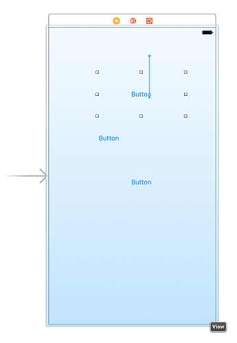

# Design des Bildschirmaufbaus

Rückblickend auf meine eigenen Projekte, empfinde ich das Design der Benutzeroberfläche als den einfachsten Einstieg – es macht Spaß, es wird sofort klar ob eine Idee Sinn macht und ich denke von Anfang an daran, wie Anwender mit meiner App interagieren. Dieses Projekt 2 ist nicht kompliziert und dennoch fangen wir auch hier im Interface Builder an.

Wie bereits in Projekt 1 stellt uns die Vorlage `Single View App` einen `UIViewController` namens `ViewController` und ein Storyboard namens `Main.storyboard` mit dessen Layout bereit.
Öffne nun genau dieses Storyboard im IB und Du findest eine grosse, leere Fläche vor – bereit für Deine Ideen.

In unserem Spiel zeigen wir Anwendern 3 Flaggen und im Navigations-Balken darüber den Namen des Landes, dessen Flagge wir bestimmen sollen. Hmmh – welcher Nav-Balken? Es ist keiner da – jedenfalls bisher. Wir müssen einen erschaffen, wie beim letzten Projekt.

Im Projekt 1 haben wir *eine Menge* behandelt, also kann es gut sein, daß Du vergessen hast, wie das ging. Kein Problem – die Vorlage für `Single View App`s hat standardmäßig keinen aber es ist trivial einen hinzuzufügen: Klicke in die Fläche des `View Controller` und wähle dann im Menü Editor > Embed In > Navigation Controller.

Mit dem Erzeugen des `Navigation Controller`s ist unser `View Controller` nach unten gerutscht. Scrolle zu ihm herunter und platziere dort drei `UIButton`s. Obwohl das eine für uns neue Art von Objekt ist, kannst Du Deine bisherigen Erfahrungen anwenden. Jeder von ihnen sollte 200 Punkte breit und 100 hoch sein. Im `Size Inspector` (oben rechts) kann man die Werte exakt eintragen. 

In den "alten Zeiten" von iOS 6 und davor wurden solche `UIButton`s mit weissem Hintergrund und abgerundeten Ecken und erhoben dargestellt. Da hat man sie sofort als antippbar identifiziert. Aber seit iOS 7 sind sie flach und zeigen nur Text. Wir werde sie später etwas interessanter gestalten.

Um schnell zum `Size Inspector` zu gelangen hilft der Shortcut Alt+Cmd+5, sonst per Menü: View > Utilities > Show Size Inspecctor. Die X Positonen sind nicht so relevant, aber für Y sollten es 100 für die erste Flagge, 230 für die zweite und 360 für die dritte sein. Das verteilt sie einigermaßen gleichmäßig.

In der folgenden Abbildung sieht man den `Size Inspektor`. Damit kann man am schnellsten, einfachsten und präzise Views positionieren und dimensionieren.

Im nächsten Schritt verwenden wir Auto Layout und beschreiben damit die Regeln, wie unser Layout an die verschieden großen iOS Gräte angepaßt wird. In diesem Fall sind die Regeln recht einfach, aber ich hoffe Euch aufzuzeigen wie clever Auto Layout ist.

Wir werden unsere Auto Layout Regeln anders anlegen als im Projekt 1. Dieser Weg ist nicht besser als der andere. Ich will nur weitere Möglichkeiten aufzeigen und Du kannst selbst entscheiden, welcher Weg für Dich besser paßt.

Wähle den obersten Button aus, dann Ctrl-Dragge von innerhalb des Buttons nach aussen kurz oberhalb – z.B. in den Leerraum des `View Controller`s. Während Du das machst, wird die Fläche bläulich um anzuzeigen, daß hier eine Auto-Layout-Regel erzeugt wird.

Sobald Du die Maus-Taste losläßt wird Dir eine Auswahl möglicher Regeln präsentiert. Zwei davon sind für uns relevant: “Top Space to Safe Area“ und “Center Horizontally in Safe Area.”

Es gibt zwei Möglichkeiten, beide Regeln zu aktivieren. Einerseits kannst Du mehrfach mit Ctrl-Drag diesen Dialog öffnen. Andererseits kannst Du auch die Umschalt-Taste gedrückt halten wenn Du eine Auswahl machst. Dann schließt der Dialog nicht und läßt Dich einen weiteren auswählen.
Abschliessend klicke auf “Add Constraints” zur Bestätigung.

Damit haben wir die erste Flagge vorbereitet. Bevor wir weitermachen, laß uns den Button View mit Beispiel-Inhalt füllen und ausprobieren wie es aussieht.

Beim Projekt 1 haben wir einfach durch Hineindraggen eines Verzeichnisses Bilder zu unserem Xcode Projekt hinzugefügt. Das lief reibungslos und wir können das gerne wiederholen. Aber ich möchte Dir hier eine weitere Methode zeigen. Es geht nun um *Asset Kataloge* (asset catalogs). Dabei handelt es sich um eine hochoptimierte Verwaltung von Bildern für iOS-Projekte. Und sie sind ähnlich einfach anzuwenden wie Bildverzeichnisse.

Wähle dazu in unserem Xcode Projekt den Eintrag `Assets.xcassets`. Eigentlich ist das garkeine Datei sondern der Standard-Xcode-Asset-Katalog dieses Projektes. Wenn Du die Dateien für dieses Projekt noch nicht von GitHub heruntergeladen hast, hole das nun bitte nach: <https://github.com/twostraws/HackingWithSwift>.

Wähle dann alle 36 Flaggen-Bilder aus und ziehe sie in das Xcode-Fenster unter den Eintrag `AppIcon` im Asset Katalog. Damit werden 12 neue Einträge angelegt – jeweils einer für jedes Land.

Ich bitte mein Abschweifen zu entschuldigen, aber das erscheint mir wichtig:
iOS Assets gibt es in drei Bildgrössen: normal, 2-fach und 3-fach für moderne Retina-Displays. Im Interface Builder verwenden wir zwar nur eine Größe, aber mit dieser Technik stellt unsere App die Bilder auch für Retina-Displays bereit.

Frühe iOS-Geräte hatten noch keine Retina-Displays (zum Beispiel 320 x 480 Pixel) und damals hat man die Elemente auch in dieser Auflösung platziert.
Mit dem iPhone 4 hat Apple sog. Retina-LCDs eingeführt, die eine vierfache Pixelzahl bereitstellten (jeweils doppelt in Höhe und Breite = 2x). Damit Entwickler nicht alle Bildschirm-Design erneuern mußten, hat Apple statt der Pixel die Einheit “points” (Punkte) eingeführt – virtuelle Pixel. Auf nicht-Retina Geräten waren dann 10 Punkte weiterhin 10 Pixel, auf Retina-Geräten wurden daraus 20 Pixel. In der Praxis sahen dann die Designs gleich aus.

Selbstverständlich ging es bei der feineren Auflösung darum, daß Bilder schärfer dargestellt wurden. Es war nicht damit getan, ein Pixel einfach auf die Fläche von vieren zu verteilen. Deshalb konnte man zu einem Bild mit dem Namen hello.png (200x100px) auch eine schärfere Retina-Variante namens hello@2x.png (400x200px) bereitstellen. Wenn in unserem Code auf hello.png verwiesen wird, schaut iOS auf Retina-Geräte nach einer Datei namens hello@2x.png. Aus dem anfänglichen “kann” wurde später ein ein teilweise “muss” z.B. für Icons für den App-Store.

Später hat Apple sogar Retina-HD-LCDs und -OLEDs eingeführt die eine 3x-Retina-Auflösung bereitstellen. Die Namenskonvention und das Bereitstellen einer weiteren Bildvariante wird nun auch auf @3x erweitert.

Das erscheint natürlich sehr Platz-verschwendend wenn man mit jeder App beim Download Bilder mit installiert, die mein Gerät garnicht benötigt oder anzeigen kann. Zum Glück verwendet der AppStore eine Technik namens “App Thinning” bei der alle Assets entfernt werden, die auf einem Gerät nicht benötigt werden.

Interessanterweise werden seit iOS 10 nur noch Retina-fähige Geräte unterstützt. Wenn Deine App also nur iOS 10 oder jünger unterstützten will, braucht sie nur @2x und @3x bereitstellen. Ich habe aber auch “1x” bereitgestellt, für den Fall daß ihr auch ein älteres iOS unterstützten wollt.

Diese ganzen Erläuterungen sollten erklären warum vorhin beim Einfügen der Assets alle automatisch in die “Schubladen” 1x, 2x, und 3x einsortiert wurden. Das ging deshalb, weil ich für die Bildernamen die offizielle Namenskonvention verwendet habe: france.png, france@2x.png und france@3x.png usw. Xcode konnte sie somit sinnvoll einsortieren.

Sobald die Bilder importiert wurden, kannst Du sie verwenden wie jedes andere im Content (Inhalt) Verzeichnis der App. Also kehren wir zurück zum Storyboard, wählen den ersten Button und öffnen den Attribute Inspector (mit Alt+Cmd+4). Wie Du siehst, hat er derzeit den Titel "Button" (das steht in der Zeile unter “Title: Plain”). Bitte lösche das. Dann klicke auf den Pfeil neben dem Aufklappmenü `Image` und wähle dort “us” für die United States.

Sobald Du das Bild dem Button zugeordnet hast sollten alle Layout-Regeln vollständig sein: Er hat eine Y-Position weil wir das als Regel gesetzt hatten. Er hat eine X-Position, weil wir bestimmt hatten, daß er horizontal zentriert sein soll. Und die Breite und Höhe bezieht er vom geladenen und zugeordnetem Bild. Wiederhole diese Bild-Zuweisung nun bitte auch für die anderen beiden Buttons.

Wir benötigen noch Auto-Layout-Regeln für die unteren beiden Buttons. 
Wähle den mittleren aus und Ctrl-Dragge dann zum oberen Button – also dieses mal nicht in den Zwischenraum. Laß die Maustaste los und es erscheinen die beiden Optionen “Vertical Spacing” und “Center Horizontally”. Wähle beide (mit Shift). Dann wähle den untersten Button, Ctrl-Dragge zum mittleren und wähle erneut beide Optionen.

Nun sind wir fast fertig, aber vielleicht fällt Dir auf, daß wir zwar die Regeln vereinbart haben, aber die Buttons weiterhin kreuz und quer liegen. Das liegt daran, daß wir IB noch auffordern müssen, die Platzierung gemäß den neu gesetzten Auto-Layout-Regeln durchzuführen.

Das geht recht einfach: Wähle alle 3 Flaggen aus und wähle im Menü Editor > Resolve Auto Layout Issues > Update Frames. Die Option erscheint zweimal, aber in diesem Falle ist egal welche wir wählen. Dieser Befehl wendet alle Regeln auf die gewählten UI Elemente an.

Was nun noch im Interface Builder zu machen bleibt: Wir brauchen für unsere 3 Buttons noch outlets um sie im Code ansprechen zu können. Öffne dazu den Assitenz-Editor mit Alt+Cmd+Return (oder View > Assistant Editor > Show Assistant Edito). Dann Ctrl-Dragge vom oberen Button in unseren Code, was das outlet `button1` erzeugt. Wiederhole das für `button2`und `button3` für die anderen beiden Flaggen-Buttons.

Wir werden hier später weiter arbeiten, aber vorerst beenden wir den Interface Builder. Wähle in der Übersicht `ViewController.swift` und wechsel zurück in den Standard-Editor (indem wir den Assistent Editor mit Cmd+Return schliessen) weil es nun mit Programmieren weitergeht.
