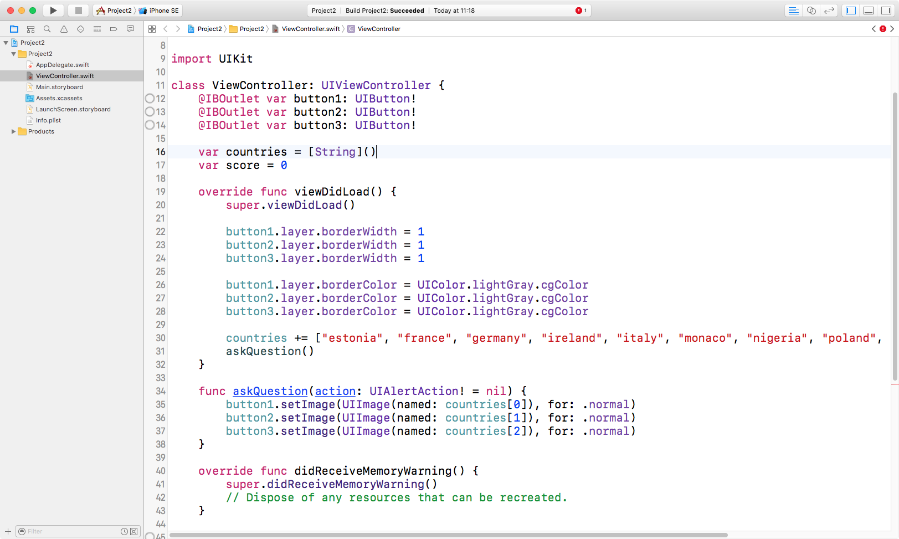

# Wir schaffen die Grundlagen des Spiels: UIButton und CALayer

Wir werden nun ein String Array anlegen mit allen Ländernamen in unserem Spiel. Und eine Property in der der aktuelle Spielstand gespeichert wird – es ist ja schließlich ein Spiel!

Fangen wir an mit den Property's. Füge folgende Zeile direkt unter den früheren `@IBOutlet`-Zeilen in `ViewController.swift` ein:

    var countries = [String]()
    var score = 0

Die erste Zeile macht etwas ähnliches wie im Projekt 1: Es erzeugt eine property namens `countries`, die ein String-Array enthält.
Die zweite Zeile hält nur eine einfache Ganzzahl `score` die mit 0 initialisiert wird. In der Zeile findet eine Besonderheit von Swift statt – die sog. *type inference*. Der Typ einer Variable wird anhand des zugewiesenen Wertes bestimmt. Das bedeutet einerseits a) daß Du gleich einen richtigen Startwert verwenden solltest, b) Du im nachhinein keinen anderen Typ zuweisen kannst und c) Du nur dann einen expliziten Typ angeben mußt, wenn sich Swift irrt.

Hier dazu ein paar Beispiele:

- `var score = 0` erzeugt ein `Int` (integer) und kann damit Ganzzahlen speichern.
- `var score = 0.0` erzeugt ein `Double`, eine von mehreren Arten wie man Fließkommazahlen ablegt, z.B. 3.14159 (beachte bitte den US-amerikanisch üblichen Dezimal-Punkt!).
- `var score = "hello"` erzeugt einen `String`, kann also Text speichern.
- `var score = ""` Auch wenn hier nichts zwischen den Anführungszeichen steht, wir trotzdem ein `String` angelegt – allerdings leer.
- `var score = ["hello"]` erzeugt ein `[String]` mit einem Eintrag, also ein Array in dem jeder Eintrag vom Typ `String` ist.
- `var score = ["hello", "world"]` erzeugt ein `[String]` mit zwei Einträgen, also ebenfalls ein Array in dem jeder Eintrag vom Typ `String` ist.

Man sollte Swift's Typen-Bestimmung so oft wie möglich walten lassen. Aber wenn wir möchten können wir auch eingreifen:

- `var score: Double = 0` Swift sieht die 0 und denkt an ein `Int`, aber wir sagen, dass es ein `Double` sein soll (die 0 wird in ein 0.0 konvertiert).
- `var score: Float = 0.0` Swift geht bei 0.0 erst einmal von einem `Double` aus, aber wir überschreiben das zu einem `Float`. Wie oben erläutert, gibt es mehrere Arten eine Fließkommazahl abzulegen. `Float` und `Double` machen das beide, aber vereinfacht gesagt, ist `Float` die Variante für weniger genaue oder nicht ganz so große Zahlen.

So, in den nächsten Minuten bringen All' das zum Laufen. Zuerst füllen wir die Landesnamen durch Anfügen dieser Zeilen an das Ende der Methode `viewDidLoad()`:

    countries.append("estonia")
    countries.append("france")
    countries.append("germany")
    countries.append("ireland")
    countries.append("italy")
    countries.append("monaco")
    countries.append("nigeria")
    countries.append("poland")
    countries.append("russia")
    countries.append("spain")
    countries.append("uk")
    countries.append("us")

Das sieht genauso wie in Projekt 1 aus – also gibt es hier nicht viel Neues zu lernen. Aber es gibt einen effizienten Weg und zwar in nur einer einzelnen Zeile:

    countries += ["estonia", "france", "germany", "ireland", "italy", "monaco", "nigeria", "poland", "russia", "spain", "uk", "us"]

Hier passieren zwei Dinge. Zuerst wird ein neues Array vom Typ `[String]` mit allen Landesnamen erzeugt und dieses dann mit dem uns neuen Operator `+=` behandelt.

Ein Operator kann auf Variablen und Konstanten angewandt werden und führt mit ihnen eine “Operation” aus. Zum Beispiel gibt es den Operator `+`. Mit “5 + 4” haben wir eine Konstante (5), einen Operator (+) und einer weitere Konstante (4). 

Bei `+=` werden der Additions-Operator (+) mit dem Zuweisungs-Operator (=) kombiniert zu einem “addiere und weise zu”. In unserem Beispiel wird das rechte Konstrukt dem linken hinzugefügt und danach das Ergebnis dem linken zugewiesen.

Nach den Landesnamen fügen wir einen weiteren Befehl an das Ende von `viewDidLoad()`:

    askQuestion()

Damit rufen wir die Methode `askQuestion()` auf. **Diese Methode existiert noch nicht, also würde sich der Compiler beschweren.** Allerdings werden wir die Methode gleich definieren. Diese Methode wird ein paar Flaggen in unsere Buttons füllen, damit die Anwender die richtige auswählen kann.

Füge Folgendes nach `viewDidLoad()` an:

    func askQuestion() {
        button1.setImage(UIImage(named: countries[0]), for: .normal)
        button2.setImage(UIImage(named: countries[1]), for: .normal)
        button3.setImage(UIImage(named: countries[2]), for: .normal)
    }

Die erste Zeile ist leicht erklärt: Wir deklarieren die neue Methode `askQuestion()`, die keinen Aufrufparameter erwartet. Die nächste drei verwenden `UIImage(named:)` um Bilder zu laden, wobei die Namen aus Positionen des Landesnames-Array per Index geholt werden. Das neue daran ist :

- `button1.setImage()` weist dem Button ein anderes `UIImage` zu. Derzeit haben wir dort die US-Flagge. Die wird beim Aufruf von `askQuestion()` ersetzt werden.
- `for: .normal` Die Methode `setImage()` benötigt einen zweiten Paramter: "Welcher Status des Buttons soll geändert werden?". Mit `.normal` sagen wir "… der Normalzustand des Buttons."

Hinter `.normal` verbergen sich gleich 2 Themenbereiche, die wir beide erklären müssen. Erstens wird es *ähnlich wie* ein Datentyp namens `enum` verwendet – kurz für `Enumeration` (Aufzählung). Wenn wir uns vorstellen, daß Buttons drei Zustände haben können: normal, highlighted (hervorgehoben) und disabled (gesperrt). Diese *könnte* man ja auch mit den Zahlen 0, 1 und 2 repräsentieren, was aber nicht sofort klärt, welche nun für was genau steht.

Aufzählungen lösen dieses Problem, in dem wir den Dingen sinnvolle Name geben dürfen. Statt einer 0 schreiben wir `.normal`, und anstelle von 1 dürfen wir `.disabled` verwenden, usw. Das erleichtert uns sowohl das Schreiben, wie auch das Verstehen von Sourcecode, ohne Performace-Einbußen – Perfekt!

**Anmerkung für Fortgeschrittene:** Oben sagte ich daß `UIControlState` “*ähnlich* eingesetzt werden wie `enum`s” und nicht etwa, daß “*sie ein `enum` sind*”, weil das in diesem Fall unter der Haube besonders ist. In Objective-C – der Programmiersprache, in der UIKit geschrieben ist – ist es ein `enum`, aber in Swift wird es gehandhabt als ein `struct` das nur *wie* ein `enum` verwendet wird; also ist es technisch gesehen kein reines `enum` in Swift. Obwohl wir noch nicht in die Tiefen von Swift eingedrungen sind: “technisch korrekt” ist “das wahre Korrekt”!

Und noch etwas Neues steckt in `.normal` – warum der Punkt am Anfang? Also an dieser Stelle wird das Bild eines `UIButton`s gesetzt und ein Zustands-Wert wird erwartet. Hinter `.normal` kann sich in anderen Kontexten ganz Unterschiedliches verbergen. Der Compiler weis, daß `setImage()` als zweiten Parameter einen Wert vom Typ `UIControlState` erwartet und ergänzt selbstständig von `.normal` auf `UIControlState.normal`, was wir an dieser Stelle auch hätten ausschreiben können.

Nun sollte das Spiel in einem lauffähige Zustand sein – laß es uns ausprobieren.

Zuerst wähle den iPhone 8 Simulator im Menü Product > Destination > iPhone 8. Dann starte den Simulator mit Cmd+R.

Uns fallen sogleich zwei Probleme ins Auge:

1. Sowohl die estonische, wie auch die französische Flagge enthalten Weiss und heben sich schlecht vom Hintergrund ab.
2. Das "Spiel" macht keinen Spaß, wenn immer die selben 3 Flaggen angezeigt werden!

Problem Nr. 2 muß noch ein paar Minuten warten, aber das erste fixen wir gleich. Ein grosser Vorteil aller Unterklassen von `UIView`s im UIKit ist, daß sie unter der Haube auf dem Framework `Core Animation` und dessen Klasse `CALayer` fußen, also auch die von uns verwendeten Klassen `UIButton` und `UITableView`. Diese tiefere Ebene läßt uns das gesamte Aussehen anpassen. Fangen wir mit der Eigenschaft `borderWidth` an.

Die schlechte Erkennbarkeit von Flaggen mit Weiss vor unserem weissen Hintergrund läßt sich mit einem sichtbaren Rand beheben. Füge diese 3 Zeilen vor dem Aufruf von `askQuestion()` ein:

    button1.layer.borderWidth = 1
    button2.layer.borderWidth = 1
    button3.layer.borderWidth = 1

Wir erinnern uns daran: Points (Punkte) und Pixel sind unterschiedliche Einheiten. Die `1` ist in points und wird auf vor-Retina-Geräten als 1 Pixel, auf Retina als 2 Pixel und auf HD Retina als 3 Pixel interpretiert. Damit wird der Rand auf allen Geräten mehr oder minder gleich breit wahrgenommen werden.

Standardmäßig ist der Rand eines `CALayer` schwarz, was wir aber mit einem Farbwert vom Typ `UIColor` ändern können. Aber weil `CALayer` eine Ebene tiefer im System liegt sind die Aufrufe allerdings etwas komplizierter. Wie das prefix `UI` zeigt, kommen die UIKit-Klassen alle aus einem gemeinsamen *Universum* und können besser miteinander umgehen. Aber dem tiefer liegenden `CA`/`CG`-Universum sind sie erst einmal fremd.

In dieser tieferen Ebene gibt es eine eigene Datenstruktur für Farben namens `CGColor` und zum Glück stellt uns das höher angesiedelte `UIColor` eine Konvertierung von/nach `CGColor` bereit. Wir ergänzen also unsere Rand-Anpassungen um Folgendes:

    button1.layer.borderColor = UIColor.lightGray.cgColor
    button2.layer.borderColor = UIColor.lightGray.cgColor
    button3.layer.borderColor = UIColor.lightGray.cgColor

Wie wir hier erkennen, hat die Klasse `UIColor` für oft verwendete Farben (hier hellgrau) eine Property die uns direkt einen Wert vom passenden Typ zurückgibt. Aber weil wir die Farbe in einer Property des `CALayer`s `.layer` setzen wollen, konvertieren wir sie von `UIColor` nach `CGColor` mit `.cgColor`.

Falls Du etwas anderes als `lightGray` (hellgrau) möchtest, kannst Du auch eine eigene Farbe erzeugen z.B. mit:

    UIColor(red: 1.0, green: 0.6, blue: 0.2, alpha: 1.0).cgColor

Hier gibst Du vier Werte an für den Rot-, Grün-, Blau-Anteil und alpha steht für die Sichtbarkeit/Deckung. Im Beispiel oben wird ein Orange erzeugt und in ein `CGColor` umgewandelt, damit wir damit eine Property des `CALyer`s setzten können.

So – ich denke wir haben genug Kosmetik betrieben. Es wird Zeit daraus eine richtiges Spiel zu machen …
