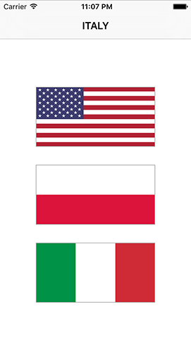

# Rate, welche Flagge: Zufallszahlen

Unser momentater Code wählt die ersten drei Einträge im Länder-Array und platziert sie auf den drei Knöpfen in unserem View Controller. Das ist für den Anfang in Ordnung, aber eigentlich wollen wir jedes Mal zufällige Länder wählen. Es gibt zwei Wege, dies zu tun:

1. Ziehe drei Zufallszahlen und nutze diese, um die Flaggen aus dem Array auszulesen.
2. Mische die Reihenfolge des Array und wähle dann die ersten drei Einträge.

Beide Ansätze sind gültig, aber der erste erfordert etwas mehr Arbeit, da wir sicherstellen müssen, dass alle drei Zahlen verschieden sind - dieses Spiel würde noch weniger Spaß machen, wenn alle drei Flaggen gleich wären!

Der zweite Ansatz ist einfacher zu realisieren, da Swift eingebaute Methoden zum Mischen von Arrays hat: `shuffle()` für Mischen an Ort und Stelle und `shuffled()`, um ein neues, durchmischtes Array zurück zu geben.

Füge diese Code-Zeile am Anfang der Methode `askQuestion()` hinzu, direkt vor dem ersten Aufruf der Methode `setImage()`:

    countries.shuffle()

Dies wird automatisch die Reihenfolder der Länder im Array randomisieren, was bedeutet, dass `countries[0]`, `countries[1]`, and `countries[2]` jedes Mal auf eine andere Flagge verweisen, wenn die Methode `askQuestion()` aufgerufen wird. Drücke zum Ausprobieren Cmd+R, um das Programm ein paar Mal laufen zu lassen und jedes Mal andere Flaggen zu sehen.

Der nächste Schritt ist, zu ermitteln, welche Antwort die richtige sein soll, und dafür erzeugen wir eine neue Eigenschaft für unseren View Controller mit dem Namen `correctAnswer`. Platziere diese ziemlich weit oben, direkt oberhalb von `var score = 0`:

    var correctAnswer = 0

Damit haben wir eine neue Ganzzahl-Eigenschaft, die abspeichern wird, ob Flagge 0, 1 oder 2 die richtige Antwort ist.

Um die richtige Antwort auszuwählen, brauchen wir wieder das Zufallszahlen-System von Swift, da wir für die richtige Antwort eine Zufallszahl wählen müssen. Alle numerischen Typen in Swift, so wie `Int`, `Double` und `CGFloat`, haben eine Methode `random(in:)`, die eine Zufallszahl in einem bestimmten Zahlenbereich generiert. Um also eine Zufallszahl zwischen 0 und (einschließlich) 2 zu generieren, musst du diese Zeile direkt unterhalb der drei Aufrufe von `setImage()` in `askQuestion()` einfügen:

    correctAnswer = Int.random(in: 0...2)

Jetzt wo wir die richtige Antwort haben, brauchen wir nur noch ihren Text in die Navigation Bar zu schreiben. Das geht mit der `title`-Eigenschaft unseres View Controllers, aber wir müssen noch eine Sache zusätzlich machen: Wir wollen nicht "france" oder "uk" in die Navigation Bar schreiben, weil das hässlich aussieht. Wir könnten den ersten Buchstaben groß schreiben, und das würde auch super funktionieren für Länder wie Frankreich, Deutschland, und so weiter, aber es würde schlecht aussehen bei "Us" und "Uk", die eigentlich "US" und "UK" heißen müssten.

Die Lösung hierfür ist einfach: wir schreiben einfach den ganzen String groß. Das geht mit der `uppercased()`-Methode eines jeden Strings, daher müssen wir lediglich den String aus dem Länder-Array an der Position von `correctAnswer` auslesen und ihn dann groß schreiben. Füge dies am Ende der Methode `askQuestion()` hinzu, direkt nachdem `correctAnswer` gesetzt wird:

    title = countries[correctAnswer].uppercased()

Wenn das erledigt ist, kannst du das Spiel starten - es ist jetzt beinahe spielbar: du bekommst jedes Mal drei unterschiedliche Flaggen, und die Flagge, auf die der Spieler tippen soll, hat ihren Namen ganz oben stehen.

Natürlich fehlt da noch eine Sache: der Nutzer kann auf die Flaggen-Knöpfe tippen, aber sie *machen* im Moment noch nichts. Lass uns das in Ordnung bringen...
