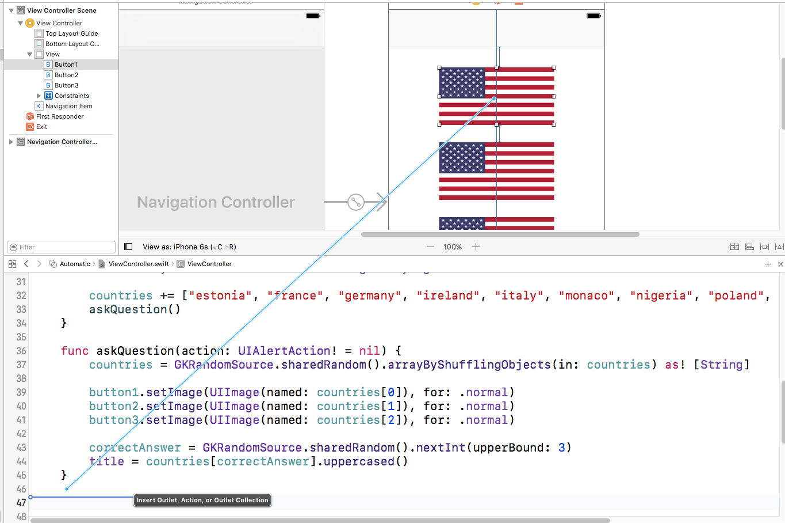
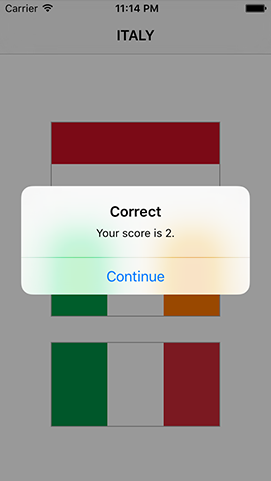

# Von outlets zu Aktionen: IBAction und String-Interpolation

Wie ich im letzten Abschnitt schon sagte, kehren wir zurück zum Interface Builder. Und zwar werden wir das Betätigen unserer `UIButtons` (deren `tap` Aktion) mit unserem Code verbinden. Wähle in der Übersicht Main.storyboard, wechsle in den Assistant Editor, damit wir sowohl den Code wie auch das Screen-Design sehen können.

**Wichtig:** Bitte lese den folgenden Abschnitt sehr sorgfältig durch. Mir passierten dabei in der Eile oft Fehler und vor denen will ich Dich bewahren!

Wähle den obersten Button aus, Ctrl+Dragge von dort in den Sourcecode direkt hinter den Block der Methode `askQuestion()`. Beim Überfahren des Codes erscheint der Text "Insert Outlet, Action, or Outlet Collection" und beim Loslassen sollte die Abfrage mit Auswahl kommen. Das kennen wir bereits, aber hier das Besondere: **wähle nicht “outlet”**

Genau, dort wo oben bisher "Connection: Outlet" steht, ändere es bitte ab in “Action”.
Wenn Du hier den Vorschlag Outlet beläßt (was mir leider oft in der Hast passiert ist) bekommst Du einen Haufen Probleme! Durch die Änderung auf Action ändert sich der Dialog etwas. Zwar werden wir immernoch nach einem Namen gefragt, aber nun für ein Event und das Feld Type wechselte von `UIButton` auf `Any`. Wähle bitte für den Type erneut `UIButton` und trage als Name ein: `buttonTapped`. Beende mit Klick auf Connect.

Und Xcode wird für Dich Folgendes einfügen:

    @IBAction func buttonTapped(_ sender: UIButton) {
    }

… und auch hier wieder: achte auf den grauen Punkt mit Kreis links vom Sourcecode – damit wird die Verbindung zum Interface Builder angezeigt.

Bevor wir uns ansehen was das macht, verbinde bitte auch die anderen Buttons. Allerdings erzeugen wir dieses Mal keine neue Methode, sondern verbinden die Buttons mit der eben erzeugten. Also wir wählen den Button jeweils an und verbinden ihn mit Ctrl+Drag mit der Methode `buttonTapped()` (statt in den Zwischenraum). Dabei wird die Methode bläulich hinterlegt um die Verbindung anzuzeigen. Wenn die Methode danach kurz aufblitzt können wir sicher sein, daß es geklappt hat.

Was haben wir nun? Wir haben eine neu erzeugte Methode namens `buttonTapped()`, die Xcode bereits mit allen drei `UIButton`s verbunden hat. Das `Event` (Ereignis) für diese Verknüpfung ist `TouchUpInside`, was bei iOS bedeutet: “Der Anwender hat die Fläche berührt und danach den Finger wieder innerhalb der Fläche angehoben” – also, “der Knopf wurde gedrückt”.

Und wie schon früher, hat Xcode ein Sourcecode Attribute am Zeilenanfang eingetragen um zu kennzeichnen, daß es eine Verbindung zum Interface Builder (IB) gibt: `@IBAction`. Das ist ähnlich zu `@IBOutlet`, arbeitet aber in der anderen Richtung. Mit `@IBOutlet` kann unser Code das Layout ansprechen, mit `@IBAction` kann das Layout Methoden im Code triggern/aufrufen.

Die neue Methode nimmt einen Parameter entgegen, den `sender` vom Typ `UIButton`. Das ist wichtig, weil die Methode von bisher drei unterschiedlichen Buttons aufrufbar ist und wir sie nur so unterscheiden können. Denn wir wollen ja entscheiden, ob richtig geraten wurde.

Aber wie entscheiden wir, ob der richtige Knopf gedrückt wurde? Derzeit sehen sie zwar alle gleich aus, aber unter der Haube hat jeder View eine spezielle, ihn identifizierende Nummer, die wir setzen können – genannt `Tag`. Das kann jede Nummer sein, die wir uns ausdenken: Also geben wir ihnen die Nummern 0, 1 und 2, die wir bereits im Code kennengelernt haben.

Da der Standardwert für das Tag eines Views immer 0 ist, können wir das beim oberen Button belassen. Wähle den mittleren Button und öffne mit Alt+Cmd+4 den Attribut-Inspektor. Im Feld `Tag` (vielleicht mußt Du scrollen, weil die Klasse `UIButton` sehr viele Properties hat) trage dort eine 1 ein.

Wiederhole das mit den unteren Button und trage dort eine 2 ein.

Für's Erste sind wir mit dem Interface Builder fertig, also wechsele bitte zurück zum Standard-Editor und wähle ViewController.swift in der Übersicht – nun tragen wir den fehlende Code für `buttonTapped()` nach.

Die Methode soll drei Dinge tun:

1. Prüfen, ob die Antwort richtig war.
2. Den Spielstand hoch- oder runterzählen.
3. Den neuen Spielstand anzeigen.

Die erste Aufgabe ist eher einfach. Wir haben uns ja die Nummer der richtigen Antwort in der Variable `correctAnswer` gemerkt. Also wenn der Tag des Buttons `sender.tag` derselbe ist, wurde richtig geraten.

Auch der Spielstand kann einfach angepaßt werden. Wir kennen ja bereits den Operator `+=` zum Addieren, nun lernen wir sein Gegenstück (den Abzieher) `-=` auch noch kennen.

Der dritte Teil ist schon aufwändiger. Vorweg – er führt einen neuen Datentyp ein, der ein Nachrichten-Fenster anzeigt mit einer Überschrift und dem aktuellen Spielstand.

Füge Folgendes in den Methoden-Block von `buttonTapped()`:

    var title: String

    if sender.tag == correctAnswer {
        title = "Correct"
        score += 1
    } else {
        title = "Wrong"
        score -= 1
    }

Dabei sind zwei Dinge für uns neu:

1. Wir verwenden den `==` Operator. Das ist der Gleichheits-Operator und er prüft, ob der linke Operand dem rechten entspricht. Bei Gleichheit wir `true` zurückgeben, sonst `false`. Hier vergleichen wir die `Tag`-Nummer des gedrückten Knopfes mit dem Wert in `correctAnswer` den wir uns in `askQuestion()` gemerkt hatten.
2. Neu ist auch das `else`. Wenn wir eine `if`-Abfrage verwenden, folgt ein Funktions-Block (eingerahmt von geschweiften Klammern), dessen Code ausgeführt wird, wenn die Abfrage ein `true` vorfand. Swift erlaubt uns aber auch einen Block für den anderen Fall (bei `false`) anzugeben, dann ergänzen wir das `if` um ein `else` mit einem weiteren Block. An dieser Stelle setzen wir die Überschrift unterschiedlich je nach Prüfung der Antwort.

Und nun folgt das Knifflige: Wir werden die für uns neue Klasse `UIAlertController()` verwenden. Die ist gedacht für Hinweise an den Anwender mit Antwortmöglichkeit(en). Damit das funktioniert, müssen wir zwei weitere Dinge lernen:

Zuerst die String-Interpolation (Wertauflösung in Zeichenketten). Dieses Feature von Swift läßt uns in Zeichenketten direkt auf den Wert von Konstanten oder Variablen verweisen. Diese Verweise werden dann während der Zuweisung durch den aktuellen Wert ersetzt. Derzeit haben wir den Spielstand in der Variablen `score` den wir wie folgt einfliessen lassen könnten: 

    let mytext = "Your score is \(score)."

Für einen Spielstand von 10 in `score` würde das bei der Zuweisung umgewandelt in "Your score is 10". Wir müssen nur einleiten mit `\(`, dann unseren Variablen/Konstanten-Namen anfügen und mit `)` abschliessen. Es gibt zwar noch viele Varianten davon, aber das führt hier zu weit.

Das nächste was hier benötigt wird, wird *Closure* genannt. Das ist eine besondere Art von Code-Block den wir wie eine Variable verwenden können. Swift verwaltet auch wirklich eine Kopie des binären Codes und der darin verwendeten Verweise auf Variablen etc. Deshalb müssen wir aufpassen wie wir es verwenden. Zukünftig werden wir solche Closures sehr oft verwenden, aber vorerst nehmen wir zwei Abkürzungen.

Soviel zu den Erklärungen – nun zum eigentlichen Code. Füge folgendes an das Ende von `buttonTapped()` über der schliessenden, geschweiften Klammer ein:

    let ac = UIAlertController(title: title, message: "Your score is \(score).", preferredStyle: .alert)
    ac.addAction(UIAlertAction(title: "Continue", style: .default, handler: askQuestion))
    present(ac, animated: true)

**Dieser Code wirft noch einen Fehler, was wir aber bald beheben werden.**

Die Variable `title` wurde im `if` auf entweder "correct" oder "wrong" gesetzt, und das mit der String-Interpolation habe ich weiter oben bereits erklärt. Dann bleibt noch der Wert `.alert` beim Parameter `preferredStyle` zu erläutern. Wir erinnern uns an die Erklärung zu `.normal` bei der UIButton-Methode `setImage()` – auch hier handelt es sich um einen `enum` Wert.(Enumeration/Aufzählungstyp)
Bei Views der Klasse `UIAlertController()` gibt es zwei Stil-Variationen: 
- `.alert` zeigt einen Meldedialog in der Bildschirmmitte, und
- `.actionSheet` schiebt den Dialog von unten ein.
Beide haben die gleiche Funktion, aber Apple empfiehlt `.alert` um Anwendern den Wechsel der Umstände anzuzeigen und `.actionSheet` für die Auswahl einer Wahlmöglichkeit.

Die zweite Zeile benutzt die Klasse `UIAlertAction` um dem Dialog eine Auswahl "Continue" mit dem Stil "default" hinzuzufügen. Es gibt drei mögliche Stile: `.default`, `.cancel`, und `.destructive`. Deren Aussehen wird nicht von uns, sondern von iOS bestimmt, aber durch ihre subtilen Unterschiede geben sie den Anwendern hilfreiche optische Hinweise, die wir sinnvoll und verantwortlich nutzen sollten.

Das Bedeutenste ist allerdings am Ende der Zeile: `handler: askQuestion`. Der Parameter `handler` nimmt eine *Closure* entgegen, also Code der ausgeführt werden kann/soll, sobald die Option gewählt wird. Hier können wir einen neuen Block einfügen, oder mittels `askQuestion` den Code aufrufen lassen, den wir mit `askQuestion()` bereits geschrieben haben.

**Warnung:** Hier müssen wir `askQuestion` und nicht `askQuestion()` angeben. Denn das Erste meint: “hier ist der Name der Funktion/Methode/Closure die ausgeführt werden soll”, aber das Zweite würde versuchen “rufe jetzt die Methode `askQuestion()` auf und verwende das Ergebnis als Code”, was nicht passt.

Closures können vielfältig verwendet werden. Hier einfach `askQuestion` anzugeben war zweckmäßig, wird uns aber einen Compilerfehler bescheren, den wir gleich beheben werden.

In der letzten Zeile rufen wir `present()` auf, das zwei Parameter benötigt: einen View Controller der angezeigt werden soll und ob das animiert geschehen soll. Es gibt auch einen optionalen dritten Parameter: Einen weitere Closure, die am Ende der Animation ausgeführt werden soll. Das brauchen wir aber hier nicht.

Wenn wir as nun compilieren wird wohl Xcode folgendes bemängeln: “Cannot convert value of type ‘() -> ()’ to expected argument type ‘((UIAlertAction) -> Void)?’.”
Das ist leider ein prachtvolles Beispiel der wenig hilfreichen Fehlermeldungen des Swift-Compilers. Was er *eigentlich* hätte sagen sollen ist: “Eine Methode zu übergeben war richtig, aber es sollte eine Methode sein, deren erster Parameter optional angibt, welche Aktion ausgeführt wurde.”

Um das zu beheben ändern wir den Aufruf unserer Methode `askQuestion()` um von:

    func askQuestion() {

… auf:

    func askQuestion(action: UIAlertAction!) {

Das behebt zwar den oben genannten Compiler-Fehler, aber es wirft ein Problem an der anderen Stellen auf, an der wir die Methode verwendet haben, innerhalb `viewDidLoad()`. Das können wir auf zwei Wegen lösen:

1.  Wenn wir `askQuestion()` in `viewDidLoad()` aufrufen, können wir dort `action: nil` angeben, was bedeutet: “es gibt hierzu keine `UIAlertAction`”
2.  Oder wir ergänzen `askQuestion()` so, daß der Parameter den Standardwert `nil` hat, was bedeutet: “wenn nichts angegeben wurde, verwende `nil`”.

Beide Lösungen sind gleichwertig und somit zeige ich sie beide. Für die erste Möglichkeit ändere bitte den Aufruf von `askQuestion()` in `viewDidLoad()` um in:

    askQuestion(action: nil)

Oder - wenn Du lieber die zweite Lösung möchtest, ändere die Methoden-Definition von `askQuestion()` um in:

    func askQuestion(action: UIAlertAction! = nil) {

Nun probiere die App im Simulator aus, denn sie ist fertig!

