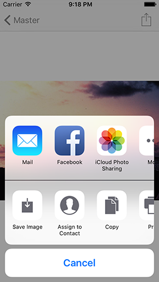

# UIActivityViewController erklärt

Beim Teilen von Dingen in iOS wird eine standardisierte, mächtige Komponente genutzt, die andere Apps auch verwenden können. Daher sollte diese deine erste Anlaufstelle sein, wenn du das Teilen zu deiner App hinzufügen möchtest. Diese Komponente heißt `UIActivityViewController`: du sagst ihr, welche Art von Daten du teilen möchtest, und sie kriegt alleine raus, wie man diese am besten teilt.  

Da wir mit Bildern arbeiten, wird `UIActivityViewController` uns automatisch die Funktionalität geben, per iMessage, Email, Twitter und Facebook zu teilen, außerdem noch das Abspeichern des Bildes in der Fotobibliothek, das Zuweisen zu einem Kontakt, das Drucken via AirPrint, und mehr. Er klinkt sich sogar in AirDrop und das Erweiterungssystem von iOS ein, damit andere Apps direkt Bilder von uns einlesen können. 

Das Beste ist, es braucht nur eine Handvoll Code-Zeilen, um das alles zum Laufen zu bringen. Aber before wir `UIActivityViewController` behandeln, müssen wir zunächst den Nutzern die Möglichkeit geben, das Teilen auszulösen, und wir werden das mit einem Bar Button Item machen. 

Wenn du dich erinnerst, verwendete Projekt 1 einen `UINavigationController`, damit Nutzer zwischen zwei Bildschirmen wechseln können. Standardmäßig hat `UINavigationController` einen Streifen ("Bar") entlang der Oberseite, der `UINavigationBar` heißt, und als Entwickler können wir Knöpfe zu dieser Navigation Bar hinzufügen, um unsere Methoden aufzurufen.

Lass uns nun einen dieser Knöpfe erzeugen. Mache zunächst eine Kopie des Ordners deines bestehenden Projekt 1 (das ganze Ding), und benenne ihn in Projekt 3 um. Öffne das Projekt jetzt in Xcode, öffne die Datei DetailViewController.swift, und finde die Methode `viewDidLoad()`. Füge dies direkt unterhalb der Zeile `title = ` hinzu:

    navigationItem.rightBarButtonItem = UIBarButtonItem(barButtonSystemItem: .action, target: self, action: #selector(shareTapped))

Du wirst damit im Moment eine Fehlermeldung erhalten, aber das ist OK; bitte lese weiter.

Das kann leicht in zwei Teile aufgespalten werden: auf der linken Seite weisen wir dem `rightBarButtonItem` des `navigationItem` unseres View Controllers etwas zu. Dieses Navigationselement wird von der Navigation Bar verwendet, um relevante Informationen anzuzeigen. In diesem Fall setzen wir das rechte Bar Button Item, das ist ein Knopf, der auf der rechten Seite der Navigation Bar erscheint, wenn dieser View Controller sichtbar wird.

Auf der rechten Seite erzeugen wir eine neue Instanz des Datentyps `UIBarButtonItem` und richten sie mit drei Parametern ein: ein Systemelement ("system item"), ein Ziel ("target") und eine Aktion. Das Systemelement spezifizieren wir als `.action`, aber du kannst auch `.` eintippen und dir von der Code-Vervollständigung sagen lassen, welche weiteren Optionen verfügbar sind. Das `.action`-Systemelement zeigt einen Pfeil, der aus einem Kasten herausragt, was dem Nutzer mitteilt, dass er damit etwas machen kann, wenn er darauf tippt.

Die Parameter `target` und `action` gehen Hand in Hand, da sie in Kombination dem `UIBarButtonItem` sagen, welche Methode aufgerufen werden soll. Der `action`-Parameter sagt "Wenn du angetippt wirst, rufe die Methode `shareTapped()` auf", und der Ziel-Parameter sagt dem Knopf, dass die Methode zum momentanen View Controller gehört - `self`.

Der Teil in `#selector` erfordert mehr Erklärungen, da er aus neuer und ungewöhnlicher Syntax besteht. Er sagt dem Swift-Compiler, dass es eine Methode namens "shareTapped" geben wird, die ausgelöst werden soll, wenn der Knopf angetippt wird. Swift wird das für dich überprüfen: wenn wir aus Versehen "shareTaped" schreiben würden - ohne das zweite P - würde sich Xcode weigern, die App zu bauen, bis der Schreibfehler behoben ist.

Wenn du das Aussehen der verschiedenen verfügbaren System Bar Button Elemente nicht magst, kannst du selbst eins mit eigenem Titel und Bild erstellen. Es ist allgemein vorzuziehen, wenn möglich die Systemelemente zu benutzen, da Nutzer schon wissen, was diese machen.  

Nachdem wir den Bar-Knopf erzeugt haben, ist es jetzt Zeit, die Methode `shareTapped()` zu erzeugen. Bist du bereit für diese riesige, komplizierte Menge Code? Hier kommt sie! Füge dies direkt nach der `viewWillDisappear()`-Methode ein:

    @objc func shareTapped() {
        let vc = UIActivityViewController(activityItems: [imageView.image!], applicationActivities: [])
        vc.popoverPresentationController?.barButtonItem = navigationItem.rightBarButtonItem
        present(vc, animated: true)
    }

Das war's. Mit diesen drei Code-Zeilen kann `shareTapped()` Fotos via AirDrop verschicken, auf Twitter posten, und viel mehr. Du musst schon zugeben, iOS kann manchmal ziemlich großartig sein!

Die vierte Zeile ist alt; we haben schon alles über `present()` in Projekt 2 gelernt. Allerdings sind die Zeilen 1, 2 und 3 neu, also lass mich erklären, was sie tun:

- Zeile 1 ist der Methoden-Name, der mit `@objc` markiert ist, da diese Methode vom darunter liegenden Objective-C Betriebssystem (dem `UIBarButtonItem`) aufgerufen wird, daher müssen wir sie als verfügbar für Objective-C Code markieren. Wenn du eine Methode mit Hilfe von `#selector` aufrufst, wirst du auch immer `@objc` verwenden müssen. 
- Zeile 2 erzeugt einen `UIActivityViewController`, was die iOS-Methode zum Teilen von Inhalten mit anderen Apps und Diensten darstellt.
- Zeile 3 sagt iOS, wo der Activity View Controller verankert sein soll - von wo aus er erscheinen soll.

Auf dem iPhone nutzen Activity View Controller automatisch den ganzen Bildschirm, aber auf dem iPad erscheinen sie als Popover, was es Nutzern erlaubt zu sehen, woran sie darunter arbeiten. Diese Code-Zeile sagt iOS, dass der Activity View Controller am rechten Bar Button Element verankert sein soll (unser Teilen-Knopf), aber das hat nur auf dem iPad einen Effekt - auf dem iPhone wird das ignoriert.

**Tipp**: Falls du dich das gefragt haben solltest, wenn du `@IBAction` verwendest, um von Storyboards aus Code aufzurufen, impliziert das automatisch `@objc` - Swift weiß, dass eine `IBAction` nur Sinn macht, wenn sie von Objective-C code aufgerufen werden kann. 

Lass uns nun anschauen, wie Activity View Controller erzeugt werden. Wie du im Code sehen kannst, übergibst du zwei Elemente: ein Array voller Elemente, die du teilen möchtest, und ein Array aus den Diensten deiner eigenen App, von denen du sicherstellen willst, dass sie auf der Liste sind. Wir übergeben als zweiten Parameter ein leeres Array, da unsere App keine Dienste anzubieten hat. Aber wenn du die App dahingehend erweitern würdest, um zum Beispiel so etwas wie "Andere Fotos wie dieses" zu unterstützen, dann würdest du diese Funktionalität hier unterbringen.

Der tatsächliche Fokus liegt also auf dem ersten Parameter: wir übergeben `[imageView.image!]`. Wenn du dich erinnerst, wird das Bild in einer `UIImageView` mit dem Namen `imageView` angezeigt, und `UIImageView` hat eine optionale Eigenschaft namens `image`, die ein `UIImage` enthält. Aber sie ist optional, das heißt es kann ein Bild geben oder eben nicht. `UIActivityViewController` möchte nichts wissen von "vielleicht ja, vielleicht nein", er will Fakten - er will ein reales Bild, nicht ein mögliches Bild.

Zum Glück wissen wir mit Sicherheit, dass unsere Image View ein Bild enthält, denn wir haben eins festgelegt! Tatsächlich ist es das, worum es bei diesem View Controller überhaupt geht. Daher benutzen wir `imageView.image!` mit dem Ausrufezeichen am Ende, um das Optional zwangsweise zu entpacken. Das wird dann in ein Array gepackt und an `UIActivityViewController` gesendet.

Und... das war's. Nein, wirklich. Wir sind so ziemlich fertig: unsere App unterstützt jetzt das Teilen.

Mach dir keine Sorgen, wenn du dir bezüglich `@objc` noch nicht sicher bist - wir werden noch öfter darauf zurückkommen. Das Wichtigste, das du dir merken solltest, ist, wenn Swift-Code eine Swift-Methode aufruft, muss diese Methode nicht mit `@objc` markiert werden. Wenn andererseits Objective-C Code eine Swift-Methode aufrufen muss - und das passiert zum Beispiel  jedes Mal, wenn sie von einer von Apples UI-Komponenten aufgerufen wird - dann *ist* das `@objc` Pflicht. 

## Einen kleinen Bug fixen

Es gibt da einen kleinen, aber wichtigen Bug im aktuellen Code: Wenn du "Bild speichern" innerhalb des Activity View Controllers auswählst, wird die App sofort abstürzen. Was hier passiert ist, dass unsere App versucht, auf die Fotobibliothek des Nutzers zuzugreifen, damit es das Bild dort ablegen kann, aber das lässt iOS nicht zu, solange der Nutzer nicht vorher die Erlaubnis dafür gegeben hat.

Um das zu reparieren, müssen wir die Datei Info.plist unseres Projekts bearbeiten. Wir haben diese bisher noch nicht angefasst, aber sie ist dafür gedacht, Konfigurationseinstellungen für unsere App zu speichern, die sich über die Zeit niemals verändern werden.

Wähle im Projekt-Navigator Info.plist aus, und wenn du dann eine große Tabelle voller Daten siehst, rechts-klicke in den weißen Raum darunter. Klicke auf "Add Row" (Zeile hinzufügen) in dem Menü, das dann erscheint, und du solltest eine neue Liste von Optionen sehen, die mit "Application Category" beginnt.

Ich möchte nun, dass du durch diese Liste scrollst, bis du den Namen "Privacy - Photo Library Additions Usage Description" (Privatsphäre - Nutzungsbeschreibung für Zugänge zur Fotobibliothek) findest. Das ist es, was dem Nutzer angezeigt wird, wenn die App etwas zur Fotobibliothek hinzufügen muss. 

Wenn du “Privacy - Photo Library Additions Usage Description”  auswählst, siehst du, dass rechts davon der Eintrag "String" erscheint, und rechts von "String" wird leerer weißer Raum sein. In diesen weißen Raum kannst du einen Text eintippen, der dem Nutzer angezeigt wird, um zu erklären, was deine App mit der Fotobibliothek vorhat.

In dieser App müssen wir nur Bilder abspeichern, schreibe daher diesen Text in den Kasten: "Wir müssen Fotos abspeichern, die du magst."

Versuch nun, die App erneut laufen zu lassen, und dieses Mal wird nach dem Auswählen von "Bild speichern" eine Nachricht angezeigt, die den Nutzer fragt, ob es OK ist, dass die App in deren Fotos schreiben darf - viel besser!
