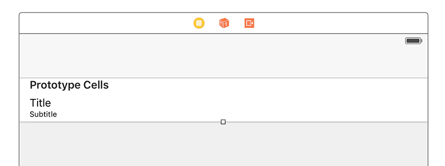
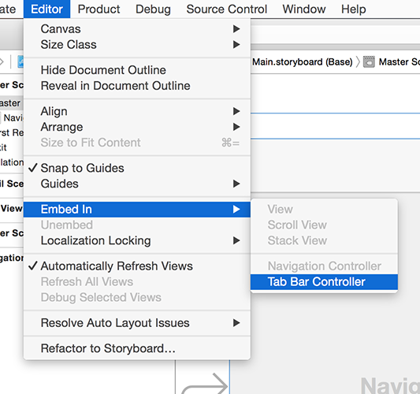

# Das grundlegende UI erstellen: UITabBarController

Wir haben `UINavigationController` bereits in früheren Projekten verwendet, um das Herzstück einer Benutzeroberfläche bereit zu stellen, welches uns steuern lässt, welcher Bildschirm gerade sichtbar ist. Eine andere fundamentale UI-Komponente ist die Tab Bar, die du in Apps wie dem App Store, Musik und Photos sehen kannst - sie lässt Nutzer steuern, welchen Bildschirm sie sehen wollen, indem sie darauf tippen, was sie interessiert.

Unsere aktuelle App hat einen einzigen, leeren View Controller, aber wir werden sie mit einem Table View Controller, einem Navigation Controller und einem Tab Bar Controller aufpeppen, damit du sehen kannst, wie all diese zusammen arbeiten.

Du solltest die Übung mittlerweile kennen, zumindest zum Teil. Öffne ViewController.swift und ändere `ViewController` so, dass er von `UITableViewController` erbt anstatt von `UIViewController`. Das heißt, ändere diese Zeile:

    class ViewController: UIViewController {

… in diese:

    class ViewController: UITableViewController {

Öffne nun Main.storyboard, lösche den bestehenden View Controller und ziehe einen Table View Controller an seine Stelle. Benutze den Identität-Inspektor, um seine Klasse in "ViewController" zu ändern, dann vergiss nicht, das Kästchen für "Is Initial View Controller" zu markieren. 

Wähle seine Prototypen-Zelle aus und nutze den Attribute-Inspektor, um ihr den Bezeichner "Cell" zu geben. Während du dabei bist, ändere Accessory in "Disclosure Indicator"; dies ist ein großartiger UI-Hinweis, und er ist perfekt für dieses Projekt. In diesem Projekt werden wir außerdem den Stil der Zelle ändern - das ist der erste Eintrag im Attribute-Inspektor. Er ist standardmäßig "Default", aber ich bitte dich, ihn zu "Subtitle" zu ändern, damit jede Zeile ein Haupt-Titel-Label und ein Untertitel-Label hat.

Now for the interesting part: we need to wrap this view controller inside two other things. Go to Editor > Embed In > Navigation Controller, and then straight away go to Editor > Embed In > Tab Bar Controller. The navigation controller adds a gray bar at the top called a navigation bar, and the tab bar controller adds a gray bar at the bottom called a tab bar. Hit Cmd+R now to see them both in action.

Behind the scenes, `UITabBarController` manages an array of view controllers that the user can choose between. You can often do most of the work inside Interface Builder, but not in this project. We're going to use one tab to show recent petitions, and another to show popular petitions, which is the same thing really – all that's changing is the data source.

Doing everything inside the storyboard would mean duplicating our view controllers, which is A Bad Idea, so instead we're just going to design one of them in the storyboard then create a duplicate of it using code.

Now that our navigation controller is inside a tab bar controller, it will have acquired a gray strip along its bottom in Interface Builder. If you click that now, it will select a new type of object called a `UITabBarItem`, which is the icon and text used to represent a view controller in the tab bar. In the attributes inspector (Alt+Cmd+4) change System Item from "Custom" to "Most Recent".

One important thing about `UITabBarItem` is that when you set its system item, it assigns both an icon and some text for the title of the tab. If you try to change the text to your own text, the icon will be removed and you need to provide your own. This is because Apple has trained users to associate certain icons with certain information, and they don't want you using those icons incorrectly!

Select the navigation controller itself (just click where it says Navigation Controller in big letters in the center of the view controller), then press Alt+Cmd+3 to select the identity inspector. We haven't been here before, because it's not used that frequently. However, here I want you to type "NavController" in the text box to the right of where it says "Storyboard ID". We'll be needing that soon!

In the picture below you can see how the identity inspector should look when configured for your navigation controller. You'll be using this inspector in later projects to give views a custom class by changing the first of these four text boxes.

We're done with Interface Builder, so please open the file ViewController.swift so we can make the usual changes to get us a working table view.

First, add this property to the `ViewController` class:

    var petitions = [String]()

That will hold our petitions. We won’t be using strings in the final project – in fact we’ll change that in the next chapter – but it’s good enough for now.

Now add this `numberOfRowsInSection` method:

    override func tableView(_ tableView: UITableView, numberOfRowsInSection section: Int) -> Int {
        return petitions.count
    }

We also need to add a `cellForRowAt` method, but this time it’s going to be a bit different: we’re going to set some dummy `textLabel.text` like before, but we’re also going to set `detailTextLabel.text` – that’s the subtitle in our cell. It’s called “detail text label” rather than “subtitle” because there are other styles available, for example one where the detail text is on the right of the main text.
  
Add this method now:

    override func tableView(_ tableView: UITableView, cellForRowAt indexPath: IndexPath) -> UITableViewCell {
        let cell = tableView.dequeueReusableCell(withIdentifier: "Cell", for: indexPath)
        cell.textLabel?.text = "Title goes here"
        cell.detailTextLabel?.text = "Subtitle goes here"
        return cell
    }

Step one is now complete: we have a basic user interface in place, and are ready to proceed with some real code…
