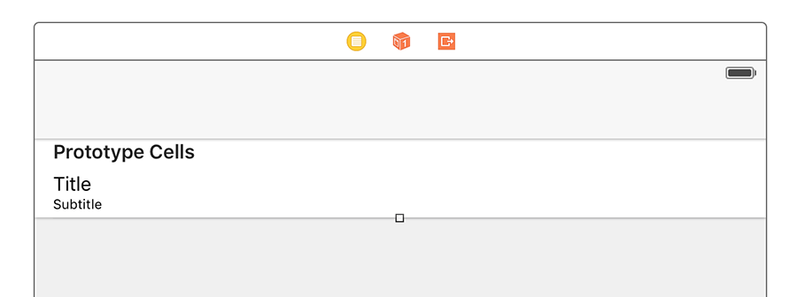
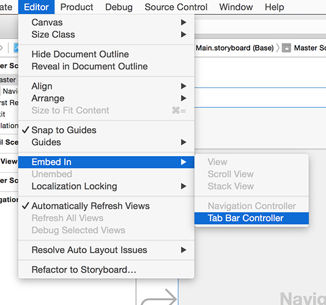

# Die grundlegende UI erstellen: UITabBarController

Wir haben `UINavigationController` bereits in früheren Projekten verwendet, um das Herzstück einer Benutzeroberfläche bereit zu stellen, welches uns steuern lässt, welcher Bildschirm gerade sichtbar ist. Eine andere fundamentale UI-Komponente ist die Tab Bar, die du in Apps wie dem App Store, Musik und Photos sehen kannst - sie lässt Nutzer steuern, welchen Bildschirm sie sehen wollen, indem sie darauf tippen, was sie interessiert.

Unsere aktuelle App hat einen einzigen, leeren View Controller, aber wir werden sie mit einem Table View Controller, einem Navigation Controller und einem Tab Bar Controller aufpeppen, damit du sehen kannst, wie all diese zusammen arbeiten.

Du solltest die Übung mittlerweile kennen, zumindest zum Teil. Öffne ViewController.swift und ändere `ViewController` so, dass er von `UITableViewController` erbt anstatt von `UIViewController`. Das heißt, ändere diese Zeile:

    class ViewController: UIViewController {

… in diese:

    class ViewController: UITableViewController {

Öffne nun Main.storyboard, lösche den bestehenden View Controller und ziehe einen Table View Controller an seine Stelle. Benutze den Identität-Inspektor, um seine Klasse in "ViewController" zu ändern, dann vergiss nicht, das Kästchen bei "Is Initial View Controller" anzukreuzen. 

Wähle seine Prototypen-Zelle aus und nutze den Attribute-Inspektor, um ihr den Bezeichner "Cell" zu geben. Während du dabei bist, ändere Accessory in "Disclosure Indicator"; dies ist ein großartiger UI-Hinweis, und er ist perfekt für dieses Projekt. In diesem Projekt werden wir außerdem den Stil der Zelle ändern - das ist der erste Eintrag im Attribute-Inspektor. Er ist standardmäßig "Default", aber ich bitte dich, ihn zu "Subtitle" zu ändern, damit jede Zeile ein Haupt-Titel-Label und ein Untertitel-Label hat.

Jetzt der interessante Teil: Wir müssen den View Controller in zwei anderen Dingen verpacken. Gehe zu Editor > Embed In > Navigation Controller, und dann direkt zu Editor > Embed In > Tab Bar Controller. Der Navigation Controller fügt open einen Navigation Bar genannten grauen Balken hinzu, und der Tab Bar Controller fügt unten einen Tab Bar genannten grauen Balken hinzu. Drücke nun  Cmd+R, um beide in Aktion zu sehen.

Hinter den Kulissen verwaltet `UITabBarController` ein Array von View Controllern, aus denen der Nutzer wählen kann. Oft kannst du die meiste Arbeit im Interface Builder erledigen, aber nicht in diesem Projekt. Wir werden ein Tab nutzen, um neueste Petitionen zu zeigen, und ein anderes, um beliebte Petitionen zu zeigen, was im Grund das gleiche ist - das einzige was sich ändert, ist die Datenquelle.

Alles in einem Storyboard zu machen würde bedeuten, unsere View Controller zu duplizieren, was eine schlechte Idee ist, daher werden wir stattdessen nur einen von ihnen im Storyboard entwerfen und dann mit Hilfe von Code ein Duplikat davon erstellen.

Jetzt da unser Navigation Controller innerhalb eines Tab Bar Controllers ist, wird er im Interface Builder einen grauen Streifen entlang der Unterkante dazu gewonnen haben. Wenn du nun darauf klickst, wird ein neuer Objekttyp namens `UITabBarItem` ausgewählt, welches das Symbol und den Text enthält, um einen View Controller in der Tab Bar zu repräsentieren. Ändere im Attribute-Inspektor (Alt+Cmd+4) das System Item von "Custom" zu "Most Recent" (das bedeutet "kürzlich").

Eine wichtige Sache beim `UITabBarItem` ist, dass wenn du sein System Item festlegst, sowohl ein Symbol als auch ein Text für den Titel des Tabs zugewiesen werden. Wenn du versuchst, den Text mit eigenem Text zu ersetzen, wird das Symbol entfernt und du musst dein eigenes bereit stellen. Das kommt daher, dass Apple die Nutzer daran gewöhnt hat, bestimmte Symbole mit bestimmten Informationen zu assoziieren, und sie wollen nicht, dass du diese Symbole unsachgemäß verwendest!

Wählen den Navigation Controller aus (klicke einfach dorthin, wo Navigation Controller in großen Buchstaben in der Mitte des View Controller steht), dann drücke Alt+Cmd+3, um den Identität-Inspektor auszuwählen. Hier waren wir noch nicht, da dieser nicht so häufig benutzt wird. Dennoch tippe bitte "NavController" in das Textfeld rechts der Beschriftung "Storyboard ID". Wir werden das bald brauchen!

In dem untenstehenden Bild kannst du sehen, wie der Identität-Inspektor aussehen sollte, wenn er für deinen Navigation Controller konfiguriert ist. Du wirst diesen Inspektor in zukünftigen Projekten nutzen, um Views eine individuelle Klasse zu geben, indem du die erste der vier Textfelder änderst.

Wir sind mit dem Interface Builder fertig, also öffne bitte die Datei ViewController.swift, damit wir die üblichen Änderungen vornehmen können, um eine lauffähige Table View zu bekommen.

Füge zunächst diese Eigenschaft zur Klasse `ViewController` hinzu:

    var petitions = [String]()

Diese wird unsere Petitionen speichern. Im fertigen Projekt werden wir keine Strings verwenden - tatsächlich werden wir das im nächsten Kapitel ändern - aber für den Moment ist das gut genug.

Füge nun diese Methode, `numberOfRowsInSection`, hinzu:

    override func tableView(_ tableView: UITableView, numberOfRowsInSection section: Int) -> Int {
        return petitions.count
    }

Wir müssen auch die Methode `cellForRowAt` hinzufügen, aber diesmal wird es ein bisschen anders ablaufen: wir legen einen Platzhalter-Text für `textLabel.text` fest wie bisher, aber wir spezifizieren auch `detailTextLabel.text` - das ist der Untertitel in unserer Zelle. Es heißt "Detail Text Label" statt "Subtitle" ("Untertitel"), da auch noch andere Stile verfügbar sind, zum Beispiel einer bei dem der Detail-Text rechts des Haupt-Textes steht.

Füge nun diese Methode hinzu:

    override func tableView(_ tableView: UITableView, cellForRowAt indexPath: IndexPath) -> UITableViewCell {
        let cell = tableView.dequeueReusableCell(withIdentifier: "Cell", for: indexPath)
        cell.textLabel?.text = "Title goes here"
        cell.detailTextLabel?.text = "Subtitle goes here"
        return cell
    }

Damit ist der erste Schritt abgeschlosen: wir haben eine grundlegende Benutzeroberfläche parat und sind bereit, um mit etwas richtigem Code weiter zu machen...
