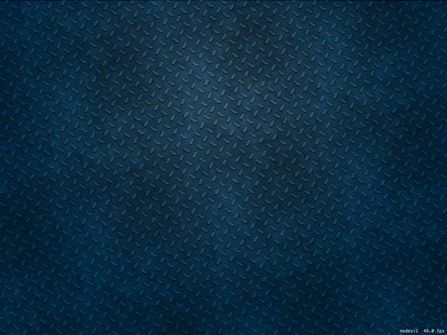

# Falling boxes: SKSpriteNode, UITouch, SKPhysicsBody

<!-- YOUTUBE: f1Bf1ORCLb4 -->

The first thing you should do is run your game and see what a default SpriteKit template game looks like. You should see a large gray window saying "Hello, World!", and when you tap two spinning boxes should appear. In the bottom right is a node count (how many things are on screen right now) and a frame rate. You're aiming for 60 frames per second all the time, if possible.

From the project navigator please find and open GameScene.swift, and replace its entire contents with this:

    import SpriteKit

    class GameScene: SKScene {
        override func didMove(to view: SKView) {
        }
        
        override func touchesBegan(_ touches: Set<UITouch>, with event: UIEvent?) {
        }
    }

That removes almost all the code, because it’s just not needed. 

SpriteKit’s equivalent of Interface Builder is called the Scene Editor, and it’s where that big “Hello World” label is. Select GameScene.sks to open the scene editor now, then click on the “Hello World” label and delete it.

While you’re in the scene editor, there’s one more change I’d like to make, and it will help simplify our positioning slightly. With the scene selected, look in the attributes inspector (note: its icon is different here!) for Anchor Point. This determines what coordinates SpriteKit uses to position children and it’s X:0.5 Y:0.5 by default.

This is *different* to UIKit: it means “position me based on my center”, whereas UIKit positions things based on their top-left corner. This is usually fine, but when working with the main scene it’s easiest to set this value to X:0 Y:0. So, please make that change now – anchor point should 0 for both X and Y.

**Note:** SpriteKit considers Y:0 to be the bottom of the screen whereas UIKit considers it to be the top – hurray for uniformity!

I’d also like you to change the size of the scene, which is just above the anchor point. This is probably 750x1334 by default; please change it to 1024x768 to match iPad landscape size.

**Tip:** The 9.7-inch iPad is 1024 points wide and 768 high, but the 10.5-inch and 12.9-inch are both larger. Helpfully, SpriteKit takes care of this for us: we just asked for a 1024x768 canvas and it will give us one regardless of what device our game runs on – nice!

The last change I’d like you to make is to select Actions.sks and tap your backspace button to delete it – select “Move to Trash” when Xcode asks you what you want to do.

All these changes have effectively cleaned the project, resetting it back to a vanilla state that we can build on.

With the template stuff deleted, I'd like you to import the assets for the project. If you haven't already downloaded the code for this project, please do so now. You should copy the entire Content folder from the example project into your own, making sure the "Copy items if needed" box is checked.

Let's kick off this project by ditching the plain background and replacing it with a picture. If you want to place an image in your game, the class to use is called `SKSpriteNode`, and it can load any picture from your app bundle just like `UIImage`.

To place a background image, we need to load the file called background.jpg, then position it in the center of the screen. Remember, unlike UIKit SpriteKit positions things based on their center – i.e., the point 0,0 refers to the horizontal and vertical center of a node. And also unlike UIKit, SpriteKit's Y axis starts at the bottom edge, so a higher Y number places a node higher on the screen. So, to place the background image in the center of a landscape iPad, we need to place it at the position X:512, Y:384.

We're going to do two more things, both of which are only needed for this background. First, we're going to give it the blend mode `.replace`. Blend modes determine how a node is drawn, and SpriteKit gives you many options. The `.replace` option means "just draw it, ignoring any alpha values," which makes it fast for things without gaps such as our background. We're also going to give the background a `zPosition` of -1, which in our game means "draw this behind everything else."

To add any node to the current screen, you use the `addChild()` method. As you might expect, SpriteKit doesn't use `UIViewController` like our UIKit apps have done. Yes, there is a view controller in your project, but it's there to host your SpriteKit game. The equivalent of screens in SpriteKit are called *scenes*.

When you add a node to your scene, it becomes part of the node tree. Using `addChild()` you can add nodes to other nodes to make a more complicated tree, but in this game we're going to keep it simple.

Add this code to the `didMove(to:)` method, which is sort of the equivalent of SpriteKit's `viewDidLoad()` method:

    let background = SKSpriteNode(imageNamed: "background.jpg")
    background.position = CGPoint(x: 512, y: 384)
    background.blendMode = .replace
    background.zPosition = -1
    addChild(background)

If you run the app now you'll see a dark blue image for the background rather than plain gray – hardly a massive improvement, but this is just the beginning.

Let's do something a bit more interesting, so add this to the `touchesBegan()` method:

    if let touch = touches.first {
        let location = touch.location(in: self)
        let box = SKSpriteNode(color: UIColor.red, size: CGSize(width: 64, height: 64))
        box.position = location
        addChild(box)
    }

We haven't used `touchesBegan()` before, so the first two lines needs to be explained. This method gets called (in UIKit and SpriteKit) whenever someone starts touching their device. It's possible they started touching with multiple fingers at the same time, so we get passed a new data type called `Set`. This is just like an array, except each object can appear only once.

We want to know where the screen was touched, so we use a conditional typecast plus `if let` to pull out any of the screen touches from the `touches` set, then use its `location(in:)` method to find out where the screen was touched in relation to `self` - i.e., the game scene. `UITouch` is a UIKit class that is also used in SpriteKit, and provides information about a touch such as its position and when it happened.

The third line is also new, but it's still `SKSpriteNode`. We're just writing some example code for now, so this line generates a node filled with a color (red) at a size (64x64). The `CGSize` struct is new, but also simple: it just holds a width and a height in a single structure.

The code sets the new box's position to be where the tap happened, then adds it to the scene. No more talk: press Cmd+R to make sure this all works, then tap around the screen to make boxes appear.

OK, I admit: that's still quite boring. Let's make it even more interesting – are you ready to see quite how powerful SpriteKit is? Just before setting the position of our new box, add this line:

    box.physicsBody = SKPhysicsBody(rectangleOf: CGSize(width: 64, height: 64))

And just before the end of `didMove(to:)`, add this:

    physicsBody = SKPhysicsBody(edgeLoopFrom: frame)

The first line of code adds a physics body to the box that is a rectangle of the same size as the box. The second line of code adds a physics body to the whole scene that is a line on each edge, effectively acting like a container for the scene.

If you run the scene now, I hope you can't help but be impressed: you can tap on the screen to create boxes, but now they'll fall to the ground and bounce off. They'll also stack up as you tap more often, and fall over realistically if your aim isn't spot on.

This is the power of SpriteKit: it's so fast and easy to make games that there really is nothing holding you back. But we're just getting warmed up!
