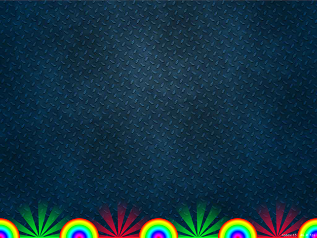

# Spinning slots: SKAction

<!-- YOUTUBE: 7t9Vy529unw -->

The purpose of the game will be to drop your balls in such a way that they land in good slots and not bad ones. We have bouncers in place, but we need to fill the gaps between them with something so the player knows where to aim.

We'll be filling the gaps with two types of target slots: good ones (colored green) and bad ones (colored red). As with bouncers, we'll need to place a few of these, which means we need to make a method. This needs to load the slot base graphic, position it where we said, then add it to the scene, like this:

    func makeSlot(at position: CGPoint, isGood: Bool) {
        var slotBase: SKSpriteNode

        if isGood {
            slotBase = SKSpriteNode(imageNamed: "slotBaseGood")
        } else {
            slotBase = SKSpriteNode(imageNamed: "slotBaseBad")
        }

        slotBase.position = position
        addChild(slotBase)
    }

Unlike `makeBouncer(at:)`, this method has a second parameter – whether the slot is good or not – and that affects which image gets loaded. But first, we need to call the new method, so add these lines just before the calls to `makeBouncer(at:)` in `didMove(to:)`:

    makeSlot(at: CGPoint(x: 128, y: 0), isGood: true)
    makeSlot(at: CGPoint(x: 384, y: 0), isGood: false)
    makeSlot(at: CGPoint(x: 640, y: 0), isGood: true)
    makeSlot(at: CGPoint(x: 896, y: 0), isGood: false)

The X positions are exactly between the bouncers, so if you run the game now you'll see bouncer / slot / bouncer / slot and so on.

One of the obvious-but-nice things about using methods to create the bouncers and slots is that if we want to change the way slots look we only need to change it in one place. For example, we can make the slot colors look more obvious by adding a glow image behind them:

    func makeSlot(at position: CGPoint, isGood: Bool) {
        var slotBase: SKSpriteNode
        var slotGlow: SKSpriteNode

        if isGood {
            slotBase = SKSpriteNode(imageNamed: "slotBaseGood")
            slotGlow = SKSpriteNode(imageNamed: "slotGlowGood")
        } else {
            slotBase = SKSpriteNode(imageNamed: "slotBaseBad")
            slotGlow = SKSpriteNode(imageNamed: "slotGlowBad")
        }

        slotBase.position = position
        slotGlow.position = position

        addChild(slotBase)
        addChild(slotGlow)
    }

That basically doubles every line of code, changing "Base" to "Glow", but the end result is quite pleasing and it's clear now which slots are good and which are bad.

We could even make the slots spin slowly by using a new class called `SKAction`. SpriteKit actions are ridiculously powerful and we're going to do some great things with them in later projects, but for now we just want the glow to rotate very gently.

Before we look at the code to make this happen, you need to learn a few things up front:

- Angles are specified in radians, not degrees. This is true in UIKit too. 360 degrees is equal to the value of 2 x Pi – that is, the mathematical value π. Therefore π radians is equal to 180 degrees.
- Rather than have you try to memorize it, there is a built-in value of π called `CGFloat.pi`.
- Yes `CGFloat` is yet another way of representing decimal numbers, just like `Double` and `Float`. Behind the scenes, `CGFloat` can be either a `Double` or a `Float` depending on the device your code runs on. Swift also has `Double.pi` and `Float.pi` for when you need it at different precisions.
- When you create an action it will execute once. If you want it to run forever, you create another action to wrap the first using the `repeatForever()` method, then run that.

Our new code will rotate the node by 180 degrees (available as the constant `CGFloat.pi` or just `.pi`) over 10 seconds, repeating forever. Put this code just before the end of the `makeSlot(at:)` method:

    let spin = SKAction.rotate(byAngle: .pi, duration: 10)
    let spinForever = SKAction.repeatForever(spin)
    slotGlow.run(spinForever)

If you run the game now, you'll see that the glow spins around very gently. It's a simple effect, but it makes a big difference.

