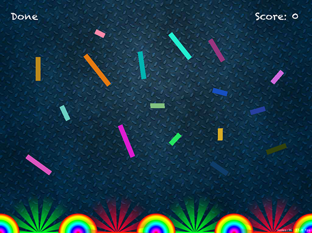

# Scores on the board: SKLabelNode

<!-- YOUTUBE: kSMS0h9qR7s -->

To make a score show on the screen we need to do two things: create a score integer that tracks the value itself, then create a new node type, `SKLabelNode`, that displays the value to players.

The `SKLabelNode` class is somewhat similar to `UILabel` in that it has a `text` property, a font, a position, an alignment, and so on. Plus we can use Swift's string interpolation to set the text of the label easily, and we're even going to use the property observers you learned about in project 8 to make the label update itself when the score value changes.

Declare these properties at the top of your class:

    var scoreLabel: SKLabelNode!

    var score = 0 {
        didSet {
            scoreLabel.text = "Score: \(score)"
        }
    }

We're going to use the Chalkduster font, then align the label to the right and position it on the top-right edge of the scene. Put this code into your `didMove(to:)` method, just before the end:

    scoreLabel = SKLabelNode(fontNamed: "Chalkduster")
    scoreLabel.text = "Score: 0"
    scoreLabel.horizontalAlignmentMode = .right
    scoreLabel.position = CGPoint(x: 980, y: 700)
    addChild(scoreLabel)

That places the label into the scene, and the property observer automatically updates the label as the `score` value changes. But it's not complete yet because we don't ever modify the player's score. Fortunately, we already have places in the `collisionBetween()` method where we can do exactly that, so modify the method to this:

    func collisionBetween(ball: SKNode, object: SKNode) {
        if object.name == "good" {
            destroy(ball: ball)
            score += 1
        } else if object.name == "bad" {
            destroy(ball: ball)
            score -= 1
        }
    }

The `+=` and `-=` operators add or subtract one to the variable depending on whether a good or bad slot was struck. When we change the variable, the property observer will spot the change and update the label.

We have a score, so that means players have the achievement they were craving, right? Well, no. Clearly all it takes to get a number even higher than Gangnam Style's YouTube views is to sit and tap at the top of the screen directly above a green slot.

Let's add some actual challenge: we're going to let you place obstacles between the top of the scene and the slots at the bottom, so that players have to position their balls exactly correctly to bounce off things in the right ways.

To make this work, we're going to add two more properties. The first one will hold a label that says either "Edit" or "Done", and one to hold a boolean that tracks whether we're in editing mode or not. Add these two alongside the score properties from earlier:

    var editLabel: SKLabelNode!

    var editingMode: Bool = false {
        didSet {
            if editingMode {
                editLabel.text = "Done"
            } else {
                editLabel.text = "Edit"
            }
        }
    }

Then add this to `didMove(to:)` to create the edit label in the top-left corner of the scene:

    editLabel = SKLabelNode(fontNamed: "Chalkduster")
    editLabel.text = "Edit"
    editLabel.position = CGPoint(x: 80, y: 700)
    addChild(editLabel)

That's pretty much identical to creating the score label, so nothing to see here. We're using a property observer again to automatically change the editing label's text when edit mode is changed.

But what *is* new is detecting whether the user tapped the edit/done button or is trying to create a ball. To make this work, we're going to ask SpriteKit to give us a list of all the nodes at the point that was tapped, and check whether it contains our edit label. If it does, we'll flip the value of our `editingMode` boolean; if it doesn't, we want to execute the previous ball-creation code.

We're going to insert this change just after `let location =` and before `let ball =`, i.e. right here:

    let location = touch.location(in: self)
    // new code to go here!
    let ball = SKSpriteNode(imageNamed: "ballRed")

Change that to be:

    let location = touch.location(in: self)

    let objects = nodes(at: location)

    if objects.contains(editLabel) {
        editingMode.toggle()
    } else {
        let ball = SKSpriteNode(imageNamed: "ballRed")
        // rest of ball code
    }

Did you notice I slipped in a small but important new method there? `editingMode.toggle()` changes `editingMode` to true if it’s currently false, and to false if it was true. We could have written `editingMode = !editingMode` there and it would do the same thing, but `toggle()` is both shorter and clearer.

Obviously the `// rest of ball code` comment is where the rest of the ball-creating code goes, but note that you need to add the new closing brace after you've created the ball, to close the `else` block.

This uses the `!` operator that you met in project 5 to mean "set `editingMode` to be the opposite of whatever it is right now." That change will be picked up by the property observer, and the label will be updated to reflect the change.

Now that we have a boolean telling us whether we're in editing mode or not, we're going to extend `touchesBegan()` even further so that if we're in editing mode we add blocks to the screen of random sizes, and if we're not it drops a ball.

To get the structure right, this is what you want to have:

    if objects.contains(editLabel) {
        editingMode.toggle()
    } else {
        if editingMode {
            // create a box
        } else {
            // create a ball
        }
    }

The `// create a ball` comment is where your current ball creation code goes. The `// create a box` comment is what we're going to write in just a moment.

First, we're going to use a new property on nodes called `zRotation`. When creating the background image, we gave it a Z position, which adjusts its depth on the screen, front to back. If you imagine sticking a skewer through the Z position – i.e., going directly into your screen – and through a node, then you can imagine Z rotation: it rotates a node on the screen as if it had been skewered straight through the screen.

To create randomness we’re going to be using both `Int.random(in:)` for integer values and `CGFloat.random(in:)` for `CGFloat` values, with the latter being used to create random red, green, and blue values for a `UIColor`. So, replace the `// create a box` comment with this:

    let size = CGSize(width: Int.random(in: 16...128), height: 16)
    let box = SKSpriteNode(color: UIColor(red: CGFloat.random(in: 0...1), green: CGFloat.random(in: 0...1), blue: CGFloat.random(in: 0...1), alpha: 1), size: size)
    box.zRotation = CGFloat.random(in: 0...3)
    box.position = location

    box.physicsBody = SKPhysicsBody(rectangleOf: box.size)
    box.physicsBody?.isDynamic = false

    addChild(box)

So, we create a size with a height of 16 and a width between 16 and 128, then create an `SKSpriteNode` with the random size we made along with a random color, then give the new box a random rotation and place it at the location that was tapped on the screen. For a physics body, it's just a rectangle, but we need to make it non-dynamic so the boxes don't move when hit.

At this point, we almost have a game: you can tap Edit, place as many blocks as you want, then tap Done and try to score by dropping balls. It's not perfect because we don't force the Y position of new balls to be the top of the screen, but that's something you can fix yourself – how else would you learn, right?

