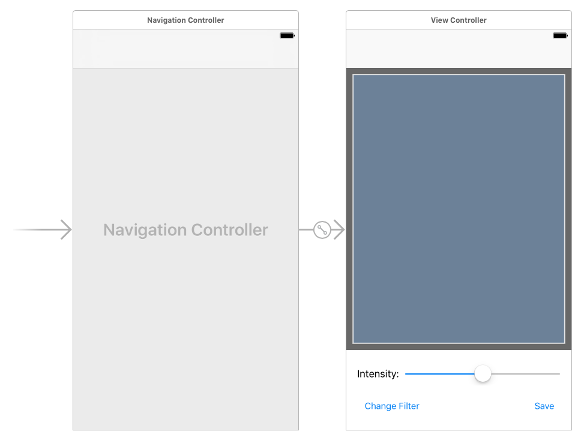
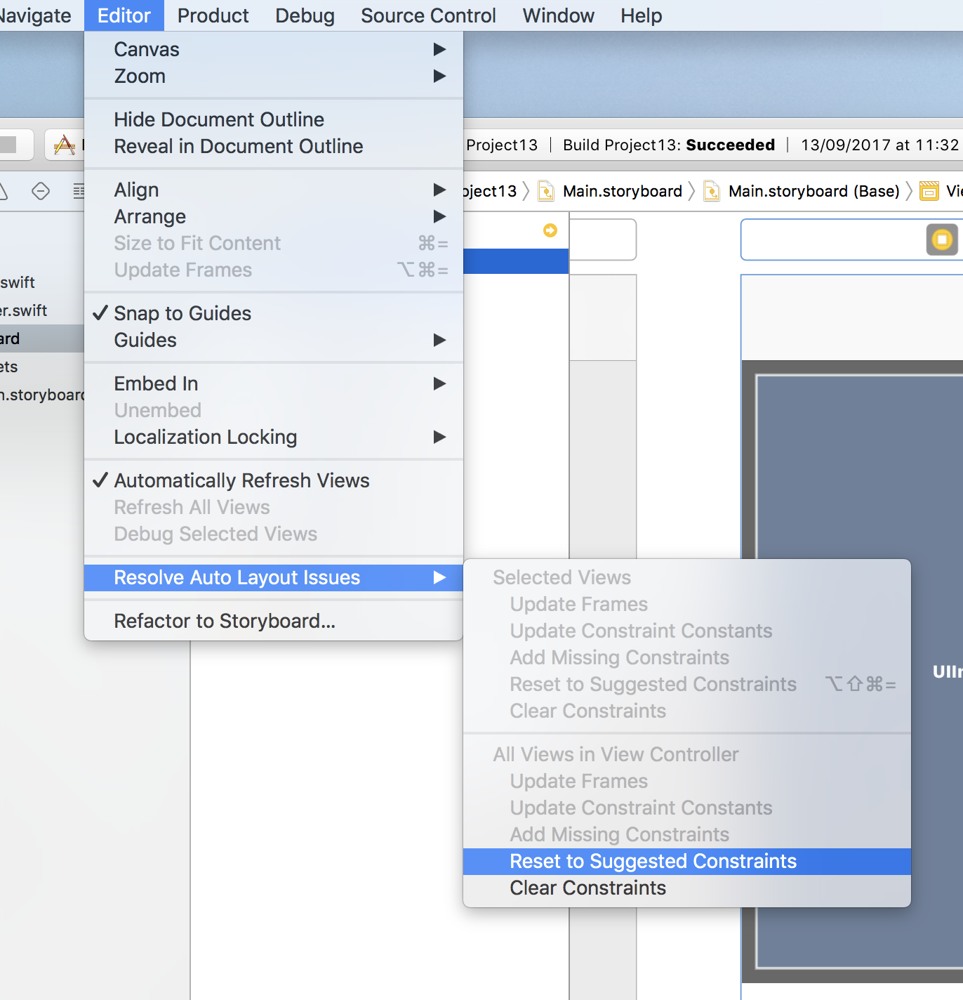

# Designing the interface

<!-- YOUTUBE: tT-hyQeUDNk -->

Select your Main.storyboard file to open Interface Builder, then embed the view controller inside a navigation controller.

Bring up the object library, then search for "UIView" and drag a view into your controller – this is a regular view, not a view controller or a storyboard reference. If Interface Builder is already using the iPhone 8 sizing, give the new view a width of 375 and height of 470, with X:0 and Y:64. If you’re not sure, look for the words “View as: iPhone 8” at the bottom of Interface Builder – if you see something else, click it and select iPhone 8 and Portrait.

All being well, using 375x470 and X:0 Y:64 should place the view just below the navigation controller, occupying most of the screen. In the attributes inspector, give the view the background color "Dark Gray Color".

Create an image view, and place it inside the view you just created. I'd like you to indent it by 10 points on every side – i.e., width 355, height 450, X:10, Y:10. Change the image's view mode from "Scale to fill" to "Aspect Fit". Don't place any more views inside the gray view – everything else should be placed directly on the main (white) view.

That's the top part of the UI complete. For the bottom part, start by creating a label with width 72, height 21, X:16, Y:562. Give it the text "Intensity" and make it right-aligned. Now drop a slider next to it, giving it width 262, X:96, Y:558. You can't adjust the height for sliders, so leave it at the default.

Finally, place two buttons. The first button should be 120 wide and 44 high, with X:16, Y:605. Give it the title "Change Filter". The second button should be 60 wide by 44 high, with X:300, Y:605. Give it the title "Save".

In the picture below you can see how your finished layout should look.

So that's the basic layout complete, but of course we need to add Auto Layout constraints because we need it all to resize smoothly on various devices. But, you know, I'm feeling lazy – how about we make Auto Layout do the work for us this time?

Select the view controller by clicking on "View Controller" in the document outline, then go to the Editor menu and choose Resolve Auto Layout Issues > Reset To Suggested Constraints.

That's it! Your Auto Layout is done: Xcode just added the ideal constraints everywhere so that your interface resizes perfectly. Don't believe me? Try giving the image view a red background color (temporarily!), then launching it in any device and rotating the screen. You should see everything (including the red box) be positioned and resized correctly.

Make sure you switch the image view back to having a clear background color.

That was remarkably easy, and is another example of Apple doing a lot of hard work for you. Using Xcode to make your Auto Layout rules can be a real help, but it won't be right all the time. After all, it just takes its best guess as to your intentions. It will also frequently add more constraints than strictly necessary for the job, so use it with care.

Before we leave Interface Builder, I'd like you to add an outlet for the image view and the slider, called respectively `imageView` and `intensity`. Please also create actions from the two buttons, calling methods `changeFilter()` and `save()`. You can leave these methods with no code inside them for now.

Finally, we want the user interface to update when the slider is dragged, so please create an action from the slider. It should give you the "Value Changed" event rather than Touch Up Inside, and that's what we want. Call the action's method `intensityChanged()`.

That's it for the storyboard, so bring up ViewController.swift and let's start coding…
