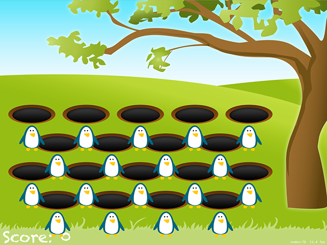

# Getting up and running: SKCropNode

<!-- YOUTUBE: C2a0O7nMAoA -->

We already went over the basics of SpriteKit in project 11, so this time we're going to move a little faster – add these two properties to your `GameScene` class:

    var gameScore: SKLabelNode!
    var score = 0 {
        didSet {
            gameScore.text = "Score: \(score)"
        }
    }

Blah blah property observers blah – this is old stuff to a Swift veteran like you, so I don't need to explain what that does.

Now modify your `didMove(to:)` method so it reads this:

    override func didMove(to view: SKView) {
        let background = SKSpriteNode(imageNamed: "whackBackground")
        background.position = CGPoint(x: 512, y: 384)
        background.blendMode = .replace
        background.zPosition = -1
        addChild(background)

        gameScore = SKLabelNode(fontNamed: "Chalkduster")
        gameScore.text = "Score: 0"
        gameScore.position = CGPoint(x: 8, y: 8)
        gameScore.horizontalAlignmentMode = .left
        gameScore.fontSize = 48
        addChild(gameScore)
    }

If you run the "game" now you'll see a grassy background with a tree on one side, plus the score label at the bottom left. We’re going to be doing much more with that in a moment, but first we need to fix one small but important bug: our game will look wrong on certain devices.

We set our game scene to have the size 1024x768, which will be sized correctly for most iPads. However, the 11-inch iPad Pro is a little bit special: it has an aspect ratio that’s ever so slightly different from the other iPads, and the default behavior of our Xcode template is to stretch the game so the edges get cut off.

Very often that solution is perfectly fine – the difference is only very slight, after all – but in this case we can ask SpriteKit to gently stretch our scene so that it fits the device dimensions no matter what aspect ratio.

To do that, open GameViewController.swift and find this line of code:

    scene.scaleMode = .aspectFill

Now modify it to this:

    scene.scaleMode = .fill

If you run the game again you’ll see it looks identical on iPad, iPad Air, and iPad Pro 12.9-inch, but it is ever so slightly stretched on the 11-inch iPad Pro – imperceptible, really, but it avoids our score lying off the screen.

Now that the small layout bug is fixed, the next job is to fill our game scene with holes, with a penguin in each hole. We want each hole to do as much work itself as possible, so rather than clutter our game scene with code we're going to create a subclass of `SKNode` that will encapsulate all hole related functionality.

Add a new file, choosing iOS > Source > Cocoa Touch Class, make it a subclass of `SKNode` and name it "WhackSlot". You've already met `SKSpriteNode`, `SKLabelNode` and `SKEmitterNode`, and they all come from `SKNode`. This base class doesn't draw images like sprites or hold text like labels; it just sits in our scene at a position, holding other nodes as children.

**Note:** If you were wondering why we're not calling the class `WhackHole` it's because a slot is more than just a hole. It will contain a hole, yes, but it will also contain the penguin image and more.

When you create the subclass you will immediately get a compile error, because Swift claims not to know what `SKNode` is. This is easily fixed by adding the line `import SpriteKit` at the top of your file, just above the `import UIKit`.

To begin with, all we want the `WhackSlot` class to do is add a hole at its current position, so add this method to your new class:

    func configure(at position: CGPoint) {
        self.position = position

        let sprite = SKSpriteNode(imageNamed: "whackHole")
        addChild(sprite)
    }

You might wonder why we aren't using an initializer for this purpose, but the truth is that if you created a custom initializer you get roped into creating others because of Swift's `required init` rules. If you don't create any custom initializers (and don't have any non-optional properties) Swift will just use the parent class's `init()` methods.

We want to create four rows of slots, with five slots in the top row, then four in the second, then five, then four. This creates quite a pleasing shape, but as we're creating lots of slots we're going to need three things:

1. An array in which we can store all our slots for referencing later.
2. A `createSlot(at:)` method that handles slot creation.
3. Four loops, one for each row.

The first item is easy enough – just add this property above the existing `gameScore` definition in GameScene.swift:

    var slots = [WhackSlot]()

As for number two, that's not hard either – we need to create a method that accepts a position, then creates a `WhackSlot` object, calls its `configure(at:)` method, then adds the slot both to the scene and to our array:

    func createSlot(at position: CGPoint) {
        let slot = WhackSlot()
        slot.configure(at: position)
        addChild(slot)
        slots.append(slot)
    }

The only moderately hard part of this task is the four loops that call `createSlot(at:)` because you need to figure out what positions to use for the slots. Fortunately for you, I already did the design work, so I can tell you exactly where the slots should go! Put this just before the end of `didMove(to:)`:

    for i in 0 ..< 5 { createSlot(at: CGPoint(x: 100 + (i * 170), y: 410)) }
    for i in 0 ..< 4 { createSlot(at: CGPoint(x: 180 + (i * 170), y: 320)) }
    for i in 0 ..< 5 { createSlot(at: CGPoint(x: 100 + (i * 170), y: 230)) }
    for i in 0 ..< 4 { createSlot(at: CGPoint(x: 180 + (i * 170), y: 140)) }

Remember that higher Y values in SpriteKit place nodes towards the top of the scene, so those lines create the uppermost slots first then work downwards.

In case you've forgotten, `..<` is the half-open range operator, meaning that the first loop will count 0, 1, 2, 3, 4 then stop. The `i` is useful because we use that to calculate the X position of each slot.

So far this has all been stuff you've done before, so I tried to get through it as fast as I could. But it's now time to try something new: `SKCropNode`. This is a special kind of `SKNode` subclass that uses an image as a cropping mask: anything in the colored part will be visible, anything in the transparent part will be invisible.

By default, nodes don't crop, they just form part of a node tree. The reason we need the crop node is to hide our penguins: we need to give the impression that they are inside the holes, sliding out for the player to whack, and the easiest way to do that is just to have a crop mask shaped like the hole that makes the penguin invisible when it moves outside the mask.

The easiest way to demonstrate the need for `SKCropNode` is to give it a `nil` mask – this will effectively stop the crop node from doing anything, thus allowing you to see the trick behind our game.

In WhackSlot.swift, add a property to your class in which we'll store the penguin picture node:

    var charNode: SKSpriteNode!

Now add this just before the end of the `configure(at:)` method:

    let cropNode = SKCropNode()
    cropNode.position = CGPoint(x: 0, y: 15)
    cropNode.zPosition = 1
    cropNode.maskNode = nil

    charNode = SKSpriteNode(imageNamed: "penguinGood")
    charNode.position = CGPoint(x: 0, y: -90)
    charNode.name = "character"
    cropNode.addChild(charNode)

    addChild(cropNode)

Some parts of that are old and some are new, but all bear explaining.

First, we create a new `SKCropNode` and position it slightly higher than the slot itself. The number 15 isn't random – it's the exact number of points required to make the crop node line up perfectly with the hole graphics. We also give the crop node a `zPosition` value of 1, putting it to the front of other nodes, which stops it from appearing behind the hole.

We then do something that, right now, means nothing: we set the `maskNode` property of the crop node to be `nil`, which is the default value. It's there because we'll be changing it in just a moment.

We then create the character node, giving it the "good penguin" graphic, which is a blue color – the bad penguins are red, presumably because they are bubbling over with hellfire or something. This is placed at -90, which is way below the hole as if the penguin were properly hiding. And by "properly" you should read "bizarrely" because penguins aren't exactly known for hiding in holes in the countryside!

I hope you noticed the important thing, which is that the character node is added to the crop node, and the crop node was added to the slot. This is because the crop node only crops nodes that are inside it, so we need to have a clear hierarchy: the slot has the hole and crop node as children, and the crop node has the character node as a child.

If you run the game now you'll see that every hole now has a penguin directly beneath it. This is where the penguin is hiding, "in the hole", or at least would be if we gave the crop node a mask graphic. Now is probably a good time to select the whackMask.png graphic in the project navigator – it's a red square with a curved bottom to match the rim of the hole.

Remember, with crop nodes everything with a color is visible, and everything transparent is invisible, so the whackMask.png will show all parts of the character that are above the hole. Change the `maskNode = nil` line to load the actual mask instead:

    cropNode.maskNode = SKSpriteNode(imageNamed: "whackMask")

If you run the game now, you'll see the penguins are invisible. They are still there, of course, but now can't be seen.
