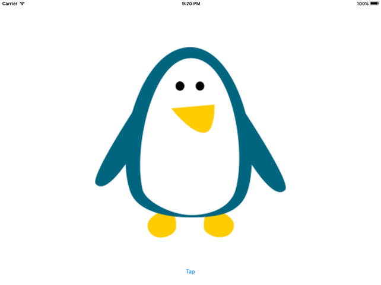

# Transform: CGAffineTransform

<!-- YOUTUBE: cQYbp4IGkgQ -->

Our code now has the perfect structure in place to let us dabble with animations freely, so it's time to learn about `CGAffineTransform`. This is a structure that represents a specific kind of transform that we can apply to any `UIView` object or subclass.

Unless you're into mathematics, affine transforms can seem like a black art. But Apple does provide some great helper functions to make it easier: there are functions to scale up a view, functions to rotate, functions to move, and functions to reset back to default.

All of these functions return a `CGAffineTransform` value that you can put into a view's `transform` property to apply it. As we'll be doing this inside an animation block, the transform will automatically be animated. This illustrates one of the many powerful things of Core Animation: you tell it what you want to happen, and it calculates all the intermediary states automatically.

Let's start with something simple: when we're at `currentAnimation` value 0, we want to make the view 2x its default size. Change the switch/case code to this:

    switch self.currentAnimation {
    case 0:
        self.imageView.transform = CGAffineTransform(scaleX: 2, y: 2)

    default:
        break
    }

That uses an initializer for `CGAffineTransform` that takes an X and Y scale value as its two parameters. A value of 1 means "the default size," so `2, 2` will make the view twice its normal width and height. By default, UIKit animations have an "ease in, ease out" curve, which means the movement starts slow, accelerates, then slows down again before reaching the end.

Run the app now and tap the button to watch the penguin animate from 1x to 2x its size over one second, all by setting the transform inside an animation. You can keep tapping the button as many times more as you want, but nothing else will happen at this time. If you apply a 2x scale transform to a view that already has a 2x scale transform, nothing happens.

The next case is going to be 1, and we're going to use a special existing transform called `CGAffineTransform.identity`, or just `.identity`. This effectively clears our view of any pre-defined transform, resetting any changes that have been applied by modifying its `transform` property.

Add this to the switch/case statement after the existing case:

    case 1:
        self.imageView.transform = .identity

For the sake of clarity, your code should now read:

    switch self.currentAnimation {
    case 0:
        self.imageView.transform = CGAffineTransform(scaleX: 2, y: 2)
        
    case 1:
        self.imageView.transform = .identity
        
    default:
        break
    }

With the second case in there, tapping the button repeatedly will first scale the penguin up, then scale it back down (resetting to defaults), then do nothing for lots of taps, then repeat the scale up/scale down. This is because our `currentAnimation` value is told to wrap (return to 0) when it's greater than 7, so the `default` case executes quite a few times.

Let's continue adding more cases: one to move the image view, then another to reset it back to the identity transform:

    case 2:
        self.imageView.transform = CGAffineTransform(translationX: -256, y: -256)

    case 3:
        self.imageView.transform = .identity

That uses another new initializer for `CGAffineTransform` that takes X and Y values for its parameters. These values are *deltas*, or differences from the current value, meaning that the above code subtracts 256 from both the current X and Y position.

Tapping the button now will scale up then down, then move and return back to the center, all smoothly animated by Core Animation.

We can also use `CGAffineTransform` to rotate views, using its `rotationAngle` initializer. This accepts one parameter, which is the amount in radians you want to rotate. There are three catches to using this function:

1. You need to provide the value in radians specified as a `CGFloat`. This usually isn't a problem – if you type 1.0 in there, Swift is smart enough to make that a `CGFloat` automatically. If you want to use a value like pi, use `CGFloat.pi`.
2. Core Animation will always take the shortest route to make the rotation work. So, if your object is straight and you rotate to 90 degrees (radians: half of pi), it will rotate clockwise. If your object is straight and you rotate to 270 degrees (radians: pi + half of pi) it will rotate counter-clockwise because it's the smallest possible animation.
3. A consequence of the second catch is that if you try to rotate 360 degrees (radians: pi times 2), Core Animation will calculate the shortest rotation to be "just don't move, because we're already there." The same goes for values over 360, for example if you try to rotate 540 degrees (one and a half full rotations), you'll end up with just a 180-degree rotation.

With all that in mind, here's are two more cases that show off rotation:

    case 4:
        self.imageView.transform = CGAffineTransform(rotationAngle: CGFloat.pi)
    case 5:
        self.imageView.transform = .identity

As well as animating transforms, Core Animation can animate many of the properties of your views. For example, it can animate the background color of the image view, or the level of transparency. You can even change multiple things at once if you want something more complicated to happen.

As an example, to make our view almost fade out then fade back in again while also changing its background color, we're going to modify its transparency by setting its `alpha` value, where 0 is invisible and 1 is fully visible, and also set its `backgroundColor` property – first to green, then to clear.

Add these two new cases:

    case 6:
        self.imageView.alpha = 0.1
        self.imageView.backgroundColor = UIColor.green

    case 7:
        self.imageView.alpha = 1
        self.imageView.backgroundColor = UIColor.clear

That completes all possible cases, 0 to 7. But Core Animation isn't finished just yet. In fact, we've only scratched its surface in these tests, and there's much more it can do.

To give you the briefest glimpse of its power, replace this line of code:

    UIView.animate(withDuration: 1, delay: 0, options: [],

…with this:

    UIView.animate(withDuration: 1, delay: 0, usingSpringWithDamping: 0.5, initialSpringVelocity: 5, options: [],

This changes the `animate(withDuration:)` so that it uses spring animations rather than the default, ease-in-ease-out animation. I'm not even going to tell you what this does because I'm sure you're going to be impressed – press Cmd+R to run the app and tap the button for yourself. We're done!
