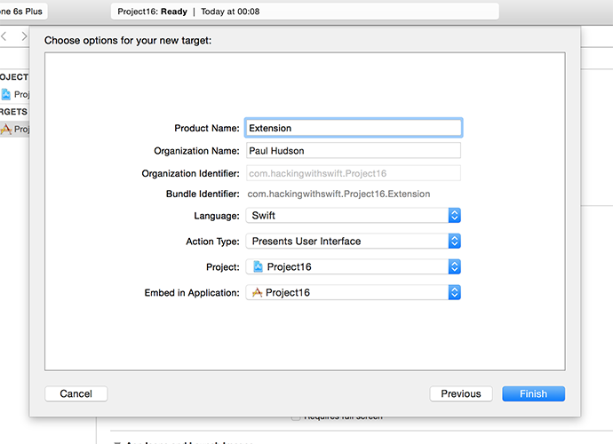

# Annotations and accessory views: MKPinAnnotationView

<!-- YOUTUBE: VkvEA7v5JyQ -->

Every time the map needs to show an annotation, it calls a `viewFor` method on its delegate. We don't implement that method right now, so the default red pin is used with nothing special – although as you've seen it's smart enough to pull out the title for us.

Customizing an annotation view is a little bit like customizing a table view cell or collection view cell, because iOS automatically reuses annotation views to make best use of memory. If there isn't one available to reuse, we need to create one from scratch using the `MKPinAnnotationView` class.

Our custom annotation view is going to look a lot like the default view, with the exception that we're going to add a button that users can tap for more information. So, they tap the pin to see the city name, then tap its button to see more information. In our case, it's those fascinating facts I spent literally tens of seconds writing.

There are a couple of things you need to be careful of here. First, `viewFor` will be called for your annotations, but also Apple's. For example, if you enable tracking of the user's location then that's shown as an annotation and you don't want to try using it as a capital city. If an annotation is not one of yours, just return `nil` from the method to have Apple's default used instead.

Second, adding a button to the view isn't done using the `addTarget()` method you already saw in project 8. Instead, you just add the button and the map view will send a message to its delegate (us!) when it's tapped.

Here's a breakdown of what the method will do:

1. If the annotation isn't from a capital city, it must return `nil` so iOS uses a default view.
2. Define a reuse identifier. This is a string that will be used to ensure we reuse annotation views as much as possible.
3. Try to dequeue an annotation view from the map view's pool of unused views.
4. If it isn't able to find a reusable view, create a new one using `MKPinAnnotationView` and sets its `canShowCallout` property to true. This triggers the popup with the city name.
5. Create a new `UIButton` using the built-in `.detailDisclosure` type. This is a small blue "i" symbol with a circle around it.
6. If it can reuse a view, update that view to use a different annotation.

We already used Interface Builder to make our view controller the delegate for the map view, but if you want code completion to work you should also update your code to declare that the class conforms. So, in ViewController.swift, find this line:

    class ViewController: UIViewController {

And change it to this:

    class ViewController: UIViewController, MKMapViewDelegate {

Put this method into your view controller, watching out for my numbered comments:

    func mapView(_ mapView: MKMapView, viewFor annotation: MKAnnotation) -> MKAnnotationView? {
        // 1
        guard annotation is Capital else { return nil }
    
        // 2
        let identifier = "Capital"
        
        // 3
        var annotationView = mapView.dequeueReusableAnnotationView(withIdentifier: identifier)

        if annotationView == nil {
            //4
            annotationView = MKPinAnnotationView(annotation: annotation, reuseIdentifier: identifier)
            annotationView?.canShowCallout = true

            // 5
            let btn = UIButton(type: .detailDisclosure)
            annotationView?.rightCalloutAccessoryView = btn
        } else {
            // 6
            annotationView?.annotation = annotation
        }

        return annotationView
    }

You can press Cmd+R to run your app, and now if you tap on any pin you'll see a city's name as well as a button you can tap to show more information. Like I said, you don't need to use `addTarget()` to add an action to the button, because you'll automatically be told by the map view using a `calloutAccessoryControlTapped` method.

When this method is called, you'll be told what map view sent it (we only have one, so that's easy enough), what annotation view the button came from (this is useful), as well as the button that was tapped.

The annotation view contains a property called `annotation`, which will contain our `Capital` object. So, we can pull that out, typecast it as a `Capital`, then show its title and information in any way we want. The easiest for now is just to use a `UIAlertController`, so that's what we'll do.

Add this code to your view controller, just beneath the previous method:

    func mapView(_ mapView: MKMapView, annotationView view: MKAnnotationView, calloutAccessoryControlTapped control: UIControl) {
        guard let capital = view.annotation as? Capital else { return }
        let placeName = capital.title
        let placeInfo = capital.info

        let ac = UIAlertController(title: placeName, message: placeInfo, preferredStyle: .alert)
        ac.addAction(UIAlertAction(title: "OK", style: .default))
        present(ac, animated: true)
    }

With that, the project is done. We have pins in place, city names being showed when the pins are tapped, and more information popping up when requested. Perfect!

