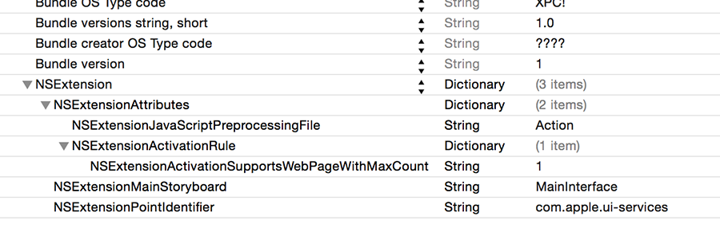
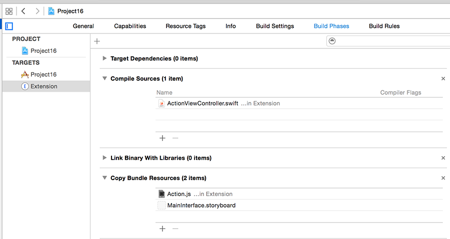

# What do you want to get?

<!-- YOUTUBE: s5Q8tgU2BJU -->

Inside the Extension group in the project navigator is a file called Info.plist. You have one for your app too, and in fact all apps have one. This plist (that's short for property list, remember) contains metadata about apps and extensions: what language is it, what version number is it, and so on.

For extensions, this plist also describes what data you are willing to accept and how it should be processed. Look for the key marked NSExtension and open its disclosure indicator: you should see NSExtensionAttributes, NSExtensionMainStoryboard and NSExtensionPointIdentifier. It's that first one we care about, because it modifies the way our extension behaves.

Open up the disclosure arrow for NSExtensionAttributes and you should see NSExtensionActivationRule, then String, then TRUEPREDICATE. Change String to be Dictionary, then open *its* disclosure arrow and click the small + button to the left of “Dictionary”, and when it asks you for a key name change "New item" to be "NSExtensionActivationSupportsWebPageWithMaxCount". You can leave the new item as a string (it doesn't really matter), but change its value to be 1 – that's the empty space just to the right of String.

Adding this value to the dictionary means that we only want to receive web pages – we aren't interested in images or other data types.

Now select the NSExtensionAttributes line itself, and click the + button that appears next to the word Dictionary. Replace "New item" with "NSExtensionJavaScriptPreprocessingFile", then give it the value "Action". This tells iOS that when our extension is called, we need to run the JavaScript preprocessing file called Action.js, which will be in our app bundle. Make sure you type "Action" and not "Action.js", because iOS will append the ".js" itself.

In the picture below you can see how your extension's property list should look. Make sure you enter the key names precisely, because there is no room for error.

I say "will be" rather than "is" because we haven't actually created this file yet. Right-click on your extension's Info.plist file and choose New File. When you're asked what template you want, choose iOS > Other > Empty, then name it Action.js, and put this text into it:

    var Action = function() {};

    Action.prototype = {

    run: function(parameters) {

    },

    finalize: function(parameters) {

    }

    };

    var ExtensionPreprocessingJS = new Action

This is a book about Swift, not a book about JavaScript, so I'm afraid I don't intend to explain what that code does except for two things:

- There are two functions: `run()` and `finalize()`. The first is called before your extension is run, and the other is called after.
- Apple expects the code to be exactly like this, so you shouldn't change it other than to fill in the `run()` and `finalize()` functions.

Even now, after all this hacking around, your extension *still* isn't ready to run, and I can only apologize – I told you it was complicated!

**Having problems?** One reader reported that Xcode had tried to compile Action.js rather than copy it into the project, which will cause problems when you try to run the extension.

If you're worried that this might have happened to you, it's easy enough to check: choose your project from the Project Navigator, then choose your extension from the list of targets – it's just called Extension if you followed my instructions so far. Now choose the Build Phases tab and open up Compile Sources and Copy Bundle Resources.

If things have worked correctly you should see Action.js under Copy Bundle Resources and *not* Compile Sources. If this isn't the case, you can just drag it to move.
