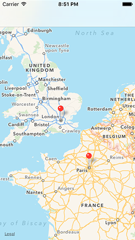

# Establishing communication

<!-- YOUTUBE: -i-0CLhHILc -->

To begin with, all we're going to do is send some data from Safari to our extension to make sure everything is set up correctly – after all, it's been quite a bit of hassle so far with nothing to show for it!

First, we're going to modify Action.js to send two pieces of data to our extension: the URL the user was visiting, and the title of the page. Go to Action.js and modify the `run()` function to this:

    run: function(parameters) {
        parameters.completionFunction({"URL": document.URL, "title": document.title });
    },

JavaScript is quite a murky language, so you might be staring at that blankly. If I were to put it in plain English, what it means is "tell iOS the JavaScript has finished preprocessing, and give this data dictionary to the extension." The data that is being sent has the keys "URL" and "title", with the values being the page URL and page title.

As with the previous JavaScript, don't worry about the nitty-gritty. There are many volumes of books on learning JavaScript and I don't intend to repeat them here.

Now that data is being sent from JavaScript, data will be received in Swift. In ActionViewController.swift, replace the `// do stuff!` comment with this:

    guard let itemDictionary = dict as? NSDictionary else { return }
    guard let javaScriptValues = itemDictionary[NSExtensionJavaScriptPreprocessingResultsKey] as? NSDictionary else { return }
    print(javaScriptValues)

Before I explain what that code does, please run the code. I'm saying this because if you're like me then you're probably desperate to see anything working at this point, so let's at least make sure things are working. When you press Run, wait for the list of host applications to finish loading, then select Safari and click Run.

When Safari loads, go to any web page, then tap the action toolbar button on the bottom – it's the box with an arrow coming out. You'll see two rows of icons: swipe to the right on the bottom row. If your extension isn't listed, click More and enable it there. Don't be surprised if you see strange messages being printed out in the Xcode debug console while you're doing this, because Apple sometimes likes to spout unhelpful warnings in their own code.

In the picture below you can see where your extension's icon should appear inside Safari's action menu. If you don't see it there, tap More.

When your app runs, you should see messages in the console at the bottom of your Xcode window. If the console isn't visible, use Shift+Cmd+C to activate it, and you should see something like this:

    {
        URL = "https://www.apple.com/retail/code/";
        title = "Apple Retail Store - Hour of Code Workshop";
    }

If you're seeing that, well done – your extension is working! If not, you screwed up somewhere, so check my steps again.

Let's take a look at the code. As a reminder, here it is again:

    guard let itemDictionary = dict as? NSDictionary else { return }
    guard let javaScriptValues = itemDictionary[NSExtensionJavaScriptPreprocessingResultsKey] as? NSDictionary else { return }
    print(javaScriptValues)

`NSDictionary` is a new data type, and it’s not really one you have much cause to use in Swift that often because it’s a bit of a holdover from older iOS code. Put simply, `NSDictionary` works like a Swift dictionary, except you don't need to declare or even *know* what data types it holds. One of the nasty things about `NSDictionary` is that you don't need to declare or even know what data types it holds.

Yes, it's both an advantage and a disadvantage in one, which is why modern Swift dictionaries are preferred. When working with extensions, however, it's definitely an advantage because we just don't care what's in there – we just want to pull out our data.

When you use `loadItem(forTypeIdentifier:)`, your closure will be called with the data that was received from the extension along with any error that occurred. Apple could provide other data too, so what we get is a dictionary of data that contains all the information Apple wants us to have, and we put that into `itemDictionary`.

Right now, there's nothing in that dictionary other than the data we sent from JavaScript, and that's stored in a special key called `NSExtensionJavaScriptPreprocessingResultsKey`. So, we pull that value out from the dictionary, and put it into a value called `javaScriptValues`.

We sent a dictionary of data from JavaScript, so we typecast `javaScriptValues` as an `NSDictionary` again so that we can pull out values using keys, but for now we just send the whole lot to the `print()` function, which dumps the dictionary contents to Xcode's debug console.

So, we've successfully proved that Safari is sending data to our extension; it's time to do something interesting with it!
