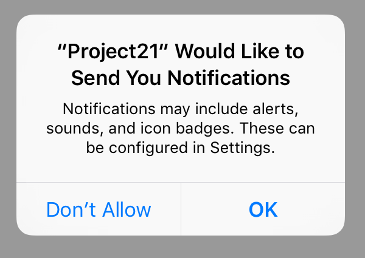

# Scheduling notifications: UNUserNotificationCenter and UNNotificationRequest

<!-- YOUTUBE: QD_mVOeOaGA -->

We only need two buttons to control the entire user interface for this project, and the easiest way to do that is using navigation bar buttons. So, open Main.storyboard in Interface Builder and embed the view controller inside a navigation controller – and that’s it for the interface.

Open ViewController.swift and add these two method stubs:

    @objc func registerLocal() {

    }

    @objc func scheduleLocal() {

    }

Now add this code to `viewDidLoad()`:

    navigationItem.leftBarButtonItem = UIBarButtonItem(title: "Register", style: .plain, target: self, action: #selector(registerLocal))
    navigationItem.rightBarButtonItem = UIBarButtonItem(title: "Schedule", style: .plain, target: self, action: #selector(scheduleLocal))

OK, time to explain how this project needs to work. First, you can't post messages to the user's lock screen unless you have their permission. This is a sensible restriction – it would, after all, be awfully annoying if any app could bother you when it pleased.

So, in order to send local notifications in our app, we first need to request permission, and that's what we'll put in the `registerLocal()` method. You register your settings based on what you actually need, and that's done with a method called `requestAuthorization()` on `UNUserNotificationCenter`. For this example we're going to request an alert (a message to show), along with a badge (for our icon) and a sound (because users just *love* those.)

You also need to provide a closure that will be executed when the user has granted or denied your permissions request. This will be given two parameters: a boolean that will be true if permission was granted, and an `Error?` containing a message if something went wrong.

All this functionality is contained in the UserNotifications framework, so before continuing add this `import` line now:

    import UserNotifications

OK, let’s go – change your `registerLocal()` method to be this:

    @objc func registerLocal() {
        let center = UNUserNotificationCenter.current()

        center.requestAuthorization(options: [.alert, .badge, .sound]) { (granted, error) in
            if granted {
                print("Yay!")
            } else {
                print("D'oh")
            }
        }
    }

Helpful tip: if you want to test allowing or denying permission, just reset the simulator and run the app again to get a clean slate. Choose the Hardware menu then “Erase all Content and Settings" to make this happen.

Once we have user permission, it's time to fill in the `scheduleLocal()` method. This will configure all the data needed to schedule a notification, which is three things: content (what to show), a trigger (when to show it), and a request (the combination of content and trigger.)

Before I dive into the code, there are a few extra things I want to discuss.

First, the reason a notification request is split into two smaller components is because they are interchangeable. For example, the trigger – when to show the notification – can be a calendar trigger that shows the notification at an exact time, it can be an interval trigger that shows the notification after a certain time interval has lapsed, or it can be a geofence that shows the notification based on the user’s location.

I’ll be demonstrating both calendar and interval triggers here, but to do calendar triggers requires learning another new data type called `DateComponents`. We’re going to start with a calendar notification, which is where you specify a day, a month, an hour, a minute, or any combination of those to produce specific times. For example, if you specify hour 8 and minute 30, and *don’t* specify a day, it means either “8:30 tomorrow” or “8:30 every day” depending on whether you ask for the notification to be repeated.

So, we could create a repeating alarm at 10:30am every morning like this:

    var dateComponents = DateComponents()
    dateComponents.hour = 10
    dateComponents.minute = 30
    let trigger = UNCalendarNotificationTrigger(dateMatching: dateComponents, repeats: true)

When it comes to *what* to show, we need to use the class `UNMutableNotificationContent`. This has lots of properties that customize the way the alert looks and works – we’ll be using these:

- The `title` property is used for the main title of the alert. This should be a couple of words at most.
- The `body` property should contain your main text.
- If you want to specify a sound you can create a custom `UNNotificationSound` object and attach it to the `sound` property, or just use `UNNotificationSound.default`.
- To attach custom data to the notification, e.g. an internal ID, use the `userInfo` dictionary property.
- You can also attach custom actions by specifying the `categoryIdentifier` property.

Putting those all together, we could create some notification content like this:

    let content = UNMutableNotificationContent()
    content.title = "Title goes here"
    content.body = "Main text goes here"
    content.categoryIdentifier = "customIdentifier"
    content.userInfo = ["customData": "fizzbuzz"]
    content.sound = UNNotificationSound.default

The combination of content and trigger is enough to be combined into a request, but here notifications get clever: as well as content and a trigger, each notification also has a unique identifier. This is just a string you create, but it *does* need to be unique because it lets you update or remove notifications programmatically.

Apple’s example for this is an app that displays live sports scores to the user. When something interesting happens, what the user really wants is for the existing notification to be updated with new information, rather than have multiple notifications from the same app over time.

For technique project we don’t care what name is used for each notification, but we do want it to be unique. So, we’ll be using the `UUID` class to generate unique identifiers – we’ve used this before, so hopefully you’re familiar.

OK, enough talk – time for some code. Change the `scheduleLocal()` method to this:

    @objc func scheduleLocal() {
        let center = UNUserNotificationCenter.current()

        let content = UNMutableNotificationContent()
        content.title = "Late wake up call"
        content.body = "The early bird catches the worm, but the second mouse gets the cheese."
        content.categoryIdentifier = "alarm"
        content.userInfo = ["customData": "fizzbuzz"]
        content.sound = UNNotificationSound.default

        var dateComponents = DateComponents()
        dateComponents.hour = 10
        dateComponents.minute = 30
        let trigger = UNCalendarNotificationTrigger(dateMatching: dateComponents, repeats: true)

        let request = UNNotificationRequest(identifier: UUID().uuidString, content: content, trigger: trigger)
        center.add(request)
    }

If you want to test out your notifications, there are two more things that will help. 

First, you can cancel pending notifications – i.e., notifications you have scheduled that have yet to be delivered because their trigger hasn’t been met – using the `center.removeAllPendingNotificationRequests()` method, like this:

    center.removeAllPendingNotificationRequests()

Second, chances are you’ll find the interval trigger far easier to test with than the calendar trigger, because you can set it to a low number like 5 seconds to have your notification trigger almost immediately.

To do that, replace the existing trigger with this code:

    let trigger = UNTimeIntervalNotificationTrigger(timeInterval: 5, repeats: false)

With that small change you should be able to click Schedule in the simulator, then press Cmd+L to lock the device and have it show an alert just a few seconds later.
