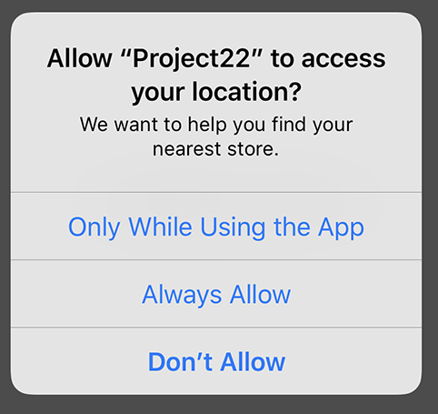

# Requesting location: Core Location

<!-- YOUTUBE: Oz5vxVIKIqU -->

It should come as no surprise that Apple considers a user's location to be private, and that means we need to ask for permission to use it. How you ask for permission depends on what you're trying to do: would you like the user's location only when your app is running, or would you like a user's location even when your app isn't running?

You might think that you'd only ever want location access when your app is running. After all, what's the point in asking for information when your app isn't around to use it?

There are times you'll want both. For example, if you're creating a map app that shows users how to get from their current location to your nearest store, you'll only need their location when the app is being used. But if you're creating an app that needs to be woken up when the user reaches a location, then you'll need access even when the app isn't running – iOS monitors the user's location on your behalf and automatically starts your app as needed.

Using location when the app isn’t running is of course highly sensitive information, so Apple flags it up in three ways:

1. If you request Always access, users will still get the chance to choose When In Use.
2. If they choose Always, iOS will automatically ask them again after a few days to confirm they still want to grant Always access.
3. When your app is using location data in the background the iOS UI will update to reflect that – users will know it’s happening.
4. Users can, at any point, go into the settings app and change from Always down to When In Use.

In this app we’re going to request Always access so that our app can detect beacons in the background. Requesting location access requires a change to your apps Info.plist file, which is the property list file we first met way back in project 3. We need to add to that file the reason why we want the user’s location – a string that will be shown in the iOS UI when the user is being asked to accept or decline our request.

Because of the rules above, we need to add two keys: “Privacy - Location Always and When In Use Usage Description” and “Privacy - Location When In Use Usage Description”. So, please add them both now, make sure their types are set to String, then in the value fields enter some text to explain to users *why* you want their location. For example, "We want to help you find your nearest store." When your user is prompted to grant location access, this text will be shown alongside Apple's own descriptive message.

That's enough knowledge to get this app jump started, so open up Main.storyboard and place a label in there. Give it the custom font System Thin size 40, then give the text "UNKNOWN". For constraints, please center it horizontally and vertically. Now create an outlet for it using the assistant editor, and name the outlet `distanceReading`.

That label will show one of four messages depending on how close we are to our test beacon, which of course might be an iPad acting as a beacon if you don't own actual hardware. Because iBeacons use very low energy levels, their range is limited and also easily interrupted; even something as simple as turning your back to the beacon weakens its signal dramatically. Based on the beacon's distance to us, we'll show either "UNKNOWN", "FAR", "NEAR" or "RIGHT HERE".

Apple restricts your ranging to these values because of the signal's low energy nature, but it's more than enough for most uses.

To complete our current step, let's make sure we have location configured correctly. This bit will work fine on the simulator, because although the simulator isn't capable of detecting iBeacons it can simulate general location information well enough.

Open ViewController.swift and add this import alongside UIKit:

    import CoreLocation

Now add this property to your class:

    var locationManager: CLLocationManager?

This is the Core Location class that lets us configure how we want to be notified about location, and will also deliver location updates to us.

That doesn't actually create a location manager, or even prompt the user for location permission! To do that, we first need to create the object (easy), then set ourselves as its delegate (easy, but we need to conform to the protocol), then finally we need to request authorization. We'll start by conforming to the protocol, so change your class definition to this:

    class ViewController: UIViewController, CLLocationManagerDelegate {

Now modify your `viewDidLoad()` method to this:

    override func viewDidLoad() {
        super.viewDidLoad()

        locationManager = CLLocationManager()
        locationManager?.delegate = self
        locationManager?.requestAlwaysAuthorization()

        view.backgroundColor = .gray
    }

Creating the object and setting the delegate are easy enough, but the `requestAlwaysAuthorization()` call is new. This is where the actual action happens: if you have already been granted location permission then things will Just Work; if you haven't, iOS will request it now.

**Note:** if you used the "when in use" key, you should call `requestWhenInUseAuthorization()` instead. If you did not set the correct plist key earlier, your request for location access will be ignored.

I slipped one other thing in there: I set the view's background color to be gray. As well as changing the label's text, we'll be using color to tell users how distant the beacon is.

Requesting location authorization is a non-blocking call, which means your code will carry on executing while the user reads your location message and decides whether to grant you access to their location.

When the user has finally made their mind, you'll get told their result because we set ourselves as the delegate for our `CLLocationManager` object. The method that will be called is this one:

    func locationManager(_ manager: CLLocationManager, didChangeAuthorization status: CLAuthorizationStatus) {
        if status == .authorizedAlways {
            if CLLocationManager.isMonitoringAvailable(for: CLBeaconRegion.self) {
                if CLLocationManager.isRangingAvailable() {
                    // do stuff
                }
            }
        }
    }

Put that into your view controller class somewhere, then run your app. It's important to test it before continuing, because if you've made a mistake somewhere it's hard to know unless you stop and check. The most common error is misconfiguring the plist with location privacy settings, so if you don't see a message requesting location access then check there first.

The `didChangeAuthorization` method we just added doesn't do anything because it just has a comment saying `// do stuff`. We'll fill that in with great stuff shortly, but for now look at the conditional statements wrapped around it: did we get authorized by the user? If so, is our device able to monitor iBeacons? If so, is ranging available? (Ranging is the ability to tell roughly how far something else is away from our device.)
