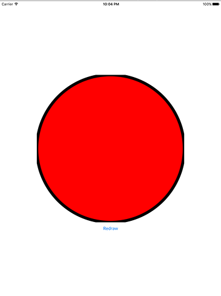
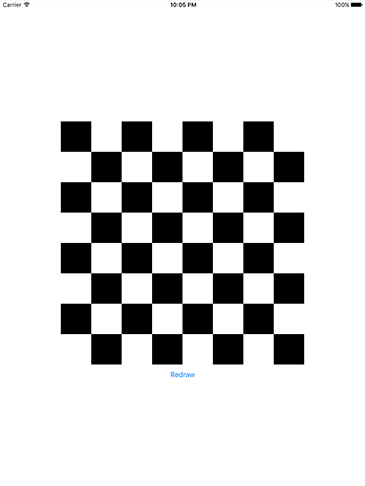

# Ellipses and checkerboards

<!-- YOUTUBE: i0T0uWnaKDg -->

Add a case to your `redrawTapped()` method to call a new method: `drawCircle()`. This will… wait for it… *draw a circle*. So, your `switch/case` should look like this:

    switch currentDrawType {
    case 0:
        drawRectangle()

    case 1:
        drawCircle()

    default:
        break
    }

There are several ways of drawing rectangles using Core Graphics, but the method we used in `drawRectangle()` is particularly useful because in order to draw a circle we need to change just one line of code. This is because drawing circles (or indeed any elliptical shape) in Core Graphics is done by specifying its rectangular bounds.

So, where before you had:

    ctx.cgContext.addRect(rectangle)

…you can now use this:

    ctx.cgContext.addEllipse(in: rectangle)

It even has the same parameters! So, the full `drawCircle()` method is this:

    func drawCircle() {
        let renderer = UIGraphicsImageRenderer(size: CGSize(width: 512, height: 512))

        let img = renderer.image { ctx in
            let rectangle = CGRect(x: 0, y: 0, width: 512, height: 512)

            ctx.cgContext.setFillColor(UIColor.red.cgColor)
            ctx.cgContext.setStrokeColor(UIColor.black.cgColor)
            ctx.cgContext.setLineWidth(10)

            ctx.cgContext.addEllipse(in: rectangle)
            ctx.cgContext.drawPath(using: .fillStroke)
        }

        imageView.image = img
    }

Run the app now and click the button once to make it draw a circle. Notice how the stroke around the edge appears to be clipped at the top, right, bottom and left edges? This is a direct result of what I was saying about stroke positioning: the stroke is centered on the edge of the path, meaning that a 10 point stroke is 5 points inside the path and 5 points outside.

The rectangle being used to define our circle is the same size as the whole context, meaning that it goes edge to edge – and thus the stroke gets clipped. To fix the problem, change the rectangle to this:

    let rectangle = CGRect(x: 5, y: 5, width: 502, height: 502)

That indents the circle by 5 points on all sides, so the stroke will now look uniform around the entire shape.

While that works fine, there is a better option: `CGRect` has an `insetBy()` method that lets us push each edge in by a certain amount. So instead of the above, a much cleaner piece of code is this:

    let rectangle = CGRect(x: 0, y: 0, width: 512, height: 512).insetBy(dx: 5, dy: 5)

That adds 5 points of inset on each edge, which has the same result.

A different way of drawing rectangles is just to fill them directly with your target color. Add a "case 2" to your `switch/case` that calls a method named `drawCheckerboard()`, and give it this code:

    func drawCheckerboard() {
        let renderer = UIGraphicsImageRenderer(size: CGSize(width: 512, height: 512))

        let img = renderer.image { ctx in
            ctx.cgContext.setFillColor(UIColor.black.cgColor)

            for row in 0 ..< 8 {
                for col in 0 ..< 8 {
                    if (row + col) % 2 == 0 {
                        ctx.cgContext.fill(CGRect(x: col * 64, y: row * 64, width: 64, height: 64))
                    }
                }
            }
        }

        imageView.image = img
    }

The only piece of code in there that you won't recognize is `fill()`, which skips the add path / draw path work and just fills the rectangle given as its parameter using whatever the current fill color is. You already know about ranges and modulo, so you should be able to see that this method makes every other square black, alternating between rows.

There are two things to be aware of with that code. First, we're filling every other square in black, but leaving the other squares alone. As we haven’t specified that our renderer is opaque, this means those places where we haven't filled anything will be transparent. So, if the view behind was green, you'd get a black and green checkerboard. Second, you can actually make checkerboards using a Core Image filter – check out `CICheckerboardGenerator` to see how!

