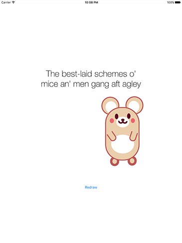

# Images and text

<!-- YOUTUBE: I12-RAh0BxI -->

Add one final case to your switch/case statement calling a method `drawImagesAndText()`, because no discussion of Core Graphics would be useful without telling you how to draw images and text to your context.

If you have an attributed string in Swift, how can you place it into a graphic? The answer is simpler than you think: attributed strings have a built-in method called `draw(with:)` that draws the string in a rectangle you specify. Even better, your attributed string styles are used to customize the font and size, the formatting, the line wrapping and more all with that one method.

Remarkably, the same is true of `UIImage`: any image can be drawn straight to a context, and it will even take into account the coordinate reversal of Core Graphics.

To help make the code clearer, here's a bulleted list of all the things the method needs to do:

1. Create a renderer at the correct size.
2. Define a paragraph style that aligns text to the center.
3. Create an attributes dictionary containing that paragraph style, and also a font.
4. Wrap that attributes dictionary and a string into an instance of `NSAttributedString`.
5. Load an image from the project and draw it to the context.
6. Update the image view with the finished result.

Below is that the same process, now coded in Swift. As per usual, the number comments match the list above:

    func drawImagesAndText() {
        // 1
        let renderer = UIGraphicsImageRenderer(size: CGSize(width: 512, height: 512))

        let img = renderer.image { ctx in
            // 2
            let paragraphStyle = NSMutableParagraphStyle()
            paragraphStyle.alignment = .center

            // 3
            let attrs: [NSAttributedString.Key: Any] = [
                .font: UIFont.systemFont(ofSize: 36),
                .paragraphStyle: paragraphStyle
            ]

            // 4
            let string = "The best-laid schemes o'\nmice an' men gang aft agley"
            let attributedString = NSAttributedString(string: string, attributes: attrs)
            
            // 5
            attributedString.draw(with: CGRect(x: 32, y: 32, width: 448, height: 448), options: .usesLineFragmentOrigin, context: nil)

            // 5
            let mouse = UIImage(named: "mouse")
            mouse?.draw(at: CGPoint(x: 300, y: 150))
        }

        // 6
        imageView.image = img
    }

That completes our project – good job!

