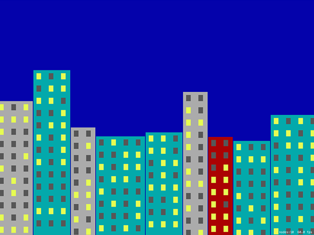

# Building the environment: SKTexture and filling a path

<!-- YOUTUBE: T6Qg0qnNtSA -->

We're going to start by making the game environment, which means building the night-time, high-rise skyscraper scene that forms the backdrop for the game. We're going to do most of this with an `SKSpriteNode` subclass for buildings that sets up physics, draws the building graphic, and ultimately handles the building being hit by stray bananas. Are you ready to flex your Core Graphics muscle a little?

Add a new file, choosing iOS > Source > Cocoa Touch Class, name it "BuildingNode" and make it a subclass of `SKSpriteNode`. Open the new file for editing, and add `import SpriteKit` just above the UIKit import.

Initially, this class needs to have three methods:

1. `setup()` will do the basic work required to make this thing a building: setting its name, texture, and physics.
2. `configurePhysics()` will set up per-pixel physics for the sprite's current texture.
3. `drawBuilding()` will do the Core Graphics rendering of a building, and return it as a `UIImage`.

In amongst those three points was one small thing that you may have missed: "the sprite's *current* texture." This tells you that the texture will change as bits get blown off by those exploding bananas. To make this work, we're going to keep a copy of the building's texture as a `UIImage` so that we can modify it later.

Before we dive into the code we need to define some collision bitmasks. This is identical to project 26, except now we need only three categories: buildings, bananas and players. In the case of buildings, the only thing they'll collide with is a banana, which triggers our explosion. So, go back to GameScene.swift and add this enum just above the `GameScene` class definition:

    enum CollisionTypes: UInt32 {
        case banana = 1
        case building = 2
        case player = 4
    }

OK, back to BuildingNode.swift. Please add this code to the class – it's a property followed by two methods:

    var currentImage: UIImage!

    func setup() {
        name = "building"

        currentImage = drawBuilding(size: size)
        texture = SKTexture(image: currentImage)

        configurePhysics()
    }

    func configurePhysics() {
        physicsBody = SKPhysicsBody(texture: texture!, size: size)
        physicsBody?.isDynamic = false
        physicsBody?.categoryBitMask = CollisionTypes.building.rawValue
        physicsBody?.contactTestBitMask = CollisionTypes.banana.rawValue
    }

This is using the same "don't override the initializer" hack from project 14, because quite frankly if I wanted to explain to you how and why Swift's initialization system worked I'd probably have to add another whole book to this series! Instead, we'll be creating the sprites as red-colored blocks of the right size, then drawing buildings into them.

As you can see in that code, it calls a `drawBuilding()` method that returns a `UIImage`, which then gets saved into the property and converted into a texture. It also calls `configurePhysics()` rather than putting the code straight into its method. Both of these two methods are separate because they will be called every time the building is hit, so we'll be using them in two different places.

That was the easy bit: you already know about bitmasks, per-pixel physics, textures and so on. The next method is `drawBuilding()` and it's going to get harder because we're going to use Core Graphics. You *did* read project 27, right? If so, this will be a cinch.

This method needs to:

1. Create a new Core Graphics context the size of our building.
2. Fill it with a rectangle that's one of three colors.
3. Draw windows all over the building in one of two colors: there's either a light on (yellow) or not (gray).
4. Pull out the result as a `UIImage` and return it for use elsewhere.

There's nothing complicated in there, but just to keep you on your toes I'm going to introduce a new way to create colors: hue, saturation and brightness, or HSB. Using this method of creating colors you specify values between 0 and 1 to control how saturated a color is (from 0 = gray to 1 = pure color) and brightness (from 0 = black to 1 = maximum brightness), and 0 to 1 for hue.

"Hue" is a value from 0 to 1 also, but it represents a position on a color wheel, like using a color picker on your Mac. Hues 0 and 1 both represent red, with all other colors lying in between.

Now, programmers often look at HSB and think it's much clumsier than straight RGB, but there are reasons for both. The helpful thing about HSB is that if you keep the saturation and brightness constant, changing the hue value will cycle through all possible colors – it's an easy way to generate matching pastel colors, for example.

There's one more thing you need to know, but you'll be pleased to know it's a fairly basic Swift feature that we just haven't needed to use so far. It's a function called `stride()`, which lets you loop from one number to another with a specific interval. We're going to use this to count from the left edge of the building to the right edge in intervals of 40, to position our windows. We'll also do this vertically, to position the windows across the whole height of the building. To make it a little more attractive, we'll actually indent the left and right edges by 10 points.

By itself, `stride()` looks like this:

    for row in stride(from: 10, to: Int(size.height - 10), by: 40) {

That means "count from 10 up to the height of the building minus 10, in intervals of 40." So, it will go 10, 50, 90, 130, and so on. Note that `stride()` has two variants: `stride(from:to:by:)` and `stride(from:through:by)`. The first counts up to but *excluding* the `to` parameter, whereas the second counts up to and *including* the `through` parameter. We'll be using `stride(from:to:by:)` below.

Now add this code for `drawBuilding()`, with numbered comments lining up to the list above:

    func drawBuilding(size: CGSize) -> UIImage {
        // 1
        let renderer = UIGraphicsImageRenderer(size: size)
        let img = renderer.image { ctx in
            // 2
            let rectangle = CGRect(x: 0, y: 0, width: size.width, height: size.height)
            let color: UIColor

            switch Int.random(in: 0...2) {
            case 0:
                color = UIColor(hue: 0.502, saturation: 0.98, brightness: 0.67, alpha: 1)
            case 1:
                color = UIColor(hue: 0.999, saturation: 0.99, brightness: 0.67, alpha: 1)
            default:
                color = UIColor(hue: 0, saturation: 0, brightness: 0.67, alpha: 1)
            }

            color.setFill()
            ctx.cgContext.addRect(rectangle)
            ctx.cgContext.drawPath(using: .fill)

            // 3
            let lightOnColor = UIColor(hue: 0.190, saturation: 0.67, brightness: 0.99, alpha: 1)
            let lightOffColor = UIColor(hue: 0, saturation: 0, brightness: 0.34, alpha: 1)

            for row in stride(from: 10, to: Int(size.height - 10), by: 40) {
                for col in stride(from: 10, to: Int(size.width - 10), by: 40) {
                    if Bool.random() {
                        lightOnColor.setFill()
                    } else {
                        lightOffColor.setFill()
                    }

                    ctx.cgContext.fill(CGRect(x: col, y: row, width: 15, height: 20))
                }
            }

            // 4
        }

        return img
    }

The only things new in there – and they are so tiny you probably didn't even notice – is my use of `.fill` rather than `.stroke` to draw the rectangles, and my use of `Bool.random()` to generate either true or false randomly.

That's the `BuildingNode` class finished for now; we'll return to it later to add a method that will be called whenever it gets hit by a banana.

Go back to GameScene.swift because we have a small amount of work to do in order to use these new building nodes to build the night sky scene.

First, add a property that will store an array of buildings. We'll be using this to figure out where to place players later on:

    var buildings = [BuildingNode]()

At this point, the `didMove(to:)` method needs to do only two things: give the scene a dark blue color to represent the night sky, then call a method called `createBuildings()` that will create the buildings. Here it is:

    override func didMove(to view: SKView) {
        backgroundColor = UIColor(hue: 0.669, saturation: 0.99, brightness: 0.67, alpha: 1)

        createBuildings()
    }

All those HSB values aren't an accident, by the way – I've chosen them so they look similar to the original design.

The `createBuildings()` method is the important one here, and calling it will finish our background scene. It needs to move horizontally across the screen, filling space with buildings of various sizes until it hits the far edge of the screen. I'm going to make it start at -15 rather than the left edge so that the buildings look like they keep on going past the screen's edge. I'm also going to leave a 2-point gap between the buildings to distinguish their edges slightly more.

Each building needs to be a random size. For the height, it can be anything between 300 and 600 points high; for the width, I want to make sure it divides evenly into 40 so that our window-drawing code is simple, so we'll generate a random number between 2 and 4 then multiply that by 40 to give us buildings that are 80, 120 or 160 points wide.

As I said earlier, we'll be creating each building node with a solid red color to begin with, then drawing over it with the building texture once it's generated. Remember: SpriteKit positions nodes based on their center, so we need to do a little division of width and height to place these buildings correctly. Here's the `createBuildings()` method – please put this directly beneath `didMove(to:)`:

    func createBuildings() {
        var currentX: CGFloat = -15

        while currentX < 1024 {
            let size = CGSize(width: Int.random(in: 2...4) * 40, height: Int.random(in: 300...600))
            currentX += size.width + 2

            let building = BuildingNode(color: UIColor.red, size: size)
            building.position = CGPoint(x: currentX - (size.width / 2), y: size.height / 2)
            building.setup()
            addChild(building)

            buildings.append(building)
        }
    }

Make sure you select the lowest-spec iPad from the list of simulator options, then press Play to see the results of your hard work – a random set of buildings will be generated each time you run the game. Well done!

