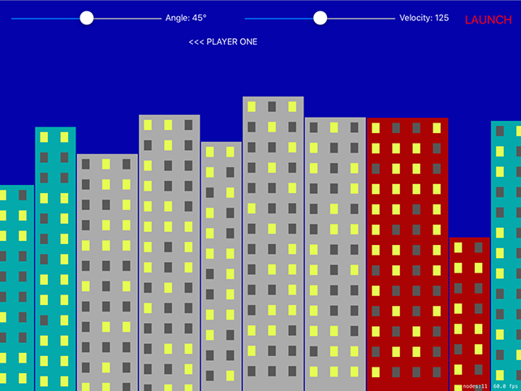

# Mixing UIKit and SpriteKit: UISlider and SKView

<!-- YOUTUBE: J7d0XPBYwKw -->

We've been mixing UIKit and SpriteKit ever since our first SpriteKit project, way back in project 11. Don't believe me? Look inside `GameViewController.swift` and you'll see a plain old `UIViewController` do all the work of loading and showing our `GameScene` code. There's a Main.storyboard file containing that view controller, and if you go to the identity inspector (Alt+Cmd+3) you'll see it has `SKView` set for its custom class – that's the view holding our scene.

This UIKit setup existed all along, but so far we've been ignoring it. No more: we're going to add some controls to that view so that players can fire bananas. The way the game works, each player gets to enter an angle and a velocity for their throw. We'll be recreating this with a `UISlider` for both of these numbers, along with a `UILabel` so players can see exactly what numbers they chose. We'll also add a "Launch" button that makes the magic happen.

Now, think about this for a moment: our game view controller needs to house and manage the user interface, and the game scene needs to manage everything inside the game. But they also need to talk to each other: the view controller needs to tell the game scene to fire a banana when the launch button is clicked, and the game scene needs to tell the view controller when a player's turn has finished so that another banana can be launched again.

This two-way communication could be done using `NotificationCenter`, but it's not very pleasant: we know the sender and receiver, and we know exactly what kind of data they will send and receive, so the easiest solution here is to give the view controller a property that holds the game scene, and give the game scene a property that holds the view controller.

Hopefully that should be setting off some alarm bells in your head, because if two objects own each other then we have a strong reference cycle – neither object can be destroyed. The solution is to make one of them have a weak reference to the other: either the game controller owns the game scene strongly, or the game scene owns the game controller strongly, but not both. As it so happens, the game controller already strongly owns the game scene, albeit indirectly: it owns the `SKView` inside itself, and the view owns the game scene. So, it's owned, we just don't have a reference to it.

So, our solution is straightforward: add a strong reference to the game scene inside the view controller, and add a weak reference to the view controller from the game scene. Add this property to the game scene:

    weak var viewController: GameViewController!

Now add this property to the game view controller:

    var currentGame: GameScene!

Like I said, the game controller already owns the game scene, but it's a pain to get to. Adding that property means we have direct access to the game scene whenever we need it. To set the property, put this into the `viewDidLoad()` method of the game view controller, just after the call to `presentScene()`:

    currentGame = scene as? GameScene
    currentGame.viewController = self

The first line sets the property to the initial game scene so that we can start using it. The second line makes sure that the reverse is true so that the scene knows about the view controller too.

Now to design the user interface: this needs two sliders, each with two labels, plus a launch button and one more label that will show whose turn it is. When you open Main.storyboard you'll probably see that it's shaped like an iPhone, which isn’t helpful when designing this user interface. Instead, I’d like you to click the View As button at the bottom of Interface Builder, and select a 9.7-inch iPad in landscape orientation so that we have more space for drawing.

Drop two sliders into your layout, both 300 points wide. The first should be at X:20, the second should be at X:480, and both should be at Y:20. Now place two labels in there, both 120 points wide. The first should be at X:325, the second should be at X:785, and both should be at Y:24 – this is slightly lower than the sliders so that everything is centered neatly.

For the launch button, place a button at X:910 Y:13, with width 100 and height 44; for the "which player is it?" label, place a label at X:370 Y:64 with width 285 and height 35.

That's the basic layout, but to make it all perfect we need a few tweaks. Using the attributes inspector, change the left-hand slider so that it has a maximum value of 90 and a current value of 45, then change the right-hand slider so that it has a maximum value of 250 and a current value of 125.

Make sure all three of your labels have their text color set to white, then give the bottom one the text “<<< PLAYER ONE" and center alignment. Select the button then give it a system bold font of size 22, a title of "LAUNCH" and a red text color.

That's the layout all done, but we also need lots of outlets: using the assistant editor, create these outlets:

- For the left slider: `angleSlider`
- For the left label: `angleLabel`
- For the right slider: `velocitySlider`
- For the right label: `velocityLabel`
- For the launch button: `launchButton`
- For the player number: `playerNumber`

You'll also need to create actions from the left slider, the right slider and the button: `angleChanged()`, `velocityChanged()` and `launch()` respectively.

That's all the layout done, so we're finished with Interface Builder and you can open up GameViewController.swift.

We need to fill in three methods (`angleChanged()`, `velocityChanged()` and `launch()`), write one new method, then make two small changes to `viewDidLoad()`.

The action methods for our two sliders are both simple: they update the correct label with the slider's current value. A `UISlider` always stores its values as a `Float`, but we only care about the integer value of that float so we're going to convert the values to `Int`s then use string interpolation to update the labels. Here's the code for both these methods:

    @IBAction func angleChanged(_ sender: Any) {
        angleLabel.text = "Angle: \(Int(angleSlider.value))°"
    }

    @IBAction func velocityChanged(_ sender: Any) {
        velocityLabel.text = "Velocity: \(Int(velocitySlider.value))"
    }

The only hard thing there is typing the ° symbol that represents degrees – to do that, press Shift+Option+8. With those methods written, we need to call both of them inside `viewDidLoad()` in order to have them load up with their default values. Add this to `viewDidLoad()` just after the call to `super`:

    angleChanged(angleSlider)
    velocityChanged(velocitySlider)

You could easily have typed default values into Interface Builder, and sometimes it's helpful to do so in order to measure your layout correctly, but setting it in code means you have only one place that can set those values so it's easier to change later if needed.

When a player taps the launch button, we need to hide the user interface so they can't try to fire again until we're ready, then tell the game scene to launch a banana using the current angle and velocity. Our game will then proceed with physics calculations until the banana is destroyed or lost (i.e., off screen), at which point the game will tell the game controller to change players and continue.

The code for the `launch()` method is trivial, largely because the work of actually launching the banana is hidden behind a call to a `launch()` method that we'll add to the game scene shortly:

    @IBAction func launch(_ sender: Any) {
        angleSlider.isHidden = true
        angleLabel.isHidden = true

        velocitySlider.isHidden = true
        velocityLabel.isHidden = true

        launchButton.isHidden = true

        currentGame.launch(angle: Int(angleSlider.value), velocity: Int(velocitySlider.value))
    }

Finally, we're going to create a `activatePlayer()` method that will be called from the game scene when control should pass to the other player. This will just update the player label to say who is in control, then show all our controls again:

    func activatePlayer(number: Int) {
        if number == 1 {
            playerNumber.text = "<<< PLAYER ONE"
        } else {
            playerNumber.text = "PLAYER TWO >>>"
        }

        angleSlider.isHidden = false
        angleLabel.isHidden = false

        velocitySlider.isHidden = false
        velocityLabel.isHidden = false

        launchButton.isHidden = false
    }

To make your code compile, you need to add a `launch()` method to GameScene.swift. It doesn't need to be the real thing, but it does need to accept parameters for angle and velocity. Give it this code for now:

    func launch(angle: Int, velocity: Int) {
    }

