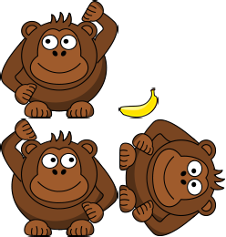

# Unleash the bananas: SpriteKit texture atlases

<!-- YOUTUBE: Jsax0NRfTrc -->

It's time to get down to the nitty-gritty business of writing code: we need to create our players then fill in the `launch()` method so that the fun can begin.

We're going to start with the easy bit, which is creating players. This needs to do two things:

1. Create a player sprite and name it "player1".
2. Create a physics body for the player that collides with bananas, and set it to not be dynamic.
3. Position the player at the top of the second building in the array. (This is why we needed to keep an array of the buildings.)
4. Add the player to the scene.
5. Repeat all the above for player 2, except they should be on the second to last building.

The player physics body can be made using a circle, because the sprite used (which is the same for both players) is more or less round. We used the second building for player 1 and the second to last for player 2 so that they aren't at the very edges of the screen. Positioning them at the top is just a matter of adding the building's height to the player's height and dividing by two, then adding that to the building's Y co-ordinate. SpriteKit measures from the center of nodes, remember!

Before we look at the code, you'll need to create some properties to hold both players, plus the banana and which player is currently in control:

    var player1: SKSpriteNode!
    var player2: SKSpriteNode!
    var banana: SKSpriteNode!

    var currentPlayer = 1

Now here's the code for `createPlayers()` – please put this in GameScene.swift:

    func createPlayers() {
        player1 = SKSpriteNode(imageNamed: "player")
        player1.name = "player1"
        player1.physicsBody = SKPhysicsBody(circleOfRadius: player1.size.width / 2)
        player1.physicsBody?.categoryBitMask = CollisionTypes.player.rawValue
        player1.physicsBody?.collisionBitMask = CollisionTypes.banana.rawValue
        player1.physicsBody?.contactTestBitMask = CollisionTypes.banana.rawValue
        player1.physicsBody?.isDynamic = false

        let player1Building = buildings[1]
        player1.position = CGPoint(x: player1Building.position.x, y: player1Building.position.y + ((player1Building.size.height + player1.size.height) / 2))
        addChild(player1)

        player2 = SKSpriteNode(imageNamed: "player")
        player2.name = "player2"
        player2.physicsBody = SKPhysicsBody(circleOfRadius: player2.size.width / 2)
        player2.physicsBody?.categoryBitMask = CollisionTypes.player.rawValue
        player2.physicsBody?.collisionBitMask = CollisionTypes.banana.rawValue
        player2.physicsBody?.contactTestBitMask = CollisionTypes.banana.rawValue
        player2.physicsBody?.isDynamic = false

        let player2Building = buildings[buildings.count - 2]
        player2.position = CGPoint(x: player2Building.position.x, y: player2Building.position.y + ((player2Building.size.height + player2.size.height) / 2))
        addChild(player2)
    }

Now, one thing we haven't done yet is actually add in the images to be used inside the game, and the reason for that is because we're going to use a special technique called texture atlases. SpriteKit doesn't use them by default, which is why we haven't used them yet – there are bigger things to worry about! But this game is perfect for texture atlases, so we're going to use them now.

A texture atlas is a set of pictures that are combined into a single image. They might be stored in their original orientation, or they might be rotated. Alongside those images, the atlas also contains positions and sizes, which means to render one of those pictures SpriteKit loads the whole atlas and just draws the small window that represents the image you want.

Texture atlases allows SpriteKit to draw lots of images without having to load and unload textures – it effectively just crops the big image as needed. Xcode automatically generates these atlases for us, even rotating sprites to make them fit more efficiently. And the best bit: just like using Assets.xcassets, you don't need to change your code to make them work; just load sprites the same way you've always done.

We want to use a texture atlas for our game, so open Assets.xcassets, right-click in the big empty space below AppIcon, and choose New Sprite Atlas. You should then drag all the images for this project onto that atlas, and drag the two particle systems directly into your Xcode project.

(Note: observant readers may notice that the player images are in fact monkeys not gorillas. This is largely down to me not being able to find a public domain gorilla picture that was good enough, and I figured penguins deserved a break.)

With the `createPlayers()` method in place, all you need to is call it inside `didMove(to:)`, just after the `createBuildings()` line:

    override func didMove(to view: SKView) {
        backgroundColor = UIColor(hue: 0.669, saturation: 0.99, brightness: 0.67, alpha: 1)

        createBuildings()
        createPlayers()
    }

It's now time to flesh out the `launch()` method. This is a complicated method because it needs to do quite a few things:

1. Figure out how hard to throw the banana. We accept a velocity parameter, but I'll be dividing that by 10. You can adjust this based on your own play testing.
2. Convert the input angle to radians. Most people don't think in radians, so the input will come in as degrees that we will convert to radians.
3. If somehow there's a banana already, we'll remove it then create a new one using circle physics.
4. If player 1 was throwing the banana, we position it up and to the left of the player and give it some spin.
5. Animate player 1 throwing their arm up then putting it down again.
6. Make the banana move in the correct direction.
7. If player 2 was throwing the banana, we position it up and to the right, apply the opposite spin, then make it move in the correct direction.

There are few things you need to know before we translate that long list into Swift. First, converting degrees to radians is done with a fixed formula that we will put into a method called `deg2rad()`:

    func deg2rad(degrees: Int) -> Double {
        return Double(degrees) * Double.pi / 180
    }

Second, SpriteKit uses a number of optimizations to help its physics simulation work at high speed. These optimizations don't work well with small, fast-moving objects, and our banana is just such a thing. To be sure everything works as intended, we're going to enable the `usesPreciseCollisionDetection` property for the banana's physics body. This works slower, but it's fine for occasional use.

Third, I said we needed to make the banana move in "the correct direction" without really explaining how we get to that. This isn't a trigonometry book, so here's the answer as briefly as possible: if we calculate the cosine of our angle in radians it will tell us how much horizontal momentum to apply, and if we calculate the sine of our angle in radians it will tell us how much vertical momentum to apply.

Once that momentum is calculated, we multiply it by the velocity we calculated (or negative velocity in the case of being player 2, because we want to throw to the left), and turn it into a `CGVector`. Remember, a vector is like an arrow where its base is at 0,0 (our current position) and tip at the point we specify, so this effectively points an arrow in the direction the banana should move.

To make the banana actually move, we use the `applyImpulse()` method of its physics body, which accepts a `CGVector` as its only parameter and gives it a physical push in that direction.

Time for the code; so you don't have to flick around so much while reading, here's a repeat list of what this method will do, with numbers matching comments in the code:

1. Figure out how hard to throw the banana. We accept a velocity parameter, but I'll be dividing that by 10. You can adjust this based on your own play testing.
2. Convert the input angle to radians. Most people don't think in radians, so the input will come in as degrees that we will convert to radians.
3. If somehow there's a banana already, we'll remove it then create a new one using circle physics.
4. If player 1 was throwing the banana, we position it up and to the left of the player and give it some spin.
5. Animate player 1 throwing their arm up then putting it down again.
6. Make the banana move in the correct direction.
7. If player 2 was throwing the banana, we position it up and to the right, apply the opposite spin, then make it move in the correct direction.

And here's the code:

    func launch(angle: Int, velocity: Int) {
        // 1
        let speed = Double(velocity) / 10.0

        // 2
        let radians = deg2rad(degrees: angle)

        // 3
        if banana != nil {
            banana.removeFromParent()
            banana = nil
        }

        banana = SKSpriteNode(imageNamed: "banana")
        banana.name = "banana"
        banana.physicsBody = SKPhysicsBody(circleOfRadius: banana.size.width / 2)
        banana.physicsBody?.categoryBitMask = CollisionTypes.banana.rawValue
        banana.physicsBody?.collisionBitMask = CollisionTypes.building.rawValue | CollisionTypes.player.rawValue
        banana.physicsBody?.contactTestBitMask = CollisionTypes.building.rawValue | CollisionTypes.player.rawValue
        banana.physicsBody?.usesPreciseCollisionDetection = true
        addChild(banana)

        if currentPlayer == 1 {
            // 4
            banana.position = CGPoint(x: player1.position.x - 30, y: player1.position.y + 40)
            banana.physicsBody?.angularVelocity = -20

            // 5
            let raiseArm = SKAction.setTexture(SKTexture(imageNamed: "player1Throw"))
            let lowerArm = SKAction.setTexture(SKTexture(imageNamed: "player"))
            let pause = SKAction.wait(forDuration: 0.15)
            let sequence = SKAction.sequence([raiseArm, pause, lowerArm])
            player1.run(sequence)

            // 6
            let impulse = CGVector(dx: cos(radians) * speed, dy: sin(radians) * speed)
            banana.physicsBody?.applyImpulse(impulse)
        } else {
            // 7
            banana.position = CGPoint(x: player2.position.x + 30, y: player2.position.y + 40)
            banana.physicsBody?.angularVelocity = 20

            let raiseArm = SKAction.setTexture(SKTexture(imageNamed: "player2Throw"))
            let lowerArm = SKAction.setTexture(SKTexture(imageNamed: "player"))
            let pause = SKAction.wait(forDuration: 0.15)
            let sequence = SKAction.sequence([raiseArm, pause, lowerArm])
            player2.run(sequence)

            let impulse = CGVector(dx: cos(radians) * -speed, dy: sin(radians) * speed)
            banana.physicsBody?.applyImpulse(impulse)
        }
    }

With that code, the game is starting to come together. Sure, the bananas don't actually explode, and player 2 never actually gets a shot, but all in good time…
