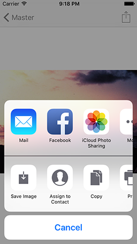

# UIActivityViewController explained

<!-- YOUTUBE: _bjMK-c1EV8 -->

Sharing things using iOS uses a standard, powerful component that other apps can plug into. As a result, it should be your first port of call when adding sharing to an app. This component is called `UIActivityViewController`: you tell it what kind of data you want to share, and it figures out how best to share it.

As we're working with images, `UIActivityViewController` will automatically give us functionality to share by iMessage, by email and by Twitter and Facebook, as well as saving the image to the photo library, assigning it to contact, printing it out via AirPrint, and more. It even hooks into AirDrop and the iOS extensions system so that other apps can read the image straight from us.

Best of all, it takes just a handful of lines of code to make it all work. But before we touch `UIActivityViewController`, we first need to give users a way to trigger sharing, and the way we’re going to use it is to add a bar button item.

Project 1, if you recall, used a `UINavigationController` to let users move between two screens. By default, a `UINavigationController` has a bar across the top, called a `UINavigationBar`, and as developers we can add buttons to this navigation bar that call our methods.

Let's create one of those buttons now. First, take a copy of your existing Project1 folder (the whole thing), and rename it to be Project3. Now launch it in Xcode, open the file DetailViewController.swift, and find the `viewDidLoad()` method. Directly beneath the `title =` line, 

    navigationItem.rightBarButtonItem = UIBarButtonItem(barButtonSystemItem: .action, target: self, action: #selector(shareTapped))

You’ll get an error for a moment, but that’s OK; please read on.

This is easily split into two parts: on the left we're assigning to the `rightBarButtonItem` of our view controller's `navigationItem`. This navigation item is used by the navigation bar so that it can show relevant information. In this case, we're setting the right bar button item, which is a button that appears on the right of the navigation bar when this view controller is visible.

On the right we create a new instance of the `UIBarButtonItem` data type, setting it up with three parameters: a system item, a target, and an action. The system item we specify is `.action`, but you can type `.` to have code completion tell you the many other options available. The `.action` system item displays an arrow coming out of a box, signaling the user can do something when it's tapped.

The `target` and `action` parameters go hand in hand, because combined they tell the `UIBarButtonItem` what method should be called. The `action` parameter is saying "when you're tapped, call the `shareTapped()` method," and the target parameter tells the button that the method belongs to the current view controller – `self`.

The part in `#selector` bears explaining a bit more, because it's new and unusual syntax. What it does is tell the Swift compiler that a method called "shareTapped" will exist, and should be triggered when the button is tapped. Swift will check this for you: if we had written "shareTaped" by accident – missing the second P – Xcode will refuse to build our app until we fix the typo.

If you don't like the look of the various system bar button items available, you can create one with your own title or image instead. However, it's generally preferred to use the system items where possible because users already know what they do.

With the bar button created, it's time to create the `shareTapped()` method. Are you ready for this huge, complicated amount of code? Here goes! Put this just after the `viewWillDisappear()` method:

    @objc func shareTapped() {
        guard let image = imageView.image?.jpegData(compressionQuality: 0.8) else {
            print("No image found")
            return
        }
        
        let vc = UIActivityViewController(activityItems: [image], applicationActivities: [])
        vc.popoverPresentationController?.barButtonItem = navigationItem.rightBarButtonItem
        present(vc, animated: true)
    }

That's it. With those handful of lines of code, `shareTapped()` can send photos via AirDrop, post to Twitter, and much more. You have to admit, iOS can be pretty amazing sometimes!

A lot of that code is old; we already learned about `present()` in project 2. However, some other parts are new, so let me explain what they do: 

- We start with the method name, marked with `@objc` because this method will get called by the underlying Objective-C operating system (the `UIBarButtonItem`) so we need to mark it as being available to Objective-C code. When you call a method using `#selector` you’ll always need to use `@objc` too.
- Our image view may or may not have an image inside, so we’ll read it out safely and convert it to JPEG data. This has a `compressionQuality` parameter where you can specify a value between 1.0 (maximum quality) and 0.0 (minimum quality_.
- Next we create a `UIActivityViewController`, which is the iOS method of sharing content with other apps and services.
- Finally, we tell iOS where the activity view controller should be anchored – where it should appear from.

On iPhone, activity view controllers automatically take up the full screen, but on iPad they appear as a popover that allows the user to see what they were working on below. This line of code tells iOS to anchor the activity view controller to the right bar button item (our share button), but this only has an effect on iPad – on iPhone it's ignored.

**Tip:** In case you were wondering, when you use `@IBAction` to make storyboards call your code, that automatically implies `@objc` – Swift knows that no `@IBAction` makes sense unless it can be called by Objective-C code.

Let's focus on how activity view controllers are created. As you can see in the code, you pass in two items: an array of items you want to share, and an array of any of your own app's services you want to make sure are in the list. We're passing an empty array into the second parameter, because our app doesn't have any services to offer. But if you were to extend this app to have something like "Other pictures like this", for example, then you would include that functionality here.

So, the real focus is on the first parameter: we're passing in `[image]`. This is the JPEG data that describes the user’s selected image, and iOS understands that it’s an image so it can post it to Twitter, Facebook, and other places.

And… that's it. No, really. We're pretty much done: your app now supports sharing.

Don’t worry if you’re not sure about `@objc` just yet – we’ll be coming back to it again and again. The main thing to remember is that when Swift code calls a Swift method that method doesn’t need to be marked `@objc`. On the other hand, when Objective-C code needs to call a Swift method – and that’s any time it gets called by one of Apple’s UI components, for example – then the `@objc` *is* required.

## Fixing a small bug

There’s one small but important bug with the current code: if you select Save Image inside the activity view controller, you’ll see the app crashes immediately. What’s happening here is that our app tries to access the user’s photo library so it can write the image there, but that isn’t allowed on iOS unless the user grants permission first.

To fix this we need to edit the Info.plist file for our project. We haven’t touched this yet, but it’s designed to hold configuration settings for your app that won’t ever change over time.

Select Info.plist in the project navigator, then when you see a big table full of data please right-click in the white space below that. Click “Add Row” from the menu that appears, and you should see a new list of options appear that starts with “Application Category”.

What I’d like you to do is scroll down in that list and find the name “Privacy - Photo Library Additions Usage Description”. This is what will be shown to the user when your app needs to add to their photo library.

When you select “Privacy - Photo Library Additions Usage Description” you’ll see “String” appear to the right of it, and to the right of “String” will be an empty white space. That white space is where you can type some text to show to the user that explains what your app intends to do with their photo library.

In this app we only need to save images, so put this text in the box: “We need to save photos you like.”

Now try running the app again, and this time selecting “Save Image” will show a message asking whether the user is OK with the app writing to their photos – much better!
