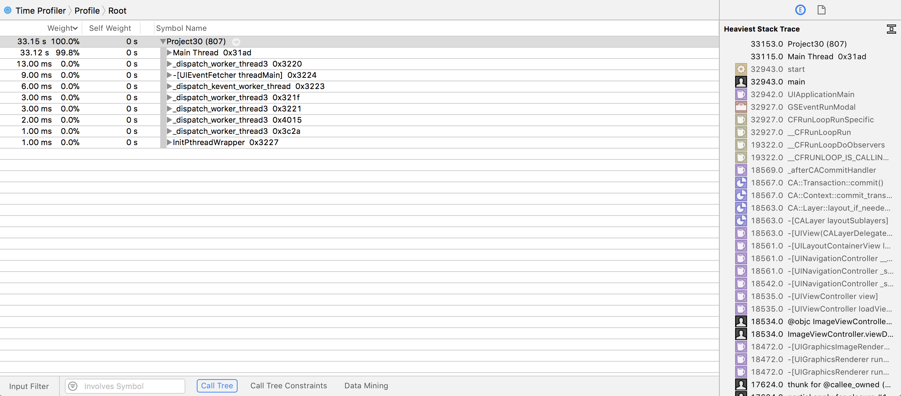

# What can Instruments tell us?

<!-- YOUTUBE: sY0zgtKfW1E -->

Press Cmd+I to run your app using Instruments, and after a few seconds a window will appear offering you a variety of profiling templates. Please select Time Profiler then click Choose. When the new window appears, click the red circle in the top-left corner to start recording of the app.

Your app will launch on your device (or in the simulator) and Instruments will begin monitoring its usage in realtime. You'll see a spike in Instruments' readings to begin with, which reflects the huge amount of work any app does just to start up. We don't care about that for now, we're more interested in the workload of the app once it's running.

So, scroll around a bit, tap an image, go back, scroll around some more, tap another image, and so on. Aim to get about at least 20 seconds or so of real app usage, then press the Stop button, which is where the record button was earlier.

The top half of your Instruments window will show readings from your app; the bottom half is showing details on those readings. By default, the detail view shows everything in the app run that was captured, but I want you to click and drag in the top window to select part of the readings when you tapped on an image. All being well (or as well as can be expected in this broken code!) you should see the readings noticeably spike at those places.

When you select an area of the readings like this, the detail view now shows information just on the part you chose. You should see that the vast majority of the time that was selected was spent on the main thread, which means we're not taking much advantage of having multiple CPU cores.

Immediately to the left of "Main thread" in the detail view is a disclosure arrow. You can click that to open up all the top-level calls made on the Main Thread, which will just be "Start", which in turn has its own calls under its own arrow. You can if you want hold down Option and click on these arrows, which causes all the children (and their children's children) to be opened up, but that gets messy.

Instead, there are two options. First, you should have a right-hand detail pane with two buttons: Extended Detail and Run Info (accessible through Cmd+1 and Cmd+2). Select "Main thread" in the detail view then press Cmd+1 to choose the extended detail view: this will automatically show you the "heaviest" stack trace, which is the code that took the most time to run.

In the picture below you can see the bottom half of Instruments after running a time profile. The pane on the right is showing the heaviest stack trace, and on the left you can see all the threads that were executing as well as what they were doing.

If you scroll down to the bottom, you'll see it's probably all around either in the table view’s `cellForRowAt` or the detail view’s `viewDidLoad()` depending on whether you spent more of your time flicking through the table view or going into the detail controller.

This heaviest stack trace is the part of your code that took up the most time. That might not always be your problem: sometimes something that runs slowly is just something that's always going to be slow, because it’s doing a lot of work. That said, it's always a good place to start!

The second option is inside the Call Tree menu that inside the status bar at the bottom of the Time Profiler window, and is called Invert Call Tree. This will show you the heaviest code first, with a disclosure arrow revealing what called it, and so on. Chances are you’ll now see lots of image-related functions: `argb32_sample_argb32()` is called by `argb32_image_mark()`, which is called by `argb32_imag()`, and so on.

There is a third option, but it's of mixed help. It's called "Hide system libraries" and is near to the "Invert Call Tree" checkbox. This eliminates all time being used by Apple's frameworks so you can focus on your own code. This is great if you have lots of complicated code that could be slow, but it doesn't help at all if your app is slow because you're using the system libraries poorly!

Now, although profiling your code is best done on a real device, using the simulator gives us some bonus functionality that will help us identify performance problems. So, try running the app in the simulator now.

Under the Debug menu on your Mac you’ll see a few options. Two in particular are very useful:

- **Color Blended Layers** shows views that are opaque in green and translucent in red. If there are multiple transparent views inside each other, you'll see more and more red.
- **Color Offscreen-Rendered** shows views that require an extra drawing pass in yellow. Some special drawing work must be drawn individually off screen then drawn again onto the screen, which means a lot more work.

Broadly speaking, you want "Color Blended Layers" to show as little red as possible, and "Color Offscreen-Rendered Yellow" to show no yellow.

Try these options on both the table view and the detail view to see how things look.
