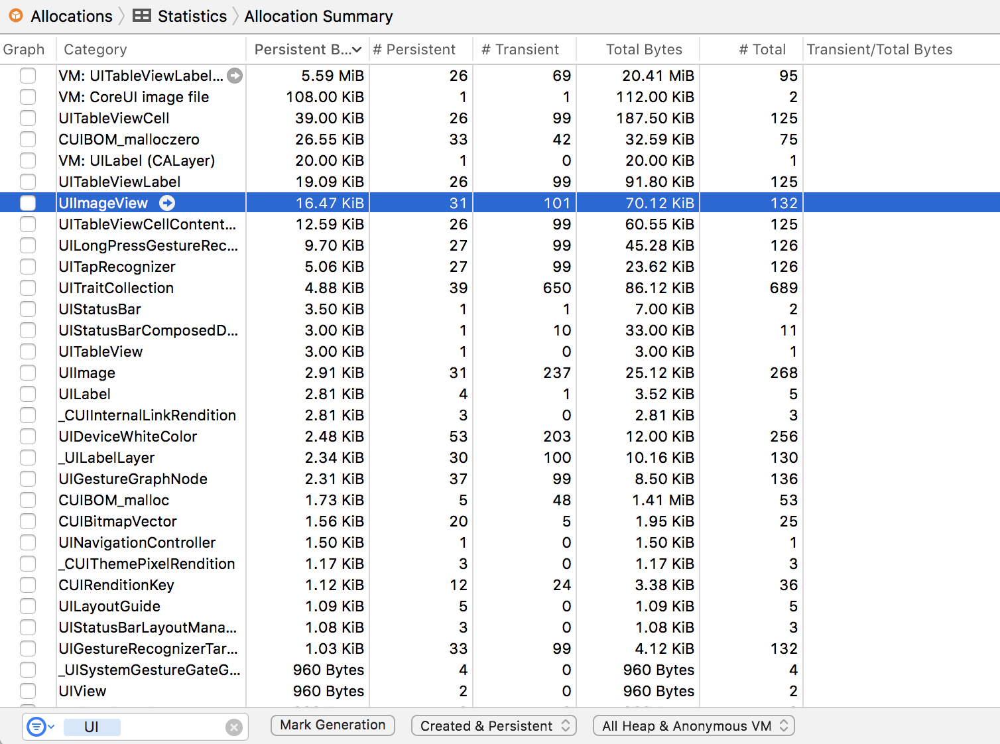

# Fixing the bugs: wasted allocations

<!-- YOUTUBE: q9BT3dK8sQs -->

Back in Xcode, press Cmd+I to launch a fresh instance of Instruments, and this time I want you to choose the Allocations instrument. This tells you how many objects you're creating and what happens to them. Press record, then scroll around the table view a few times to get a complete picture of the app running. At the very least, you should go all the way down to the bottom and back up two or three times.

What you'll see is a huge collection of information being shown – lots of "malloc", lots of "CFString", lots of "\_\_NSArrayM” and more. Stuff we just don't care about right now, because most of the code we have is user interface work. Fortunately, there's a search box just below the detail pane – it should say "Instrument Detail" but if you type "UI" in there it will only show information that has "UI" somewhere in there, which just happens to be all of Apple's user interface libraries!

In the picture below you can see how filtering for "UI" inside Instruments shows only data that has "UI" in its name somewhere, which primarily restricts the view to things that come from Apple's UIKit libraries.

Once you filter by "UI" you'll see `UIImage`, `UIImageView`, `UITableViewCell` and more. The allocations instrument will tell you how many of these objects are persistent (created and still exist) and how many are transient (created and since destroyed). Notice how just swiping around has created a large number of transient `UIImageView` and `UITableViewCell` objects?

This is happening because each time the app needs to show a cell, it creates it then creates all the subviews inside it – namely an image view and a label, plus some hidden views we don’t usually care about. iOS works around this cost by using the method `dequeueReusableCell(withIdentifier:)`, but if you look at the `cellForRowAt` method you won’t find it there. This means iOS is forced to create a new cell from scratch, rather than re-using an existing cell. This is a common coding mistake to make when you're not using storyboards and prototype cells, and it's guaranteed to put a speed bump in your apps.

If you look inside `cellForRowAt` method you'll see this line:

    let cell = UITableViewCell(style: .default, reuseIdentifier: "Cell")

That's the only place where table view cells are being created, so clearly it's the culprit because it creates a new cell every time the table view asks for one. This has been slow since the very first days of iOS development, and Apple has always had a solution: ask the table view to dequeue a cell, and if you get `nil` back then create a cell yourself.

This is different from when we were using prototype cells with a storyboard. With storyboards, if you dequeue a prototype cell then iOS automatically handles creating them as needed.

If you're creating table view cells in code, you have two options to fix this intense allocation of views. First, you could rewrite the above line to be this:

    var cell: UITableViewCell! = tableView.dequeueReusableCell(withIdentifier: "Cell")

    if cell == nil {
        cell = UITableViewCell(style: .default, reuseIdentifier: "Cell")
    }

That dequeues a cell, but if it gets `nil` back then we create one. Note the force unwrapped optional at the end of the first line – we’re saying that `cell` might initially be empty, but it will definitely have a value by the time it’s used.

The other solution you could use is to register a class with the table view for the reuse identifier "Cell". Using this method you would add this to `viewDidLoad()`:

    tableView.register(UITableViewCell.self, forCellReuseIdentifier: "Cell")

And now we can use our usual method dequeuing table view cells inside `cellForRowAt`:

    let cell = tableView.dequeueReusableCell(withIdentifier: "Cell", for: indexPath)

With this approach, you will never get `nil` when dequeuing a cell with the identifier "Cell". As with prototype cells, if there isn't one to dequeue a new cell will be created automatically.

The second solution is substantially newer than the first and can really help cut down the amount of code you need. But it has two drawbacks: with the first solution you can specify different kinds of cell styles than just `.default`, not least the `.subtitle` option we used in project 7; also, with the first solution you explicitly know when a cell has just been created, so it's easy to force any one-off work into the `if cell == nil {` block.

Regardless of which solution you chose (you'll use both in your production code, I expect), you should be able to run the allocations instrument again and see far fewer table view cell allocations. With this small change, iOS will just reuse cells as they are needed, which makes your code run faster and operate more efficiently.
