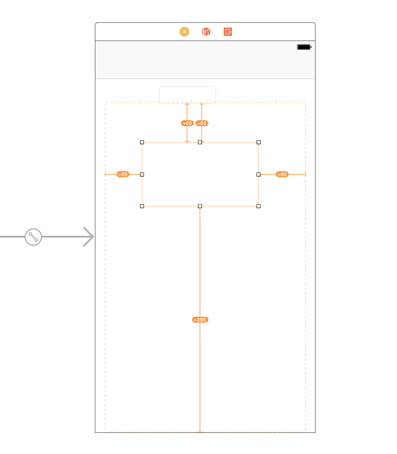
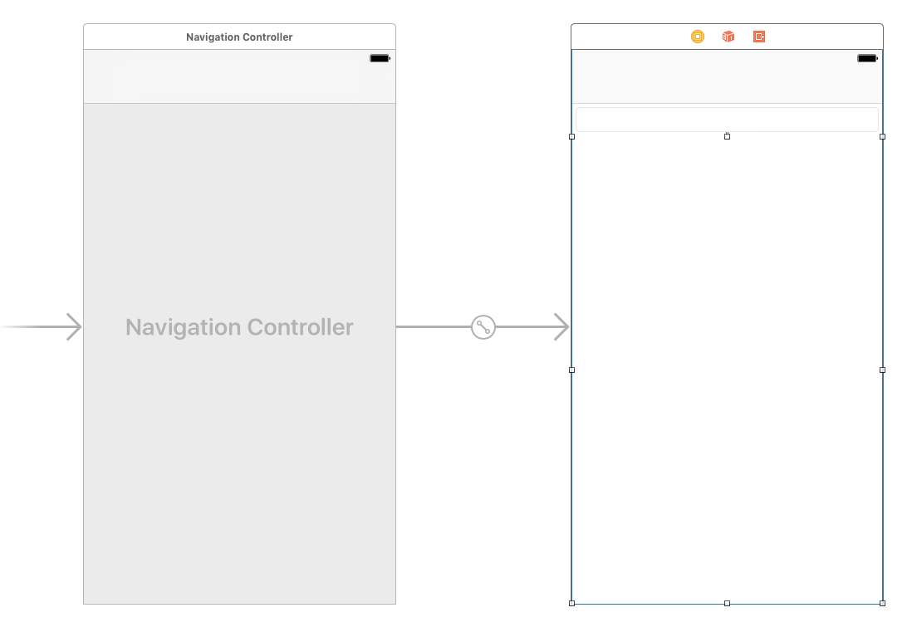
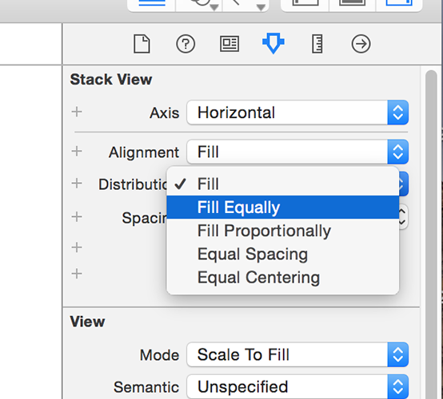

# UIStackView by example

It's very rare I say this, but Android does have some features that are enviable, and one of them is called `LinearLayout`. When you add views to a `LinearLayout`, they automatically stack up vertically one above the other, or horizontally, side by side. You don't have to worry about sizing them to fit correctly because they automatically fill the space, and you don't have to worry about moving other things around when you remove a view. Well, that's exactly what the UIKit component `UIStackView` gives us: a flexible, Auto Layout-powered view container that makes it even easier to build complex user interfaces.

As an example, lets say you want users to fill in a short form: you have a label saying "Name" then a `UITextField` to the right of it; beneath that you have another label saying "Address" and a `UITextView` beneath it; below that you have a label saying "Opt-in to marketing" and to the right of that a switch; and so on. This isn't uncommon, and to be fair it's not exactly hard to make this in Auto Layout, but you do still need to do a lot grunt work for not much benefit.

The problems usually occur if you want to make changes later: what if there's no longer enough space to show your Name label and its `UITextField` side by side? Previously this would happen if your app was running on iPhone, but with the new multitasking system in iPad it can happen if your user activates Slide Over or uses your app in Split View.

Multitasking comes in two varieties:

- **Slide Over** is when your app literally sits over the screen on the right edge, with the original application remaining full screen but dimmed. This is supported on most newer iPads.
- **Split View** is activated if the user drags the Slide Over divider to the left slightly, and it causes your app to be pinned to the screen edge while the original application is resized to take up less space. This is supported only on iPad Air 2 and newer devices.

In both these scenarios, your app now has much less space to work with, so your label and text field won't sit well side by side. Fortunately, `UIStackView` can fix this problem: you can tell it to place items side by side when your app has lots of space, or placed vertically when space is restricted. So, your app will look great on iPhone, iPad, in Slide Over and in Split View, all with a single layout.

What's more, `UIStackViews` can be nested, meaning that you can have stack views inside stack views to create a flexible grid-like layout in no time at all.

In our app, we're going to have a `UIStackView` take up nearly all the screen, and it will host multiple web views inside it. Our interface will also need a `UITextField` in there so users can enter a URL to visit. We'll use Auto Layout to pin these views in place and resize to fill the screen, but that's all.

So, open Main.storyboard in Interface Builder, then embed the existing view controller inside a navigation controller and move it across so you can see it fully. Using the object library, drag a Text Field anywhere into your view, then drag a Horizontal Stack View directly below it. Don't worry about size and position: all that matters is that the text field is above the stack view.

I want you to make the text field stretch from the left edge to the right edge in its view, with some space above and below. We’ve used a couple of different Auto Layout techniques so far, but I want to show you one more now: the Pin menu.

With the text field selected, look at the bottom of the Interface Builder window to where it says “View as: iPhone 8”. To the right of that is the zoom controls, probably showing 100% right now. But to the right of *that* are four buttons that can help you with your layout. The third of those is the Pin menu, which sets Auto Layout constraints based on containers and neighbors. Please click that now to bring up the Pin menu.

Using the menu that appears, deselect Constrain to Margins, then type 5 in each of the four text boxes. This will color the four pin lines as solid red rather than dashed lines, and you can then click "Add 4 Constraints" at the bottom of the Pin menu to save your changes.

When you click "Add 4 Constraints", four Auto Layout warnings will appear telling you that your view isn't placed correctly. Ignore them for a moment. Select your stack view, then open up the Pin menu for that. Deselect Constrain to Margins again, then enter the number 5 for the top value and 0 for the left, right and bottom values. Again, click "Add 4 Constraints".

You'll see even more Auto Layout warnings, and your view still looks like a mess. We're going to fix that now: go to the Editor menu and choose Resolve Auto Layout Issues button > Update Frames option from under where it says "All Views in View Controller". Boom! Your view will re-layout to match our exact requirements: the text field along the top, and a stack view below, both occupying all the screen. Easy, huh?

Before we're done with Interface Builder, we're going to make two small changes to the stack view, so make sure it's selected then open the attributes inspector (Alt+Command+4). From the list of attributes, please change Distribution to Fill Equally, then for Spacing enter 5.

There are a few options for the Distribution attribute, and it's worth covering what they do briefly. If our stack view had four subviews in there, then:

- **Fill** will leave three of them their natural size, and make the fourth one take up the most space. It uses Auto Layout's content hugging priority to decide which one to stretch.
- **Fill Equally** will make each subview the same size so they fill all the space available to the stack view.
- **Fill Proportionally** uses the intrinsic content size of each subview to resize them by an equal amount. So view 1 was designed to have twice as much height as views 2, 3 and 4, that ratio will remain when they are resized – all the subviews get proportionally bigger or smaller.
- **Equal Spacing** does not resize the subviews, and instead resizes the spacing between the subviews to fill the space.
- **Equal Centering** is the most complicated, but for many people also the most aesthetically pleasing. It attempts to ensure the centers of each subview are equally spaced. This might mean that the right edge of view 1 is only 10 points from the left edge of view 2, while the right edge of view 2 is 50 points from the left edge of view 3, but what matters is that the centers of view 1, 2, 3 and 4 are all identically spaced.

As for the Spacing attribute, this just determines how much margin to place between items in the stack view. We've set it to 5 here so there's a nice gap between our web views.

The last thing to do is create some connections, so hit Alt+Cmd+Return to go to the Assistant Editor. Now create IBOutlets for the text field and stack view, called `addressBar` and `stackView` respectively. Please also set the view controller to be the delegate of the text field by Ctrl+dragging from the text field to the gold and white View Controller icon in the document outline.

We're done with Interface Builder, so press Cmd+Return to return to the Standard Editor, then open ViewController.swift for editing. Time to write some code! And I hope you're ready for just how easy this is going to be…
