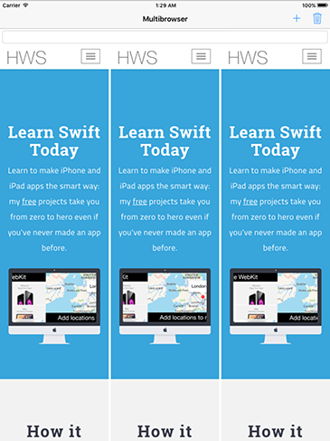

# Adding views to UIStackView with addArrangedSubview()

With our storyboard designed, it's time to write the code. As you know, our plan is to produce an app where the user can have multiple web views visible at one time, stacked together and usable in their own right. We have one address bar, so the user will need to tap a web view to select it, then enter a URL to visit.

To make this interface work, we need two buttons in our navigation bar: one to add a new web view, and one to delete whichever one the user doesn't want any more. We're also going to use the title space in the navigation bar to show the page title of whichever web view is currently active.

So, modify your `viewDidLoad()` method to this:

    override func viewDidLoad() {
        super.viewDidLoad()

        setDefaultTitle()

        let add = UIBarButtonItem(barButtonSystemItem: .add, target: self, action: #selector(addWebView))
        let delete = UIBarButtonItem(barButtonSystemItem: .trash, target: self, action: #selector(deleteWebView))
        navigationItem.rightBarButtonItems = [delete, add]
    }

That uses three new methods we haven't created yet, and we’ll fix them in turn starting with the missing `setDefaultTitle()` method. This is a fairly simple method in this project, but you're welcome to extend it later to add more interesting information for users prompting them to get started. Put this method directly beneath `viewDidLoad()`:

    func setDefaultTitle() {
        title = "Multibrowser"
    }

The second missing method, `addWebView()`, is responsible for  adding a new `WKWebView` to our `UIStackView`. This is done using a method on the stack view called `addArrangedSubview()` and *not* `addSubview()`. That's worth repeating, because it's extremely important: **you do not call `addSubview()` on `UIStackView`**. The stack view has its own subviews that it manages invisibly to you. Instead, you add to its arranged subviews array, and the stack view will arrange them as needed.

So, our first draft of `addWebView()` is pretty easy: we create a new `WKWebView`, set our view controller to be the web view's delegate, add it to the stack view, then point it at an example URL to get things started.

First, add an import for `WebKit` so we can use `WKWebView`:  

    import WebKit

Now here’s the code for `addWebView()` – put this into ViewController.swift, just below `setDefaultTitle()`:

    @objc func addWebView() {
        let webView = WKWebView()
        webView.navigationDelegate = self

        stackView.addArrangedSubview(webView)

        let url = URL(string: "https://www.hackingwithswift.com")!
        webView.load(URLRequest(url: url))
    }

You can't assign `self` to `webView.navigationDelegate` without conforming to the `WKNavigationDelegate` delegate, so please add that. While you're there, you should also add `UITextFieldDelegate` and `UIGestureRecognizerDelegate` – we'll be using these later. So, your view controller's class should start like this:

    class ViewController: UIViewController, WKNavigationDelegate, UITextFieldDelegate, UIGestureRecognizerDelegate {

Notice that we don't need to give the web view a frame or any Auto Layout constraints – that's all handled for us by `UIStackView`.

Remember, iOS apps can only load HTTPS websites by default, and you need to enable App Transport Security exceptions if you want to load non-secure websites. If you want to learn how to do that, [see my guide to App Transport Security](/example-code/system/how-to-handle-the-https-requirements-in-ios-9-with-app-transport-security).

To make the project build cleanly, I want you to create an empty `deleteWebView()` method now:

    @objc func deleteWebView() {
    }

With that in place you can run the project now and try clicking + a couple of times to add new web views, and you'll see them stack up beautifully. Stack views are amazing, right? If you find that the web views aren't appearing correctly, make sure you have set the Distribution attribute of the stack view to be Fill Equally.

Now that you can see why stack views are perfectly suited to our project, you may notice a major flaw in the plan: how does the user control each web view? And how do they know which one is currently being controlled?

We're going to fix both these problems at once using something brilliant in its simplicity: we're going to let users tap on a web view to activate it, then highlight the selected web view in blue so the user knows what's in control. When a web view is activated we also want to show its page title in the navigation bar, and if the user enters a new URL in the address bar it will be loaded inside the active web view.

We're going to draw a blue line around the selected web view so readers can clearly see their current status. To make things easier, we'll draw a blue line around every one of the web views, but because the default line width is 0 it won't be visible until we say so. I'm going to put the code to select web views inside a method so that it can be called when we create a new web view (so that each new web view starts life active) and also when a web view is tapped.

As for handling taps, we'll do that by adding a `UITapGestureRecognizer` to each web view as it's created. This has one minor complication, but it's easily fixed: `WKWebView` already has a pile of gesture recognizers attached to it, and it will catch and consume any taps before our own gesture recognizer. The fix is easy, though, and it's just a matter of telling iOS we want our recognizer and the built-in ones to work at the same time.

So, add this code to the end of `addWebView()`:

    webView.layer.borderColor = UIColor.blue.cgColor
    selectWebView(webView)

    let recognizer = UITapGestureRecognizer(target: self, action: #selector(webViewTapped))
    recognizer.delegate = self
    webView.addGestureRecognizer(recognizer)

We haven't written `selectWebView()` yet, but before we do I just want to recap its job. This method will get called whenever we want to activate a web view, meaning that we want it to be the one used to navigate to any URL the user requests, and we also want it to be highlighted so the user knows which view is in control.

We're going to track the active web view inside a property called `activeWebView`, so add this now:

    weak var activeWebView: WKWebView?

It's `weak` because it might go away at any time if the user deletes it.

With that property created, the `selectWebView()` method is straightforward: it needs to loop through the array of web views belonging to the stack view, updating each of them to have a zero-width border line, then set the newly selected one to have a border width of three points. Here's the code – place it below `addWebView()`:

    func selectWebView(_ webView: WKWebView) {
        for view in stackView.arrangedSubviews {
            view.layer.borderWidth = 0
        }

        activeWebView = webView
        webView.layer.borderWidth = 3
    }

There are two more things to do before our app starts to become useful: we need to implement the `webViewTapped()` method so that our tap gesture recognizers start working, then we need to detect when users have entered a new URL so we can navigate to it.

First up, here's the `webViewTapped()` method that gets called by the tap gesture recognizers when they are triggered:

    @objc func webViewTapped(_ recognizer: UITapGestureRecognizer) {
        if let selectedWebView = recognizer.view as? WKWebView {
            selectWebView(selectedWebView)
        }
    }

Like I said, you need to tell iOS we want these gesture recognizers to trigger alongside the recognizers built into the `WKWebView`, so add this too:

    func gestureRecognizer(_ gestureRecognizer: UIGestureRecognizer, shouldRecognizeSimultaneouslyWith otherGestureRecognizer: UIGestureRecognizer) -> Bool {
        return true
    }

We already set our view controller to be the delegate of the `UITapGestureRecognizers` we create for the web views, which means that new method will automatically tell iOS to trigger all gesture recognizers at the same time.

Finally, at least for this chapter, we need to detect when the user enters a new URL in the address bar. We already set this view controller to be the delegate of the address bar, so we'll get sent the `textFieldShouldReturn()` delegate method when the user presses Return on their iPad keyboard. We then need to make sure we have an active web view and that there's a URL to navigate to, and make it happen. We're also going to call `resignFirstResponder()` on the text field so that the keyboard hides.

Put this into your code, below `selectWebView()`:

    func textFieldShouldReturn(_ textField: UITextField) -> Bool {
        if let webView = activeWebView, let address = addressBar.text {
            if let url = URL(string: address) {
                webView.load(URLRequest(url: url))
            }
        }

        textField.resignFirstResponder()
        return true
    }

Notice that there are a few `if lets` in there to make sure all the data is unwrapped safely, and particularly important is the URL: if you try to enter a URL without “https://“ iOS will reject it. That's something you can fix later!

At this point your project should compile, although we still haven't added any code to the delete navigation button so don't tap it just yet. You can, though, click + a few times to add some web views, then select one and enter a URL to navigate.
