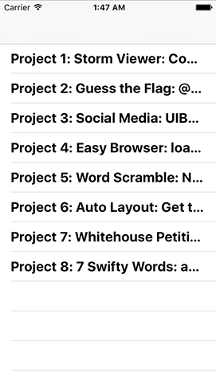
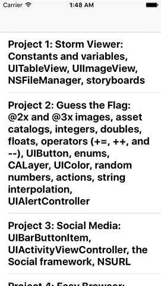
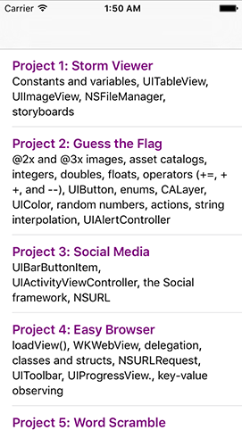

# Automatically resizing UITableViewCells with Dynamic Type and NSAttributedString

We're going to make a `UITableView` with formatted text that matches a user's preferred size, and where every cell automatically resizes to fit its contents. What's more, it's going to be so easy that you'll barely notice – Apple really has polished this technology, so you get an incredible amount of power for free.

First, though, we need to put in place the same basic `UITableViewController` foundations we’ve used several times before. So, start by opening ViewController.swift, and making the `ViewController` class inherit from `UITableViewController` rather than `UIViewController`.

Next, open Main.storyboard and delete the current view controller from the canvas. Replace it with a new Table View Controller, check its “Is Initial View Controller” box, change its class to be “ViewController”, then embed it inside a navigation controller.

Finally, select the table view’s single prototype cell, then give it the identifier “Cell” and the style “Basic”. That’s our complete interface, so you can close Main.storyboard and return to ViewController.swift.

We want our view controller to track an array called `projects`, in which we’ll track lots of Hacking with Swift projects for this app. There are lots of pieces of metadata we could store about Hacking with Swift projects, but the goal here isn't to teach you about custom subclasses – we already did that in [the tutorial on UserDefaults and NSCoding](/read/12). So, we're going to take an epic shortcut here so we can spend more time focusing on the new stuff: the projects array will hold an array of String arrays.

Arrays within arrays aren't complicated, but I'm just going to clarify in case some people didn't quite understand. Each project will be stored as an array of two elements: the project name and its subtitle. We'll then store an array of those to contain all the projects. At the end of this project we'll return to this as homework to test your skills, but for the purpose of this project it's perfectly fine.

So, add this property to the `ViewController` class now:

    var projects = [[String]]()

Let's fill up that new property with the first eight projects from Hacking with Swift. I would do more, but there's no point – you get the idea, and it just takes up more space on your screen! Put this at the end of your `viewDidLoad()` method:

    projects.append(["Project 1: Storm Viewer", "Constants and variables, UITableView, UIImageView, FileManager, storyboards"])
    projects.append(["Project 2: Guess the Flag", "@2x and @3x images, asset catalogs, integers, doubles, floats, operators (+= and -=), UIButton, enums, CALayer, UIColor, random numbers, actions, string interpolation, UIAlertController"])
    projects.append(["Project 3: Social Media", "UIBarButtonItem, UIActivityViewController, the Social framework, URL"])
    projects.append(["Project 4: Easy Browser", "loadView(), WKWebView, delegation, classes and structs, URLRequest, UIToolbar, UIProgressView., key-value observing"])
    projects.append(["Project 5: Word Scramble", "Closures, method return values, booleans, NSRange"])
    projects.append(["Project 6: Auto Layout", "Get to grips with Auto Layout using practical examples and code"])
    projects.append(["Project 7: Whitehouse Petitions", "JSON, Data, UITabBarController"])
    projects.append(["Project 8: 7 Swifty Words", "addTarget(), enumerated(), count, index(of:), property observers, range operators."])

So far, so easy. The next step is hardly challenging either: let's show each project's title and subtitle in the table view cells.

We're going to do this in a very basic way at first, but it's enough to get you started. As you know, we need to write two basic table view methods in order to get up and running: `numberOfRowsInSection` and `cellForRowAt`. Here’s the first:

    override func tableView(_ tableView: UITableView, numberOfRowsInSection section: Int) -> Int {
        return projects.count
    }

The `cellForRowAt` method is only fractionally harder: we’re going to make it show each project's title and subtitle using Swift's string interpolation. Here's the new code:

    override func tableView(_ tableView: UITableView, cellForRowAt indexPath: IndexPath) -> UITableViewCell {
        let cell = tableView.dequeueReusableCell(withIdentifier: "Cell", for: indexPath)

        let project = projects[indexPath.row]
        cell.textLabel?.text = "\(project[0]): \(project[1])"

        return cell
    }

Your project is now good to run, but what you'll see is deeply unsatisfying: each of the table view cells shows only one line of text, so our summaries get truncated after only a few letters, making them rather pointless.

Fortunately, iOS allows us to request automatic sizing of table view cells based on their contents. Even better, this technology is already baked right into our project!

To make our project titles and subtitles fully visible, we just need to tell the `UITableViewCell` that its label should show more than one line. Go back to Main.storyboard, then use the document outline to select the “Title” label inside the table view cell – you'll know when you have the correct thing selected because the Attributes inspector will say Label at the top.

Once the label is selected, look for the Lines property – it will be 1 by default, but you should change that to 0, which means "as many lines as it takes to fit the text."

That's it. No, really: go ahead and run your app now and you'll see every cell now correctly fits its content. And if you rotate between portrait and landscape you'll even see everything resize smoothly – it really couldn't be simpler.

But this has exposed another problem: the app looks terrible! All that text doesn't help users see what's important and what's not, so it's terrible user interface design. We're going to fix this with a technology called `NSAttributedString`, which a way of adding formatting such as fonts, colors and alignment to text, and can even be used to add hyperlinks if you want them.

In our case, we're going to make the project titles big and their subtitles small. We could do this by creating a `UIFont` at various sizes, but a much smarter (and user friendly!) way is to use a technology called Dynamic Type. This lets users control font size across all applications to match their preferences – they just make their choice in Settings, and Dynamic Type-aware apps respect it.

Apple pre-defined a set of fonts for use with Dynamic Type, all highly optimized for readability, and all responsive to a user's settings. To use them, all you need to do is use the `preferredFont(forTextStyle:)` method of `UIFont` and tell it what style you want. In our case we're going to use `.headline` for the project title and `.subheadline` for the project subtitle.

Remarkably enough, that's all you need to handle Dynamic Type in this project, so we can turn to look at `NSAttributedString`. Like I said, this class is designed to show text with formatting, and you can use it all across iOS to show formatted labels, buttons, navigation bar titles, and more. You create an attributed string by giving it a plain text string plus a dictionary of the attributes you want to set. If you want finer-grained control you can provide specific ranges for formatting, e.g. "bold and underline the first 10 characters, then underline everything else."

For this project, our use of attributed strings isn't complicated: we're going to create one set of formatting attributes for the title and another for the subtitle, create an attributed string out of both of them, then merge them together and return. To make things easier to read for the user, we're going to separate the title and subtitle with a line break, which looks a lot nicer.

To keep our code easy to understand, I put the attributed string work into a new method called `makeAttributedString()`. Here's the code:

    func makeAttributedString(title: String, subtitle: String) -> NSAttributedString {
        let titleAttributes = [NSAttributedString.Key.font: UIFont.preferredFont(forTextStyle: .headline), NSAttributedString.Key.foregroundColor: UIColor.purple]
        let subtitleAttributes = [NSAttributedString.Key.font: UIFont.preferredFont(forTextStyle: .subheadline)]

        let titleString = NSMutableAttributedString(string: "\(title)\n", attributes: titleAttributes)
        let subtitleString = NSAttributedString(string: subtitle, attributes: subtitleAttributes)

        titleString.append(subtitleString)

        return titleString
    }

There are some new things in there, so let's go over them quickly:

- `NSAttributedString.Key.font` is the dictionary key that specifies what font the attributed text should use. This should be provided with a `UIFont` as its value, and like I said already we're using `preferredFont(forTextStyle:)` so we can take advantage of Dynamic Type.
- `NSAttributedString.Key.foregroundColor` is the dictionary key that specifies what text color to use. This isn't needed in this project, but I figured it would be boring to have only attribute!
- Both attributed strings are created by providing a plain text string and the matching dictionary of attributes. The title string is created as a `NSMutableAttributedString` because we append the subtitle to the title to make one attributed string that can be returned.

The last piece of the puzzle is to use the return value from `makeAttributedString()` inside `cellForRowAt` so that our interface looks better. This is just a matter of setting the `attributedText` property rather than the `text` property of the cell's text label, like this:

    override func tableView(_ tableView: UITableView, cellForRowAt indexPath: IndexPath) -> UITableViewCell {
        let cell = tableView.dequeueReusableCell(withIdentifier: "Cell", for: indexPath)

        let project = projects[indexPath.row]
        cell.textLabel?.attributedText = makeAttributedString(title: project[0], subtitle: project[1])

        return cell
    }

That's it! Go ahead and run the app now and admire your purple headlines!

