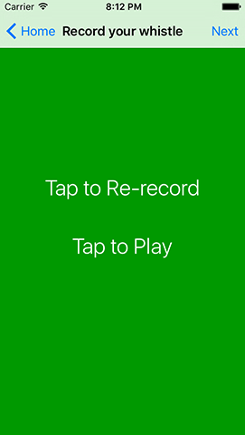

# Recording from the microphone with AVAudioRecorder

We're going to start off this project easily enough by looking at `AVAudioRecorder`: the iOS way of recording audio from the microphone. You might be tempted to skip past this so you can focus on the CloudKit parts, but please don't – I didn't put audio recording in here just for fun! Instead, it's used to demonstrate how to store binary assets (i.e., data files) inside CloudKit, so it's an integral part of the project.

The built-in Xcode template will have given you one empty view controller inside Main.storyboard, plus a ViewController.swift file. We're going to be doing almost all the user interface in code for this project, so you can almost ignore the storyboard entirely – in fact, all you need to do is select the view controller that was created and embed it inside a navigation controller. Now go to ViewController.swift and add these lines to `viewDidLoad()`:

    title = "What's that Whistle?"
    navigationItem.rightBarButtonItem = UIBarButtonItem(barButtonSystemItem: .add, target: self, action: #selector(addWhistle))
    navigationItem.backBarButtonItem = UIBarButtonItem(title: "Home", style: .plain, target: nil, action: nil)

That gives us a button to tap to add a whistle to the app, then customizes the title of the navigation bar's back button to say "Home" rather than "What's that Whistle?" which is a bit too long. We're going to return to this view controller much later to add a table view and other bits, but for now let's write the very simple `addWhistle()` method:

    @objc func addWhistle() {
        let vc = RecordWhistleViewController()
        navigationController?.pushViewController(vc, animated: true)
    }

So, that creates a new object of type `RecordWhistleViewController` (not yet written), and pushes it onto the view controller stack. That's it for ViewController.swift for now – trust me, we'll be adding a *lot* more code to it later!

Add a new file to your project, choosing Cocoa Touch Class. Make it a subclass of `UIViewController` and name it `RecordWhistleViewController`. Make sure "Also create XIB file" is not selected and that "Swift" is chosen for your language, then click Next to save it.

To begin with, we're going to place a `UIStackView` into the view, along with a button saying "Tap to record". You might think the stack view isn't necessary, but once we've got the recording working we're going to add a playback button and have `UIStackView` animate it all nicely for us, so it is definitely needed.

First things first: let's create the stack view, then use Auto Layout to so that it’s vertically centered and stretched to fill the full width of its container view. This way, the stack view will automatically grow as more views are added to it, which can be animated to look slick.

Add this property to the new `RecordWhistleViewController` class:

    var stackView: UIStackView!

Like I said, we're going to be doing all the view layout in code to make it easier to follow. `UIStackView` takes care of all the layout of its subviews, so all we need to do is position and size the stack view correctly. Put this into your class to load the view:

    override func loadView() {
        view = UIView()

        view.backgroundColor = UIColor.gray

        stackView = UIStackView()
        stackView.spacing = 30
        stackView.translatesAutoresizingMaskIntoConstraints = false
        stackView.distribution = UIStackView.Distribution.fillEqually
        stackView.alignment = .center
        stackView.axis = .vertical
        view.addSubview(stackView)

        stackView.leadingAnchor.constraint(equalTo: view.leadingAnchor).isActive = true
        stackView.trailingAnchor.constraint(equalTo: view.trailingAnchor).isActive = true
        stackView.centerYAnchor.constraint(equalTo: view.centerYAnchor).isActive = true
    }

As you’ve seen in previous tutorials, Auto Layout has a variety of ways of achieving the same result depending on your exact scenario. In this case, using anchors is the simplest, and it takes just three lines of code to get the result we want.

I've covered all that in previous projects, but now for the new stuff: using `AVAudioRecorder` to record audio from the microphone. If you're using the simulator this will automatically use your Mac's built-in microphone, so you can test either on device or in the simulator.

Recording audio in iOS uses two classes: `AVAudioSession` and `AVAudioRecorder`. `AVAudioSession` is there to enable and track sound recording as a whole, and `AVAudioRecorder` is there to track one individual recording. That is, the session is the bit that ensures we are able to record, the recorder is the bit that actual pulls data from the microphone and writes it to disk.

Use of the microphone is restricted by access controls, as you might imagine, so when we use `AVAudioSession` to request access it will automatically display a warning to the user, prompting them to confirm the access. Once we have access, we can record as much data as we want at whatever quality we want, and iOS will do most of the work.

To make the interface user friendly we're going to allow users to re-record their whistle as many times as it takes, so we'll need a button to handle that. We're also going to change the background color of the view to either red or green, to show the recording or not recording state in a more visually obvious way.

First up, we need to import the `AVFoundation` framework for this class, so please add this import now:

    import AVFoundation

We're also going to track three new properties: the record button, the recording session, and the `AVAudioRecorder` itself. Please add these three properties to your class:

    var recordButton: UIButton!

    var recordingSession: AVAudioSession!
    var whistleRecorder: AVAudioRecorder!

Now for the complicated part: setting up the recording environment. To do this, we're going to get hold of the built-in system audio session and ask for play and record privileges – record so we can grab audio from the microphone, and play so users can preview what was recorded. We'll use the `requestRecordPermission()` method of the audio session to ask the user whether we can record or not, and give that a trailing closure to execute when the user makes a choice.

If the user grants us access to the microphone, we'll execute a new method called `loadRecordingUI()`, otherwise we'll call `loadFailUI()`. Both of these need to be pushed onto the main thread because the callback from `requestRecordPermission()` can happen on any thread. I'll provide you with method stubs for `loadRecordingUI()` and `loadFailUI()` for now, but we'll add to them shortly. Replace your current `viewDidLoad()` with this:

    override func viewDidLoad() {
        super.viewDidLoad()

        title = "Record your whistle"
        navigationItem.backBarButtonItem = UIBarButtonItem(title: "Record", style: .plain, target: nil, action: nil)

        recordingSession = AVAudioSession.sharedInstance()

        do {
            try recordingSession.setCategory(.playAndRecord, mode: .default)
            try recordingSession.setActive(true)
            recordingSession.requestRecordPermission() { [unowned self] allowed in
                DispatchQueue.main.async {
                    if allowed {
                        self.loadRecordingUI()
                    } else {
                        self.loadFailUI()
                    }
                }
            }
        } catch {
            self.loadFailUI()
        }
    }

    func loadRecordingUI() {
    }

    func loadFailUI() {
    }

Just calling `requestRecordPermission()` isn’t enough to record from the microphone. As with reading photos, we also need to add a string to the Info.plist file explaining to the user what we intend to do with the audio. So, open the Info.plist file now, select any row, then click the + next that appears next to it. Select the key name “Privacy - Microphone Usage Description” then give it the value “We need to record your whistle.” Done!

To help the interface adapt to each user's preferences, we're going to use Dynamic Type to control our fonts. This means users can adjust the font size in the Settings app and have it reflected in our app. We don't need to worry about sizing up or positioning the buttons – just by using `.title1` and `.headline` we give the labels enough information to size themselves, and the stack view will do the rest.

Here's some new code for `loadRecordingUI()` and `loadFailUI()`; replace the previous stubs with this:

    func loadRecordingUI() {
        recordButton = UIButton()
        recordButton.translatesAutoresizingMaskIntoConstraints = false
        recordButton.setTitle("Tap to Record", for: .normal)
        recordButton.titleLabel?.font = UIFont.preferredFont(forTextStyle: .title1)
        recordButton.addTarget(self, action: #selector(recordTapped), for: .touchUpInside)
        stackView.addArrangedSubview(recordButton)
    }

    func loadFailUI() {
        let failLabel = UILabel()
        failLabel.font = UIFont.preferredFont(forTextStyle: .headline)
        failLabel.text = "Recording failed: please ensure the app has access to your microphone."
        failLabel.numberOfLines = 0

        stackView.addArrangedSubview(failLabel)
    }

As you should know by now, setting `numberOfLines` to 0 means "wrap over as many lines as you need." Also, and this is important, you should also be aware that you never add a subview to a `UIStackView` directly. Instead, you use its `addArrangedSubview()` method, which is what triggers the layout work.

Tapping that button will trigger a method that we haven't written yet: `recordTapped()`. But before we get onto that, you need to know a little about how recording works:

- You need to tell iOS where to save the recording. This is done when you create the `AVAudioRecorder` object because iOS streams the audio to the file as it goes so it can write large files.
- Before recording begins, you need to decide on a format, bit rate, channel number and quality. We'll be using Apple's AAC format because it gets the most quality for the lowest bitrate. For bitrate we'll use 12,000Hz, which, when combined with the High AAC quality, sounds good in my testing. We'll specify 1 for the number of channels, because we don’t need stereo for these simple recordings.
- If you set your view controller as the delegate of a recording, you'll be told when recording stops and whether it finished successfully or not.
- Recording won't stop if your app goes into the background briefly. Instead, it's things like a call coming in that might make it stop unexpectedly.

As our app is simple, we don't need a complicated method to figure out where to save our whistle audio. [In project 10](/read/10/4/importing-photos-with-uiimagepickercontroller) I gave you a simple helper method called `getDocumentsDirectory()`, which returns the path to a writeable directory owned by your app. This is a great place to save the audio, so we'll take that and append "whistle.m4a" for our filename. Put these two new methods into your code:

    class func getDocumentsDirectory() -> URL {
        let paths = FileManager.default.urls(for: .documentDirectory, in: .userDomainMask)
        let documentsDirectory = paths[0]
        return documentsDirectory
    }

    class func getWhistleURL() -> URL {
        return getDocumentsDirectory().appendingPathComponent("whistle.m4a")
    }

Note that both of those methods have the `class` keyword at the beginning, which means you call them on the class not on instances of the class. This is important, because it means we can find the whistle URL from anywhere in our app rather than typing it in everywhere.

When we want to start recording, the app needs to do a few things:

1. Make the view have a red background color so the user knows they are in recording mode.
2. Change the title of the record button to say "Tap to Stop".
3. Use the `getWhistleURL()` method we just wrote to find where to save the whistle.
4. Create a settings dictionary describing the format, sample rate, channels and quality.
5. Create an `AVAudioRecorder` object pointing at our whistle URL, set ourselves as the delegate, then call its `record()` method.

Before I show you the code for that, there are two other important things to know. First, when working in the simulator I usually like to print out the URL to a file using `print()`, because it means I can look at it in Finder and be sure it's working correctly. Second, creating an `AVAudioRecorder` can throw an error, so we need to wrap it in a `do/try/catch` block.

That's it – here's the code for `startRecording()`, with numbers added to match the list above:

    func startRecording() {
        // 1
        view.backgroundColor = UIColor(red: 0.6, green: 0, blue: 0, alpha: 1)

        // 2
        recordButton.setTitle("Tap to Stop", for: .normal)
        
        // 3
        let audioURL = RecordWhistleViewController.getWhistleURL()
        print(audioURL.absoluteString)

        // 4
        let settings = [
            AVFormatIDKey: Int(kAudioFormatMPEG4AAC),
            AVSampleRateKey: 12000,
            AVNumberOfChannelsKey: 1,
            AVEncoderAudioQualityKey: AVAudioQuality.high.rawValue
        ]

        do {
            // 5
            whistleRecorder = try AVAudioRecorder(url: audioURL, settings: settings)
            whistleRecorder.delegate = self
            whistleRecorder.record()
        } catch {
            finishRecording(success: false)
        }
    }

You’ll get two errors with that code, and we’ll fix them both now.

First, as soon as you try to set `self` for `whistleRecorder.delegate`, you'll need to conform to the `AVAudioRecorderDelegate` protocol, like this:

    class RecordWhistleViewController: UIViewController, AVAudioRecorderDelegate {

Second, once recording has started, we naturally want to stop it at some point. For that, we're going to create a `finishRecording()` method, which will take one boolean parameter saying whether the recording was successful or not. It will make the view's background color green to show that recording is finished, then it will destroy the `AVAudioRecorder` object.

The special part of this method lies in whether the recording was a success or not. If it was a success, we're going to set the record button's title to be "Tap to Re-record", but then show a new right bar button item in the navigation bar, letting users progress to the next stage of submission. So, they can submit what they have, or re-record as often as they want. If the record wasn't a success, we'll put the button's title back to being "Tap to Record" then show an error message.

Here's the new method:

    func finishRecording(success: Bool) {
        view.backgroundColor = UIColor(red: 0, green: 0.6, blue: 0, alpha: 1)

        whistleRecorder.stop()
        whistleRecorder = nil

        if success {
            recordButton.setTitle("Tap to Re-record", for: .normal)
            navigationItem.rightBarButtonItem = UIBarButtonItem(title: "Next", style: .plain, target: self, action: #selector(nextTapped))
        } else {
            recordButton.setTitle("Tap to Record", for: .normal)

            let ac = UIAlertController(title: "Record failed", message: "There was a problem recording your whistle; please try again.", preferredStyle: .alert)
            ac.addAction(UIAlertAction(title: "OK", style: .default))
            present(ac, animated: true)
        }
    }

To avoid adding yet another compiler error, add this empty `nextTapped()` method now:

    @objc func nextTapped() {

    }

So, that's the code to start and stop recording – amazingly you're most of the way there! Our one button will be used to trigger both events, so we need to write `recordTapped()`. All this will do is call `startRecording()` or `finishRecording()` depending on the current state of the app. And that's it! Here's the code:

    @objc func recordTapped() {
        if whistleRecorder == nil {
            startRecording()
        } else {
            finishRecording(success: true)
        }
    }

The last thing to do before we're done with recording is to catch the scenario where recording ends with a problem. We already set our view controller to be the delegate of our `AVAudioRecorder` object, so we'll get sent a `audioRecorderDidFinishRecording()` message when recording finished. If the recording wasn't a success, we'll call `finishRecording()` so it can clean up and restore the view to its pre-recording state.

Here's the code:

    func audioRecorderDidFinishRecording(_ recorder: AVAudioRecorder, successfully flag: Bool) {
        if !flag {
            finishRecording(success: false)
        }
    }

At this point your code will run, and I encourage you to try it in the iOS Simulator so you can see that it's working – if you kept my `print()` call in there, you can open that folder in Finder and see the finished m4a if everything has gone well.

Note: if you're a less experienced macOS user, you might not know how to navigate to a folder like the one the iOS Simulator uses, because it's hidden by default. For example, you'll get something like this: **file:///Users/twostraws/Library/Developer/CoreSimulator/Devices/E470B24D-5C0C-455F-9726-DC1EAF30D5A4/data/Containers/Data/Application/D5E4C08C-2B1E-40BC-8EBE-97F136D0AFC0/Documents/whistle.m4a** – which hardly trips off the tongue!

The easiest thing to do is copy that to a clipboard, open a Finder window, press Shift+Cmd+G, and paste it into the box. Now delete the "file://" from the start so that it reads "/Users/yourusername/.....", and "whistle.m4a" from the end, then press Return.
