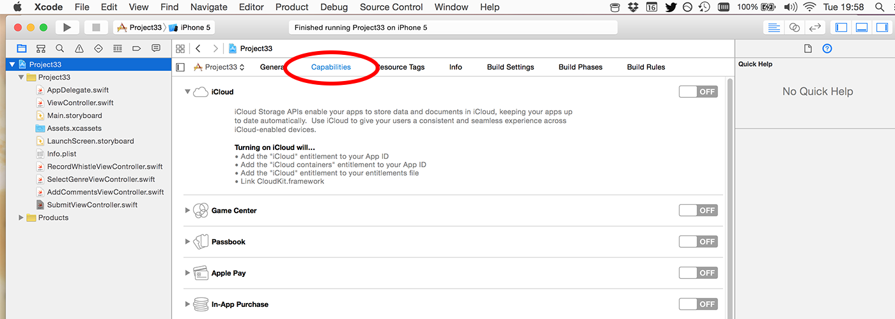
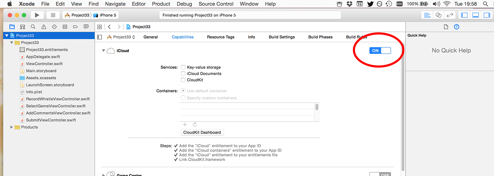
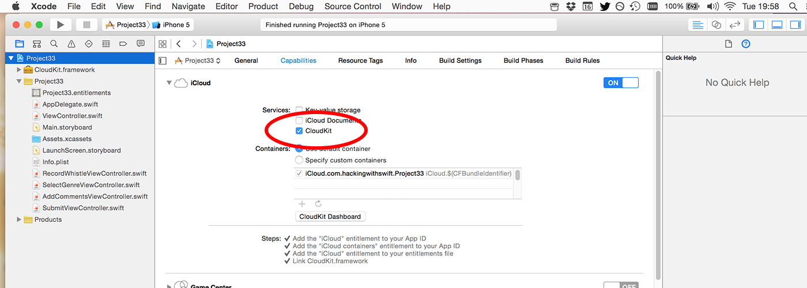

# Writing to iCloud with CloudKit: CKRecord and CKAsset

We still have an error in our code, because we haven't created the `SubmitViewController` class yet. This is where CloudKit comes into play, because this view controller has only one job: to show the user that iCloud submission is happening until it completes, at which point we'll show a "Done" button.

To make the view a little more interesting, we're going to use another `UIStackView` to arrange a text label and an activity spinner to keep the user informed. We're also going to hide the back button so the user can't escape until iCloud finishes, successfully or otherwise.

The last two view controllers have been collecting and passing on metadata, specifically a genre and user comments. We'll need to add these as properties for `SubmitViewController`, along with properties for the stack view, the label and the activity spinner. So, create a new class called `SubmitViewController`, make it a subclass of `UIViewController`, then add these properties:

    var genre: String!
    var comments: String!

    var stackView: UIStackView!
    var status: UILabel!
    var spinner: UIActivityIndicatorView!

As for the `loadView()` method, this is very similar to what we did with `RecordWhistleViewController`: we'll use a stack view that is pinned to the left and right edges then centered vertically. We'll add to this a `UILabel` to show the send status, and a `UIActivityIndicatorView` to show the user that something is happening, but otherwise there's nothing surprising in this code:

    override func loadView() {
        view = UIView()
        view.backgroundColor = UIColor.gray

        stackView = UIStackView()
        stackView.spacing = 10
        stackView.translatesAutoresizingMaskIntoConstraints = false
        stackView.distribution = UIStackView.Distribution.fillEqually
        stackView.alignment = .center
        stackView.axis = .vertical
        view.addSubview(stackView)

        stackView.leadingAnchor.constraint(equalTo: view.leadingAnchor).isActive = true
        stackView.trailingAnchor.constraint(equalTo: view.trailingAnchor).isActive = true
        stackView.centerYAnchor.constraint(equalTo: view.centerYAnchor).isActive = true

        status = UILabel()
        status.translatesAutoresizingMaskIntoConstraints = false
        status.text = "Submitting…"
        status.textColor = UIColor.white
        status.font = UIFont.preferredFont(forTextStyle: .title1)
        status.numberOfLines = 0
        status.textAlignment = .center

        spinner = UIActivityIndicatorView(style: .whiteLarge)
        spinner.translatesAutoresizingMaskIntoConstraints = false
        spinner.hidesWhenStopped = true
        spinner.startAnimating()

        stackView.addArrangedSubview(status)
        stackView.addArrangedSubview(spinner)
    }

As I said already, we're going to hide the navigation bar's back button so the user can't back out of the view controller until submission has finished. Avoiding multiple submissions is a whole other discussion that I'll save for another day, so this is the easiest way out. Modify the existing `viewDidLoad()` method to this:

    override func viewDidLoad() {
        super.viewDidLoad()

        title = "You're all set!"
        navigationItem.hidesBackButton = true
    }

There are just three more methods to write before we get onto the real meat of this tutorial: CloudKit. The first is `viewDidAppear()`, which we'll use to start the submission process. The second is a stub for `doSubmission()`, which is empty for now but we'll fill with CloudKit goodness shortly. The last one is `doneTapped()`, which will be called from a bar button item, which in turn will be created when the submission finishes.

Add this code:

    override func viewDidAppear(_ animated: Bool) {
        super.viewDidAppear(animated)

        doSubmission()
    }

    func doSubmission() {

    }

    @objc func doneTapped() {
        _ = navigationController?.popToRootViewController(animated: true)
    }

I don't think we've used `popToRootViewController(animated:)` before, but it's not a difficult method: calling it pops off all the view controllers on a navigation controller's stack, returning us to the original view controller - in our case, that's the "What's that Whistle?" screen with the + button.

Note: in the code above, I assign the result of `popToRootViewController()` to `_`, which is Swift’s way of saying “ignore this thing.” This silences an “unused result” warning, because although this method returns the array of view controllers that got removed, we don’t *care* about that, so we can throw it away.

OK, time for CloudKit: add this import to SubmitViewController.swift:

    import CloudKit

Once that's done, a whole range of new classes become available for our Swift code, but our app can't use CloudKit just yet. This is because access to iCloud is restricted by Apple, so you need to state that your app wants permission to use iCloud. To do that, click the blue Project33 icon in the Project Navigator pane, then choose your Project33 target. Select the Capabilities tab, then turn iCloud to ON and make sure the CloudKit box is checked.

  

When you do this, Apple will create an iCloud container for you called something like iCloud.com.hackingwithswift.Project33. Now: on your device (or in the simulator) you should make sure you are logged into iCloud and have iCloud Drive enabled. That's it: you're all set to use iCloud!

At this point in the project, here's what you need to know about iCloud and CloudKit:

- You create `CKRecord` objects to contain keys and values. They are like a dictionary, just with some extra smarts built in.
- You create `CKAsset` objects to hold binary blobs like our audio recording. You can attach these to a `CKRecord` just like any other value.
- Each app has its own CloudKit container (`CKContainer`), and each container has two databases (`CKDatabase`) called the public and the private database.
- The private database is for storing private user data. Any thing you upload there gets taken out of that user's iCloud quota. The public database is for storing data anyone can read. Any thing you upload there gets taken out of your CloudKit quota.
- When you write data to CloudKit it automatically figures out how to store it based on all the keys and values you provide, and their data types. You can change this later if you want.
- All CloudKit calls are asynchronous, so you provide completion blocks to be executed when the call finishes. This will tell you what went wrong if anything, but the block can be called on any thread so be careful!

Because CloudKit automatically figures out how to store your data, it means we can go ahead and start sending it whistles and whistle meta data and have it stored – no back-end configuration required.

To make things easier to explain, I'm going to split the `doSubmission()` method in two: a part that creates the record to send to iCloud, and a part that handles the result.

The first part is straightforward, because like I said the `CKRecord` class looks and works much like a dictionary: you set any key to any (valid!) value, and it does the rest. By "valid" I mean things that you can normally store in a dictionary: strings, numbers, arrays, dates and so forth. You can even store `CLLocations` for doing map-based queries – it's surprisingly simple!

You can also store assets inside `CKRecord` objects, which is exactly what we're going to do: the genre and comments are both simple string keys, but the whistle audio itself needs to be uploaded as a `CKAsset` before it's attached. This isn't hard to do, because there's a constructor method for `CKAsset` that takes a file URL just like we get back from `RecordWhistleViewController.getWhistleURL()`.

One last thing before I show you the code: each `CKRecord` has a record type, which is a string. This is a name you provide and has meaning only to you, but identifies the particular type of data you're trying to save. We're working with whistles, so we'll use the record type "Whistles". Make sure you type it correctly, because it needs to match when you write and read.

That's it – here's the first part of the `doSubmission()` method:

    let whistleRecord = CKRecord(recordType: "Whistles")
    whistleRecord["genre"] = genre as CKRecordValue
    whistleRecord["comments"] = comments as CKRecordValue

    let audioURL = RecordWhistleViewController.getWhistleURL()
    let whistleAsset = CKAsset(fileURL: audioURL)
    whistleRecord["audio"] = whistleAsset

Note: that code uses the (rare) `as` typecast because Swift doesn’t automatically convert strings to `CKRecordValue`.

The second part of the method really isn't hard at all, but it does come with a few important notices. We're going to be using the `save()` method of the CloudKit public database, which sends a `CKRecord` off to iCloud and tell us how it went. The result of this method is handed to us in a trailing closure that can be called on any thread, so the first thing you'll see is that I bounce the code back to the main thread so we can manipulate the user interface.

You'll notice that every CloudKit send method has an `Error` being passed in to the closure, reporting whether there was a problem. It is really important that you don't ignore this: mobile networks vary in strength so actions might fail at any time, plus iCloud itself is a monstrously huge beast where a dozen things could go wrong behind the scenes, leading to your code failing. But that's OK, because you're going to catch the errors and do something sensible, right? Right.

The last important notice is that we'll be setting a property on `ViewController` to be true. This property is called `isDirty` and it doesn't exist just yet, so expect an error.

All set? Here's the second part of `doSubmission()`:

    CKContainer.default().publicCloudDatabase.save(whistleRecord) { [unowned self] record, error in
        DispatchQueue.main.async {
            if let error = error {
                self.status.text = "Error: \(error.localizedDescription)"
                self.spinner.stopAnimating()
            } else {
                self.view.backgroundColor = UIColor(red: 0, green: 0.6, blue: 0, alpha: 1)
                self.status.text = "Done!"
                self.spinner.stopAnimating()

                ViewController.isDirty = true
            }

            self.navigationItem.rightBarButtonItem = UIBarButtonItem(title: "Done", style: .plain, target: self, action: #selector(self.doneTapped))
        }
    }

As you can see, regardless of whether the operation succeeds or fails we show a "Done" button so the user can escape the screen. This calls the `doneTapped()` method we already wrote. Also, the `isDirty` property belongs to `ViewController`: again, it's a *static* property so we can set it on the whole class rather than trying to find the correct instance of the class.

To silence the final warning, and to make your code build and run, add that static property to ViewController.swift:

    static var isDirty = true

Please go ahead and build your code now, and try submitting a whistle to iCloud. If you see an error at the the end asking for an authenticated account, make sure device/simulator has an iCloud account logged in, with iCloud Drive enabled, then try again.

Before we go any further, it's time for a tangent…
