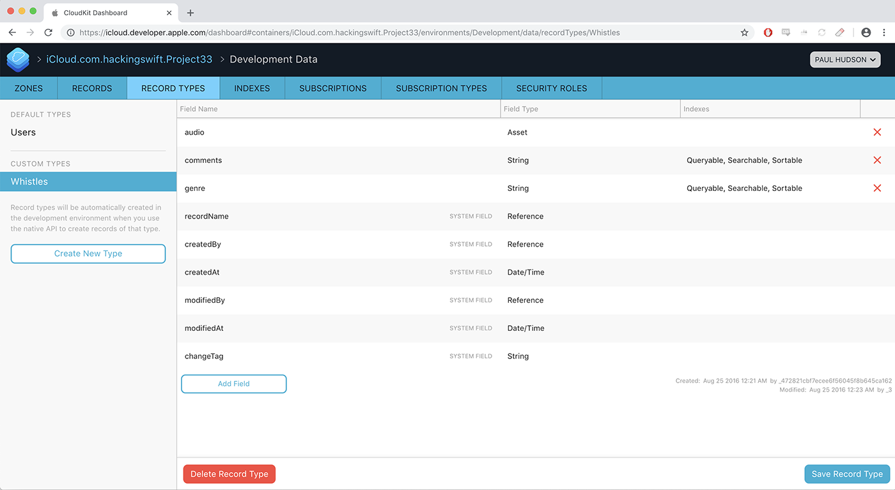
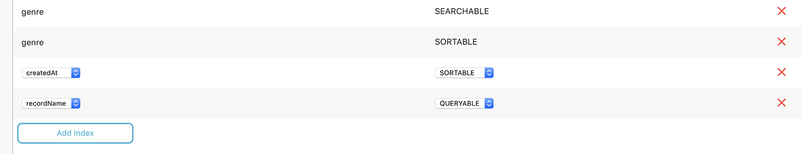

# A hands-on guide to the CloudKit dashboard

If you already finished all the Hacking with Swift projects so far, you'll know I hate tangents. I'm here to teach you something cool, and I prefer to do that using as little waffle as possible – and tangents are apt to create the Perfect Storm for waffle. But in this case it's important, so please bear with me.

If you haven't already done so, you need to run your app, record a whistle, and tap Submit now. All being well it will work first time (if not you probably missed something!), but how do you know it's worked? I mean really be *sure* that's it worked? And what do you do if you want to change a data type because you made a mistake, or perhaps even delete the whole thing and start again?

Apple has a solution for this, and it's called the CloudKit Dashboard. Now that you have submitted your first record to iCloud, you can launch <https://icloud.developer.apple.com/dashboard> in your web browser and look behind the iCloud curtain as it were. The CloudKit dashboard shows you exactly what data your app is storing, who can access it, and how much of your free quota you're using.

So, just briefly, it's time for a tangent: I want to explain a few things about CloudKit Dashboard, because it's important. Yes, it *is* important – later code won't run unless you read my instructions, so please don't skip ahead.

When you log into CloudKit Dashboard, you may need to select your project from all the others you have. You’ll then get a list of the various areas that make up your app, both in development and production. Under the Development environment please choose Data, and you’ll move onto the Records tab in a new screen.

There are several tabs here, but for now I’d like you to select Record Types, and you'll see two Record Types already there: Users and Whistles. The first of those will come under the Default Types heading because it was created automatically for you by Apple, and tracks anonymized user IDs for your app. The second of these was created by you just a few minutes ago: as soon as you called `save()` CloudKit transformed your record into a database in iCloud, and added your test whistle there.

If you select the Whistles record type you'll see that CloudKit has identified that the comments and genre fields are both strings, and the audio field is an asset. There are also some system fields that CloudKit has created for you: ID, `recordName`, `createdBy`, `createdAt`, `modifiedBy`, `modifiedAt`, and `changeTag`. Some of these are great for searching, but you can't sort using these fields by default.

We're going to want to sort by the `createdAt` field later on, so please click the Indexes tab, click Add Index, then select `createdAt` and `SORTABLE` for the two dropdowns. While you're there, please also add a `QUERYABLE` index for `recordName`, then click the Save Record Type button in the bottom-right of your browser window to commit those changes.

That was the critical stuff needed to continue this tutorial, but there are a few other niceties while you're here:

-   Back in Record Types, any of your rows can be deleted by hovering over them and clicking the X on the right-hand side. System rows like `createdBy` cannot be deleted.
-   You can add fields by clicking the Add Field button at the end of your own fields, then giving it a name and type.
-   You can browse all the data that has been uploaded by going to the Records tab and clicking Query Records.
-   When browsing individual records, you'll see links to download or remove the assets attached to the record.
-   You'll also see a delete button with the record, which is what you click when you want to delete it.

So, the CloudKit Dashboard is basically a miniature CMS that lets you peek into your data and confirm everything is working OK. But it does one more thing, which is to provide usage data for your app, which is important because CloudKit is free only if you stay below certain usage limits.

To see how much of your quota you're using, click your app’s bundle ID in the top bar, then choose Public Database Usage in the development environment. You'll see a scrolling list of charts that show you how many users you have, how many requests per second they've made, how much storage data transfer you're using for assets, and how much database storage you're using. CloudKit shows you a solid line to represent how much you've actually used, then a dashed line to show its projections about how much you're likely to use if current trends continue.

Note that all quota directly depends on the number of users you have – as you add more users, Apple adds more quota. So, the first graph directly affects all the others.

What these charts don't show is how your usage maps against your quota, and there's a good reason for that: as soon as you add in your quota, your usage becomes so tiny that you won't be able to see it!

So, that's CloudKit Dashboard: it's the perfect debugging tool because it shows you exactly what content is being stored. If the data you see is bad it means your writing code is bad. If the data there is good but your app isn't showing correctly, it means your reading code is bad. Simple!

Tangent over. Back to the code!
