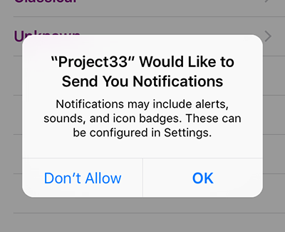

# Delivering notifications with CloudKit push messages: CKQuerySubscription

You're probably feeling very tired at this point: this has been a long tutorial and you've had to learn a lot. Fortunately, this last chapter is a bonus – you don't need to read this to have a great CloudKit app, but I do add some neat CloudKit technologies here that make the whole experience better.

So far, the app lets users record a whistle using `AVAudioRecorder`, send it off to CloudKit, download whistles others have posted, then write suggestions for what song they think it is. What we're going to add now is the ability for users to register themselves as experts for particular genres - they can say "I know all about jazz and blues music." When they do that, we'll automatically tell them when a new whistle has been posted in one of those categories, and they can jump right into the app to have a go at identifying it.

We're going to do this with one of the most important technologies in iOS, called push notifications. These are alerts that are delivered straight to the lock screens of users whenever something interesting happens, and the app usually isn't running at the time. Push is so important to iOS that it comes built into CloudKit, and it's done so elegantly that this tutorial will be over in no time. In short: don't worry, the end is in sight!

Create a new `UITableViewController` subclass called `MyGenresViewController`. Add a CloudKit import to it, then add this property:

    var myGenres: [String]!

We'll use that to track the list of genres the user considers themselves an expert on.

Before we starting adding code to this new view controller, we need to make two small changes in ViewController.swift. First, add this in `viewDidLoad()`:

    navigationItem.leftBarButtonItem = UIBarButtonItem(title: "Genres", style: .plain, target: self, action: #selector(selectGenre))

Second, add the following method that allows users to choose genres:

    @objc func selectGenre() {
        let vc = MyGenresViewController()
        navigationController?.pushViewController(vc, animated: true)
    }

Now, back to MyGenresViewController.swift. We can split this code into two parts: all the bits that handle users selecting their experts genres and saving that list, and the CloudKit part that tells iCloud we want to be notified when a new whistle has been published that might be of interest to this user.

Letting the user choose which genres interest them is easy: we're going to use `UserDefaults` to save an array of their expert genres. If there isn't one already saved, we'll create an empty array. We're also going to use a right bar button item with the title "Save" that handles the CloudKit synchronization. More on that later; for now, here's the `viewDidLoad()` method that handles loading saved genres:

    override func viewDidLoad() {
        super.viewDidLoad()

        let defaults = UserDefaults.standard
        if let savedGenres = defaults.object(forKey: "myGenres") as? [String] {
            myGenres = savedGenres
        } else {
            myGenres = [String]()
        }

        title = "Notify me about…"
        navigationItem.rightBarButtonItem = UIBarButtonItem(title: "Save", style: .plain, target: self, action: #selector(saveTapped))
        tableView.register(UITableViewCell.self, forCellReuseIdentifier: "Cell")
    }

When it comes to how many sections and rows we have, we're going to specify 1 and the value of `SelectGenreViewController.genres.count` – that static property contains all the genres used in the app, so re-using it here is perfect:

    override func numberOfSections(in tableView: UITableView) -> Int {
        return 1
    }

    override func tableView(_ tableView: UITableView, numberOfRowsInSection section: Int) -> Int {
        return SelectGenreViewController.genres.count
    }

Now for the interesting part: we want users to be able to tap on rows that they like, and have iOS show a checkmark next to them. Once a genre is added to the `myGenres` array, we can check whether it's in there using the `contains()` of that array – if the array contains the genre, we put a check next to it.

Here's the `cellForRowAt` method that does just that:

    override func tableView(_ tableView: UITableView, cellForRowAt indexPath: IndexPath) -> UITableViewCell {
        let cell = tableView.dequeueReusableCell(withIdentifier: "Cell", for: indexPath)

        let genre = SelectGenreViewController.genres[indexPath.row]
        cell.textLabel?.text = genre

        if myGenres.contains(genre) {
            cell.accessoryType = .checkmark
        } else {
            cell.accessoryType = .none
        }

        return cell
    }

The other part of this approach is catching `didSelectRowAt` so that we check and uncheck rows as they are tapped, adding and removing them from the `myGenres` array as necessary. Adding things to an array is as simple as calling the `append()` method on the array, but removing takes a little more hassle: we need to use `firstIndex(of:)` to find the location of an item in the array, and if that returns a value then we use `remove(at:)` to remove the item from the array at that index.

As a finishing touch, we'll call `deselectRow(at:)` to deselect the selected row, so it highlights only briefly. That's all there is to it – here's the `didSelectRowAt` method:

    override func tableView(_ tableView: UITableView, didSelectRowAt indexPath: IndexPath) {
        if let cell = tableView.cellForRow(at: indexPath) {
            let selectedGenre = SelectGenreViewController.genres[indexPath.row]

            if cell.accessoryType == .none {
                cell.accessoryType = .checkmark
                myGenres.append(selectedGenre)
            } else {
                cell.accessoryType = .none

                if let index = myGenres.firstIndex(of: selectedGenre) {
                    myGenres.remove(at: index)
                }
            }
        }

        tableView.deselectRow(at: indexPath, animated: false)
    }

And now for the challenging part: when users click Save, we want to write their list of genres to `UserDefaults`, then send them all to iCloud. Then, when new whistles arrive that match a user's selected genres, we want to notify them with a push message.

Thanks to what was I'm sure many months of effort from Apple engineers, registering for push messages is a breeze thanks to a class called `CKQuerySubscription`. This lets you configure a query to run on the iCloud servers, and as soon as that query matches something it will automatically trigger a push message. In our case, that query will be "when anyone publishes a whistle in a genre we care about."

But first: we need to flush out any existing subscriptions so that we don't get duplicate errors. In the interests of keeping it brief, the easiest way to do this is by calling `fetchAllSubscriptions()` to fetch all `CKQuerySubscriptions`, then passing each of them into `delete(withSubscriptionID:)`. As always, it's up to you to do useful error handling – I've done it enough for you already, so you're most of the way there.

Note: the two parameters you get from `fetchAllSubscriptions()` are an optional array of subscriptions and an error if one occurred. You need to unwrap the optional array, because the user might not have any subscriptions. Here's an initial version of `saveTapped()`:

    @objc func saveTapped() {
        let defaults = UserDefaults.standard
        defaults.set(myGenres, forKey: "myGenres")

        let database = CKContainer.default().publicCloudDatabase

        database.fetchAllSubscriptions { [unowned self] subscriptions, error in
            if error == nil {
                if let subscriptions = subscriptions {
                    for subscription in subscriptions {
                        database.delete(withSubscriptionID: subscription.subscriptionID) { str, error in
                            if error != nil {
                                // do your error handling here!
                                print(error!.localizedDescription)
                            }
                        }
                    }

                    // more code to come!
                }
            } else {
                // do your error handling here!
                print(error!.localizedDescription)
            }
        }
    }

Again, please do put in some user-facing error messages telling users what's going on – they won't see the Xcode log messages, and it's important to keep them informed.

There's just one more thing to do before this entire project is done, and that's registering subscriptions with iCloud and handling the result. You tell it what condition to match and what message to send, then call the `save()` method, and you're done – iCloud takes care of the rest. Normally you'd need to opt into push messages and create a push certificate, but again Xcode and iCloud have taken away all this work when you enabled CloudKit what feels like long ago.

To make this work, we're going to loop through each string in the `myGenres` array, create a predicate that searches for it, then use that to create a `CKQuerySubscription` using the option `.firesOnRecordCreation`. That means we want this subscription to be informed when any record is created that matches our genre predicate.

If you want to attach a visible message to a push notification, you need to create a `CKSubscription.NotificationInfo` object and set its `alertBody` property. If you want an invisible push (one that launches your app in the background silently) you should set `shouldSendContentAvailable` to be true instead.

We're going to set a notification message that contains the genre that changed by using Swift's string interpolation. We're also going to use the value `default` for the `soundName` property, which will trigger the default iOS tri-tone sound when the message arrives. With that done, we can call `save()` to send it off to iCloud, then handle any error messages that come back.

That's it – here's the code to put in place of the `more code to come!` comment:

    for genre in self.myGenres {
        let predicate = NSPredicate(format:"genre = %@", genre)
        let subscription = CKQuerySubscription(recordType: "Whistles", predicate: predicate, options: .firesOnRecordCreation)

        let notification = CKSubscription.NotificationInfo()
        notification.alertBody = "There's a new whistle in the \(genre) genre."
        notification.soundName = "default"

        subscription.notificationInfo = notification

        database.save(subscription) { result, error in
            if let error = error {
                print(error.localizedDescription)
            }
        }
    }

If you run the app now you'll be able to save your genre preferences and send them off to iCloud, but you won't get any push messages through just yet. That's because although iCloud is now totally configured to send push messages when interesting things happened, the user hasn't opted in to receive them. As you might imagine, Apple doesn't want to send push messages to users who haven't explicitly opted in to receive them, so we need to ask for push message permission.

Go to AppDelegate.swift and add an import for the UserNotifications framework:

    import UserNotifications

Now put this code into the `didFinishLaunchingWithOptions` method, before the `return true` line:

    UNUserNotificationCenter.current().requestAuthorization(options: [.alert, .sound, .badge]) { granted, error in
        if let error = error {
            print("D'oh: \(error.localizedDescription)")
        } else {
            application.registerForRemoteNotifications()
        }
    }

That requests permission to show alerts to the user, with a small error message being printed if something goes wrong. If there was no error, we call `registerForRemoteNotifications()`, which creates a unique device token that can be used to message this device. That device token is silently handed off to CloudKit, so we don’t need to do anything other than request it.

For the sake of completeness, it’s worth adding that if a remote notification arrives while the app is already running, it will be silently ignored. If you want to force iOS to show the alert you must do three things:

1. Make the `AppDelegate` class conform to `UNUserNotificationCenterDelegate`.
2. Set your app delegate to be the delegate for the user notification center.
3. Implement user notification center delegate’s `willPresent` method, calling its completion handler with how you want the alert shown.

To satisfy step 2, add this line of code before `return true` inside the app delegate’s `didFinishLaunchingWithOptions` method:

    UNUserNotificationCenter.current().delegate = self

For step 3, if you want the alert, sound, and badge of the notification to be shown even when the app is already running, you’d add this method to the app delegate:

    func userNotificationCenter(_ center: UNUserNotificationCenter, willPresent notification: UNNotification, withCompletionHandler completionHandler: @escaping (UNNotificationPresentationOptions) -> Void) {
        completionHandler([.alert, .sound, .badge])
    }

If you want only part of the notification to be used, just change the array being passed to `completionHandler()`.

That's it. No, really – this epic project is now done. Go ahead and run the app on a real iOS device, register for certain genres, then quit the app – unplug your phone, lock it, and put it to one side. Now launch the app in the simulator and create a new whistle in one of the genre you just marked, and you'll get your push.
