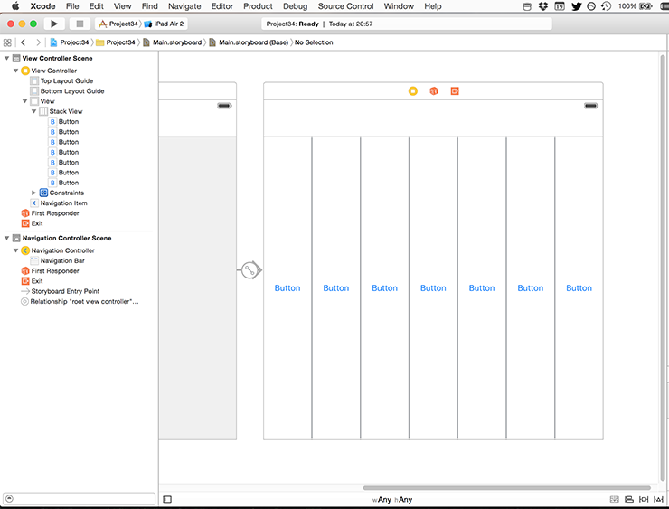
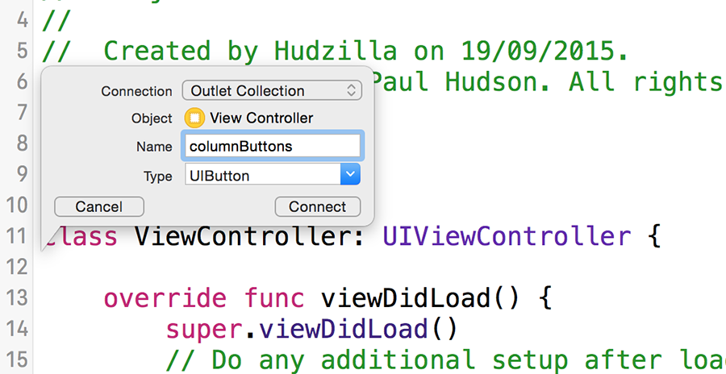

# Creating the interface with UIStackView

Once you start using UIStackView it's hard to stop, so naturally I wanted it in this project even though we're making a game. The nature of 4IR games is that you have rows and columns, and we're going to create a `UIStackView` to host the columns. If I didn't want to animate the chips falling into the board we'd be using stack views for the columns too!

Open Main.storyboard in Interface Builder, then embed the existing view controller inside a navigation controller. Now select the navigation controller you just created, find its Navigation Bar in the document outline, then deselect Translucent in the attributes inspector – we don't want our game going behind the navigation bar, after all.

From the object library drag a Horizontal Stack View into your view controller, then resize it to fill the entire view up to the bottom of the navigation bar. When that's done, go to Editor > Resolve Auto Layout Issues > Reset to Suggested Constraints to add in the Auto Layout constraints required to keep it filling the view.

Now drag seven buttons into the stack view. By default, the stack view will show the first one large and all the others as small as possible, but you should select the stack view, go to the attributes inspector, then change Distribution to Fill Equally. While you're there, give Spacing a value of 2.

These seven buttons will be used to store the columns in our game, so to make them stand out I'd like you to select them all and give them all a white background color. Button background color is quite a way down the attributes inspector, so you will need to scroll to find it. Now clear the text for all the buttons, making them just large white spaces that respond to taps.

Now I need you to select each of the buttons in order and give them increasing Tag values. The one on the far left can keep its Tag of 0, but the second one should have a Tag of 1, then 2, 3, 4, 5 and 6. This will be used to identify which button was tapped later on.

To make the buttons stand out as columns, select the view itself (you might need to use the document outline view for this) then give it a gray background color. Don't try to give the stack view a background color – it's doesn't actually do any drawing, so your background color will be ignored.

There are two more things to do in Interface Builder before we can get on with some code. The first is to create IBOutlets for those buttons so we can control them from code, but rather than create individual outlets we're going to use something called an `IBOutletCollection`. These are just IBOutlet arrays that work like normal Swift arrays, except in IB you connect multiple outlets to the same thing.

To create an outlet collection, switch to the assistant editor by pressing Alt+Cmd+Return, then Ctrl+drag from the first button on the left from IB into your source code, just before the `viewDidLoad()` line. When you release the action/outlet menu will appear, and I'd like you to choose Outlet Collection. Note: if you see only Outlet and Outlet Collection in the list (i.e., Action is missing) it means you probably selected the stack view rather than a button, so try again!

Name the outlet collection `columnButtons` and click Connect. Now Ctrl+drag from the other six buttons, but this time connect them to the same `@IBOutlet` that was just created – you need to hover over the `var columnButtons: [UIButton]!` part in order for this to work.

The second change to make is to hook up an IBAction for those buttons. We set each of them to have their own Tag because we're going to use the same action for seven buttons – the tag will be used to figure out which button was tapped.

So, Ctrl+drag from the first button into some free space inside the class, then create an action called `makeMove`. Make sure you change the Type value to be `UIButton` rather than `Any` – this will be used later. Now Ctrl+drag from the other six buttons onto that `makeMove()` method, and we're done with Interface Builder.
