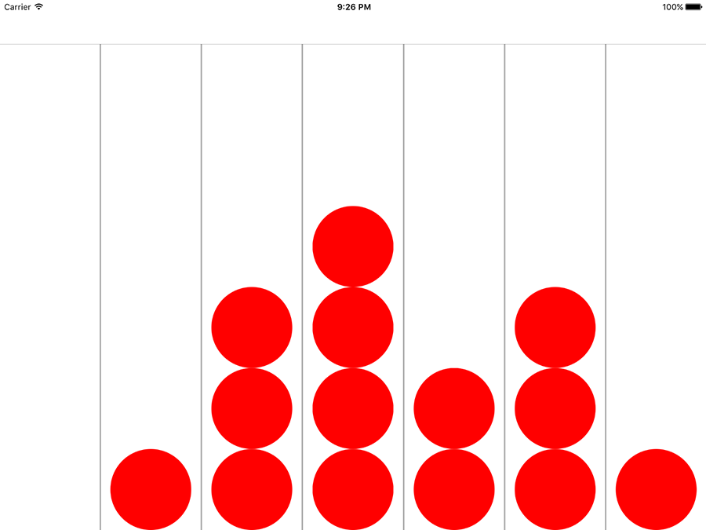

# Preparing for basic play

We're going to put together the absolute basics required to represent a 4IR game on iOS. Because of the way GameplayKit works, it's especially important to keep a good separation between your model (the state of the game) and your view (how things look).

Over the course of this project we're going to produce three different data models: one for the game board (stores the complete game state), one for players (for storing their color and name), and one for a "move" (for storing the position of one valid move in the game.)

We're going to start with the game board now, so add a new file to the project: choose Cocoa Touch Class and click Next, name it Board and make it subclass from `NSObject`, then click Next and Create.

To begin with, this `Board` class is just going to have two properties: one for tracking the width of the board, and one to track the height. We'll be adding more later, but for now add these two:

    static var width = 7
    static var height = 6

Now go back to ViewController.swift. Like I said, there's an important distinction between the model and the view. That `Board` class will hold our model, which means it will store where all the chips are and who is winning. This view controller will store its own array of where the chips are, but it does this so it can draw the view correctly.

A "chip" in this case is a 4IR piece, either red or black. We'll be using `UIViews` for this purpose, setting a high corner radius so they look like circles – it's a simple trick, but effective. To store this, we'll need an array of arrays. That is, we'll need an array to store each column, and another array to hold all those column arrays. We're also going to add a property to store a `Board` object, using that class we just created. So, add these two properties to ViewController.swift:

    var placedChips = [[UIView]]()
    var board: Board!

When the game is first run, we need to populate that `placedChips` property with empty arrays. When a game is started, we'll wipe those arrays (removing any views that were added), and also create a new game board to track progress. This is all done in two methods: `viewDidLoad()` to do the initial set up, and `resetBoard()` to create the game board variable and clear out any views from the previous game. Add these two now:

    override func viewDidLoad() {
        super.viewDidLoad()

        for _ in 0 ..< Board.width {
            placedChips.append([UIView]())
        }

        resetBoard()
    }

    func resetBoard() {
        board = Board()

        for i in 0 ..< placedChips.count {
            for chip in placedChips[i] {
                chip.removeFromSuperview()
            }

            placedChips[i].removeAll(keepingCapacity: true)
        }
    }

There won't be any views to clear out in the first run of that method, but we'll be adding more to the `resetBoard()` method later so it makes sense to call it during the first run.

Now for some complicated coding: we need to give the game board enough logic to keep track of chips. Specifically, we have to make the `Board` class do five new things:

1. Report what chip is at a specific row and column.
2. Set a particular slot to contain a chip, i.e. "make row 4 column 3 a red chip."
3. Determine whether the player can make a move in a column.
4. Find the next empty slot in a column, which is where a chip would land if it were dropped in there.
5. Add a chip to a column at the next available space.

On top of that, we also need to create the default array of slots, which will be filled with blanks to begin with.

First up, though, we need to define a new enum that will be used to store the current state of each slot. A slot can either contain a red chip, a black chip, or no chip, so we're going to encapsulate that in an enum called `ChipColor`. Put this enum in Board.swift, just before the class definition:

    enum ChipColor: Int {
        case none = 0
        case red
        case black
    }

Note that I have given it a raw type of Int, then given the first value a specific number: 0. When you do this, Swift will assign the following values an auto-incremented number, which means Red will be 1 and Black will be 2. This will be important later!

With that enum defined, we can create an array of `ChipColors`, and initialize it when the class is instantiated. Add this property and method to the `Board` class:

    var slots = [ChipColor]()

    override init() {
        for _ in 0 ..< Board.width * Board.height {
            slots.append(.none)
        }

        super.init()
    }

This array has only one dimension, which means it's a regular array rather than an array of arrays. One-dimensional arrays are less easy to work with but significantly faster, which is important because we'll be using this array *a lot* in this project.

The custom `init()` method pre-fills the array with `.none`, which means all the slots have no chip in them by default, as you would expect.

Now that we have a `slots` array, we can create the two most frequently used methods in this game: `chip(inColumn:row:)` and `set(chip:in:)`. The first is used to read the chip color of a specific slot, and the second is used to set the chip color of a specific slot. As `slots` is a one-dimensional array, you need to do a small amount of maths to find the correct row/column: you multiply the column number by the height of the board, then add the row.

Add these two methods to the `Board` class:

    func chip(inColumn column: Int, row: Int) -> ChipColor {
        return slots[row + column * Board.height]
    }

    func set(chip: ChipColor, in column: Int, row: Int) {
        slots[row + column * Board.height] = chip
    }

Those two methods will be used extensively to check what moves are valid, so it's good to keep them as small as possible.

Next up: determining whether a player can place a chip in a column. To make this work, we're going to use a helper method called `nextEmptySlot(in:)`, which will return the first row number that contains no chips in a specific column. With that helper method in place, we can check whether a player can move in a column just by checking to see if there is an empty slot there.

The `nextEmptySlot(in:)` helper method works by counting up in a column, from 0 up to the height of the board. For every slot, it calls `chip(inColumn:row:)` to see what chip color is there already, and if it gets back `.none` it means that row is good to use. If it gets to the end of the board without finding a `.none` it will return `nil` – this column has no free slots.

Here's the code:

    func nextEmptySlot(in column: Int) -> Int? {
        for row in 0 ..< Board.height {
            if chip(inColumn: column, row: row) == .none {
                return row
            }
        }

        return nil
    }

As promised, figuring out whether a player can play a particular column is now easy: we just call `nextEmptySlot(in:)` and check whether it returns `nil` or not, like this:

    func canMove(in column: Int) -> Bool {
        return nextEmptySlot(in: column) != nil
    }

The last method we need to add to our model at this time is `add(chip:in:)`, which blends two of our above methods: find the next available slot in a column using `nextEmptySlot(in:)`, and if the result is not `nil` then use `set(chip:)` to change that slot's color. Here it is:

    func add(chip: ChipColor, in column: Int) {
        if let row = nextEmptySlot(in: column) {
            set(chip: chip, in: column, row: row)
        }
    }

Annoyingly, all that code doesn't have any visual impact on our game: this is all model stuff, which is the behind-the-scenes representation how the game works. We have three other methods to write in ViewController.swift in order to update our view to match the model! I realize this seems like unnecessary duplication, but as you'll see later it's important to keep your GameplayKit classes as light as possible.

The first of our new methods is called `addChip(inColumn:row:)` and it matches the board's `add(chip:in:)` method. Adding a chip in the view takes more than just three lines of code, though: it needs to calculate the size of a chip, create a `UIView` with the correct background color, position it correctly inside the board, then add it to the `placedChips` array.

To make doubly certain the move is safe, we're only going to add a chip if the row is set correctly – i.e., if we aren't trying to add a chip below the existing row height. We're also going to animate the `transform` property of the chip view so that it starts off the top of the screen and slides in. Here's the code to put into the `ViewController` class – note that you'll get an error for the time being:

    func addChip(inColumn column: Int, row: Int, color: UIColor) {
        let button = columnButtons[column]
        let size = min(button.frame.width, button.frame.height / 6)
        let rect = CGRect(x: 0, y: 0, width: size, height: size)

        if (placedChips[column].count < row + 1) {
            let newChip = UIView()
            newChip.frame = rect
            newChip.isUserInteractionEnabled = false
            newChip.backgroundColor = color
            newChip.layer.cornerRadius = size / 2
            newChip.center = positionForChip(inColumn: column, row: row)
            newChip.transform = CGAffineTransform(translationX: 0, y: -800)
            view.addSubview(newChip)

            UIView.animate(withDuration: 0.5, delay: 0, options: .curveEaseIn, animations: {
                newChip.transform = CGAffineTransform.identity
            })

            placedChips[column].append(newChip)
        }
    }

There are three other small things in that code I want to pick out as interesting. First, user interaction is disabled on the view so that tapping on a chip is ignored and the tap is pass through to its column button. Second, the corner radius of the chip is set to `size / 2`, which will make it a circle. Finally, I've used the `.curveEaseIn` animation speed so that the chip starts dropping slowly and picks up pace.

The error in the code is that it calls a method we haven't defined yet, called `positionForChip(inColumn:row)`. We'll call this method with a row and a column, and it will return the `CGPoint` where the chip should be placed. This uses six lines of code that make sense once they have been explained, but might make you draw a blank at first. So, here's how it works:

1. It pulls out the `UIButton` that represents the correct column.
2. It sets the chip size to be either the width of the column button, or the height of the column button divided by six (for six full rows) – whichever is the lowest.
3. It uses `midX` to get the horizontal center of the column button, used for the X position of the chip.
4. It uses `maxY` to get the bottom of the column button, then subtracts half the chip size because we're working with the center of the chip.
5. It then multiplies the row by the size of each chip to figure out how far to offset the new chip, and subtracts that from the Y position calculated in 4.
6. Finally, it creates a `CGPoint` return value by putting together the X offset calculated in step 3 with the Y offset calculated in step 5.

It's not a graceful piece of code, I'll give you that, but once you understand what it's doing it's innocent enough.

Here's the code for the missing method:

    func positionForChip(inColumn column: Int, row: Int) -> CGPoint {
        let button = columnButtons[column]
        let size = min(button.frame.width, button.frame.height / 6)

        let xOffset = button.frame.midX
        var yOffset = button.frame.maxY - size / 2
        yOffset -= size * CGFloat(row)
        return CGPoint(x: xOffset, y: yOffset)
    }

That just leaves one final method before our code springs into life, and this is just a matter of filling in `makeMove()`. This uses the tag of the button that was tapped to figure out which column the player wants to use. We then use that column as the input for `nextEmptySlot(in:)` to figure out which row to play, then call `add(chip:)` on the board model and `addChip(inColumn:row:)` to create the chip's `UIView`. Here's the code:

    @IBAction func makeMove(_ sender: UIButton) {
        let column = sender.tag

        if let row = board.nextEmptySlot(in: column) {
            board.add(chip: .red, in: column)
            addChip(inColumn: column, row: row, color: .red)
        }
    }

At this point the code works, although it's a pretty dull game: there's only one player, so you can click in any column you like again and again, adding more and more chips until the board is full. The board does, however, respect the game logic: you can't add more than six chips in a column, and the chips stack up neatly.

