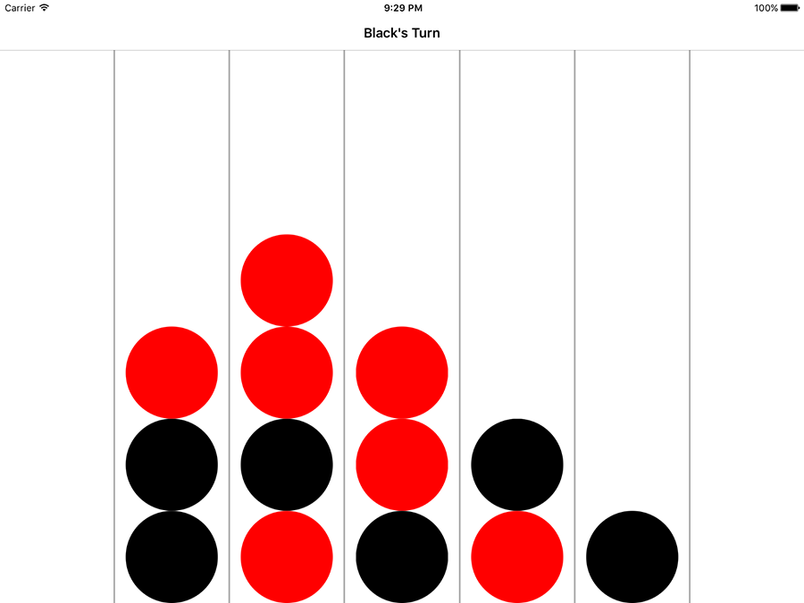

# Adding in players: GKGameModelPlayer

It's time to take our first step into GameplayKit, although at first this step will be small. Right now our game is single-player, and all chips that get dropped are red chips. We're going to upgrade this so that there are two players by creating a new `Player` class that stores a player's chip type, their name, their color, and a special GameplayKit value called `playerId` – this is just a number that identifies every player uniquely.

On top of that, we're also going to create a static property for players, which means it's a property that belongs to the class and thus can be called from anywhere. This will be an `allPlayers` array holding both `Player` objects for easy reference

So, please create a new Cocoa Touch Class in your project. Name it “Player”, then make it inherit from `NSObject`. Let's go ahead and create the properties up front. As a reminder, we need:

- The chip color of the player, either `.red`, `.black`, or `.none`.
- The drawing color the player, set to a `UIColor`.
- The name of the player, which will be either "Red" or "Black".
- A GameplayKit `playerId` property, which we'll just set to the raw value of their chip type. (We set this enum up as an integer, remember?)
- A static array of two players, red and black.

Add these properties now:

    var chip: ChipColor
    var color: UIColor
    var name: String
    var playerId: Int

    static var allPlayers = [Player(chip: .red), Player(chip: .black)]

Now for what is going to be a huge anti-climax: let's bring in GameplayKit by adding this import:

    import GameplayKit

Now make your `Player` class conform to the `GKGameModelPlayer` protocol, like this:

    class Player: NSObject, GKGameModelPlayer {

Xcode will be flagging up errors all over your code, but none of them are a result of GameplayKit – in fact, those two changes are all it takes to make GameplayKit work with our player data. Instead, the errors are because we've declared four properties non-optional and haven't given them any values, so we need to create a custom initializer.

This initializer will accept one parameter, which is the chip color to use for each player. From that we can set the player ID (as the raw value of the chip type enum), the color (either red or black `UIColor`), and the player name (either "Red" or "Black"). It's pretty straightforward really – here's the code:

    init(chip: ChipColor) {
        self.chip = chip
        self.playerId = chip.rawValue

        if chip == .red {
            color = .red
            name = "Red"
        } else {
            color = .black
            name = "Black"
        }

        super.init()
    }

We're going to add one more thing to this class before we're done, which is a small computed property that returns the opponent for a specific player. If the player is red, it returns the black player from the `allPlayers` array, and if the player is black, it returns the red player. Here's the code:

    var opponent: Player {
        if chip == .red {
            return Player.allPlayers[1]
        } else {
            return Player.allPlayers[0]
        }
    }

That's the `Player` class finished: we won't be adding any more to it in this project. But after that code, nothing has really changed because we're not actually using those players.

To take the next step in our game, we're going to start using the new `Player` class so that we have two players in the game, and we're also going to update the user interface to mark whose turn it is.

Updating the user interface requires two methods in the `Board` class: one to determine if the board is full of pieces, and one to determine if a particular player has won. With these two we can show either "Red/Black Wins!" or "Draw!" in the user interface, but for now we're just going to return false from these methods – we'll put the real code in later.

Put these two into your `Board` class:

    func isFull() -> Bool {
        return false
    }

    func isWin(for player: Player) -> Bool {
        return false
    }

Now onto the real work: we're going to create two new methods called `continueGame()` and `updateUI()`, both in the `ViewController` class. The first will get called after every move, and will end the game with an alert if needed, otherwise it will switch players. The second is responsible for updating the title of the view controller to show whose turn it is, although later on we'll also be making it kick off AI work.

The code in `updateUI()` is trivial, so let's get it out of the way. Open ViewController.swift and add this method:

    func updateUI() {
        title = "\(board.currentPlayer.name)'s Turn"
    }

We aren't tracking the current player just yet so you'll get an error at first, but we'll fix it in a moment.

The `continueGame()` method is longer, but isn't really very complicated. To help you along I'll break it down into numbered steps in the code:

1. We create a `gameOverTitle` optional string set to nil.
2. If the game is over or the board is full, `gameOverTitle` is updated to include the relevant status message.
3. If `gameOverTitle` is not nil (i.e., the game is won or drawn), show an alert controller that resets the board when dismissed.
4. Otherwise, change the current player of the game, then call `updateUI()` to set the navigation bar title.

Here's the code, with the number comments matching the list above:

    func continueGame() {
        // 1
        var gameOverTitle: String? = nil

        // 2
        if board.isWin(for: board.currentPlayer) {
            gameOverTitle = "\(board.currentPlayer.name) Wins!"
        } else if board.isFull() {
            gameOverTitle = "Draw!"
        }

        // 3
        if gameOverTitle != nil {
            let alert = UIAlertController(title: gameOverTitle, message: nil, preferredStyle: .alert)
            let alertAction = UIAlertAction(title: "Play Again", style: .default) { [unowned self] (action) in
                self.resetBoard()
            }

            alert.addAction(alertAction)
            present(alert, animated: true)

            return
        }

        // 4
        board.currentPlayer = board.currentPlayer.opponent
        updateUI()
    }

The final steps are actually pretty straightforward. First we need to create the `currentPlayer` property in the `Board` class so that it silences the Xcode errors:

    var currentPlayer: Player

That's a non-optional value, so by fixing the previous errors we introduce a new one: `currentPlayer` must be given a value inside the board's initializer. Add this at the start of the `init()` method in Board.swift:

    currentPlayer = Player.allPlayers[0]

We're almost done with this chapter, and in fact we need only make a couple more changes for our game to work with two players. First, we need to update the `makeMove()` method so that it drops in chips of the correct color rather than always using red. This is easy now that we have the `board.currentPlayer` property:

    @IBAction func makeMove(_ sender: UIButton) {
        let column = sender.tag

        if let row = board.nextEmptySlot(in: column) {
            board.add(chip: board.currentPlayer.chip, in: column)
            addChip(inColumn: column, row: row, color: board.currentPlayer.color)
            continueGame()
        }
    }

Note that I snuck in a call to `continueGame()` so that control automatically flips between players after each move.

Finally, we need to set the initial view controller title when the game is started or reset, which means modifying the `resetBoard()` method so that it calls `updateUI()`. Modify the start of the method to this:

    func resetBoard() {
        board = Board()
        updateUI()

If you run your app now, you'll see things are starting to come together: you can tap on a column to play a chip, then control hands over to the other player and the user interface updates. The game doesn't end, though, because it has no idea whether one player has made four in a row, or whether it's a draw. Let's tackle that now…

