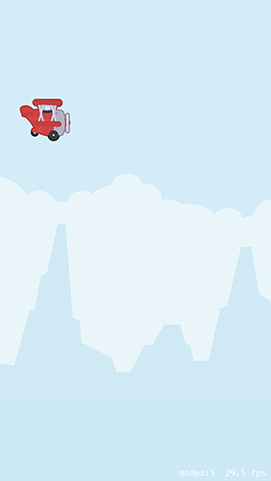
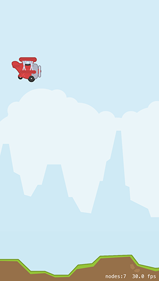

# Sky, background and ground: parallax scrolling with SpriteKit

Lots of scrolling 2D games use multiple depth levels that scroll at various speeds and deliver a surprisingly nice effect. We'll be controlling the depth of our graphics by setting the `zPosition` property of sprites, starting with the sky: this is just two colored blocks that sit right at the very back of the game.

You can create `SKSpriteNodes` with nothing more than a color and a size, and that's what we'll use here. I've sampled the sky colors based on the other graphics that we'll be adding soon – the top and bottom parts of the sky are very, *very* similar, but just different enough to be visible.

To make things easier for my brain, I'm going to be setting the `anchorPoint` property of the sprite nodes. This means they calculate their positions differently from the default, which might not sound easy at all, but trust me: it is!

By default, nodes have the anchor point X:0.5, Y:0.5, which means they calculate their position from their horizontal and vertical center. We'll be modifying that to be X:0.5, Y:1 so that they measure from their center top instead – it makes it easier to position because one part of the sky will take up 67% of the screen and the other part will take up 33%.

Here's the `createSky()` method; add this just below `createPlayer()`:

    func createSky() {
        let topSky = SKSpriteNode(color: UIColor(hue: 0.55, saturation: 0.14, brightness: 0.97, alpha: 1), size: CGSize(width: frame.width, height: frame.height * 0.67))
        topSky.anchorPoint = CGPoint(x: 0.5, y: 1)

        let bottomSky = SKSpriteNode(color: UIColor(hue: 0.55, saturation: 0.16, brightness: 0.96, alpha: 1), size: CGSize(width: frame.width, height: frame.height * 0.33))
        bottomSky.anchorPoint = CGPoint(x: 0.5, y: 1)

        topSky.position = CGPoint(x: frame.midX, y: frame.height)
        bottomSky.position = CGPoint(x: frame.midX, y: bottomSky.frame.height)

        addChild(topSky)
        addChild(bottomSky)

        bottomSky.zPosition = -40
        topSky.zPosition = -40
    }

Add a call to `createSky()` inside `didMove(to:)` then press Play again – you should see some sky behind the player's plane now. Can you spot that it's two different colors?

Next up is the background. In the assets for this game it's a set of distant mountains and clouds with a faint blue color, but we can't just add this to the game using a sprite node. The reason is simple: while the sky is just two fixed (and very similar!) colors, the background mountains need to scroll.

Making the mountains scroll is easy enough, but what's harder is ensuring the mountains don't just scroll off the screen and leave nothing behind. What we really want to happen is to have mountains scroll to the left forever, looping infinitely. We're going to accomplish this with a little cheat: we're going to create two sets of mountains, both moving left. When one moves off the screen completely we're going to move it way over to the other side of the screen so that it can carry on moving. With two sets of mountains in place, this means there'll be a seamless, never-ending mountain range in the background.

First up, add this method to your class. It creates two sprite nodes from the background texture, positioning them side by side in your scene:

    func createBackground() {
        let backgroundTexture = SKTexture(imageNamed: "background")

        for i in 0 ... 1 {
            let background = SKSpriteNode(texture: backgroundTexture)
            background.zPosition = -30
            background.anchorPoint = CGPoint.zero
            background.position = CGPoint(x: (backgroundTexture.size().width * CGFloat(i)) - CGFloat(1 * i), y: 100)
            addChild(background)
        }
    }

You'll notice that I set the anchor point to the value `CGPoint.zero`, which makes the background texture position itself from the left edge. This is helpful because it means we know exactly when each mountain is fully off the screen, because its X position will be equal to 0 minus its width. I also set the `zPosition` properties to be -30, which places them in front of the sky.

We're using `backgroundTexture.size().width * CGFloat(i)) - CGFloat(1 * i)` to calculate the X position of each mountain, which might look hard but really it isn't. This is inside a loop that counts from 0 to 1, so the first time the loop goes around X will be 0, and the second time the loop goes around X will be the width of the texture minus 1 to avoid any tiny little gaps in the mountains.

Add a call to `createBackground()` to `didMove(to:)` and hit Play to make sure it's working - you should see a static mountain range. There are two of them there, but you can't see the other one because it's way off screen. To bring that to life we need to make the mountains move: first to the left over 20 seconds, then way back over to the right over 0 seconds, i.e. immediately.

To make that work, add this code to `createBackground()` just after `addChild()`:

    let moveLeft = SKAction.moveBy(x: -backgroundTexture.size().width, y: 0, duration: 20)
    let moveReset = SKAction.moveBy(x: backgroundTexture.size().width, y: 0, duration: 0)
    let moveLoop = SKAction.sequence([moveLeft, moveReset])
    let moveForever = SKAction.repeatForever(moveLoop)

    background.run(moveForever)

So, each mountain will move to the left a distance equal to its width, then jump back another distance equal to its width. This repeats in a sequence forever, so the mountains loop indefinitely – try running the app to see how it looks!

Next up we're going to create the ground. This needs to have a Z position of -10 (not -20; you'll see why later!) and have very similar movement logic to the mountains. That is, we need to create two lots of the ground texture and have it move back and forward in a loop to create an infinite scrolling landscape.

This time, however, is a little different: we can't adjust the anchor point of the sprite because it causes problems with physics, so we need to do some maths juggling. We also need to make the ground move much faster than the mountains so you get a neat parallax scrolling effect.

Here's the code for the `createGround()` method:

    func createGround() {
        let groundTexture = SKTexture(imageNamed: "ground")

        for i in 0 ... 1 {
            let ground = SKSpriteNode(texture: groundTexture)
            ground.zPosition = -10
            ground.position = CGPoint(x: (groundTexture.size().width / 2.0 + (groundTexture.size().width * CGFloat(i))), y: groundTexture.size().height / 2)

            addChild(ground)

            let moveLeft = SKAction.moveBy(x: -groundTexture.size().width, y: 0, duration: 5)
            let moveReset = SKAction.moveBy(x: groundTexture.size().width, y: 0, duration: 0)
            let moveLoop = SKAction.sequence([moveLeft, moveReset])
            let moveForever = SKAction.repeatForever(moveLoop)

            ground.run(moveForever)
        }
    }

Remember to add a call to `createGround()` inside `didMove(to:)`, then press Play to see how things look. You should see the player's plane animating, the sky, some moving mountains, plus a faster-moving ground. It's not a game yet because there aren't any controls, but I hope you can see things coming together!

