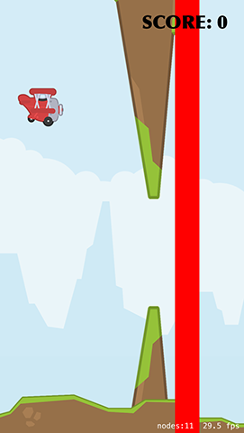

# Creating collisions

Part of the infuriating nature of Flappy Bird was that there were all sorts of collisions that could instantly kill you. In our game, these are massive rocks that will come out from the top and bottom of the screen – and if a player hits any rock, or the ground, they are history.

The player's job is to fly their plane safely through the rocks that come along. The difficult part is that the gap between rocks varies in position, and can be high, low or in the middle of the screen, so the player needs quick reactions to score anything over a few points.

We're going to make a `createRocks()` method in just a moment, but first here's what it needs to do:

1. Create top and bottom rock sprites. They are both the same graphic, but we're going to rotate the top one and flip it horizontally so that the two rocks form a spiky death for the player.
2. Create a third sprite that is a large red rectangle. This will be positioned just after the rocks and will be used to track when the player has passed through the rocks safely – if they touch that red rectangle, they should score a point. (Don't worry, we'll make it invisible later!)
3. Use Swift’s random number generation to generate a number in a range. This will be used to determine where the safe gap in the rocks should be.
4. Position the rocks just off the right edge of the screen, then animate them across to the left edge. When they are safely off the left edge, remove them from the game.

Here's the `createRocks()` method, with numbered comments matching the numbers above:

    func createRocks() {
        // 1
        let rockTexture = SKTexture(imageNamed: "rock")

        let topRock = SKSpriteNode(texture: rockTexture)
        topRock.zRotation = .pi
        topRock.xScale = -1.0

        let bottomRock = SKSpriteNode(texture: rockTexture)
        
        topRock.zPosition = -20
        bottomRock.zPosition = -20

        // 2
        let rockCollision = SKSpriteNode(color: UIColor.red, size: CGSize(width: 32, height: frame.height))
        rockCollision.name = "scoreDetect"

        addChild(topRock)
        addChild(bottomRock)
        addChild(rockCollision)

        // 3
        let xPosition = frame.width + topRock.frame.width

        let max = CGFloat(frame.height / 3)
        let yPosition = CGFloat.random(in: -50...max)

        // this next value affects the width of the gap between rocks
        // make it smaller to make your game harder – if you're feeling evil!
        let rockDistance: CGFloat = 70

        // 4
        topRock.position = CGPoint(x: xPosition, y: yPosition + topRock.size.height + rockDistance)
        bottomRock.position = CGPoint(x: xPosition, y: yPosition - rockDistance)
        rockCollision.position = CGPoint(x: xPosition + (rockCollision.size.width * 2), y: frame.midY)

        let endPosition = frame.width + (topRock.frame.width * 2)

        let moveAction = SKAction.moveBy(x: -endPosition, y: 0, duration: 6.2)
        let moveSequence = SKAction.sequence([moveAction, SKAction.removeFromParent()])
        topRock.run(moveSequence)
        bottomRock.run(moveSequence)
        rockCollision.run(moveSequence)
    }

If you haven't seen it before, the `xScale` property lets you stretch sprites horizontally. Using -1.0 as the value is what causes the flip effect - it stretches the sprite by -100%, inverting it. I'm also using -20 for the `zPosition` because we want the rocks to appear behind the ground sprites to keep the illusion intact.

You'll notice we're adding the movement action to the top rock, the bottom rock and the collision sprite. If you wanted, you could create an extra `SKNode` that contains all three rock sections, then animate *that*, but it gives you the same result. You might also have noticed the curious duration I set: 6.2. I chose this through trial and error because the rocks move a different distance to the ground and yet need to move at about the same speed – a duration of 6.2 comes close enough.

Now, we're *not* going to add a call to `createRocks()` in `didMove(to:)`. You see, if we did that it would create just one pair of rocks, which isn't what we want. Instead, we want rocks to be created every few seconds continuously until the player dies, which means we need a second method: `startRocks()`. Add this now:

    func startRocks() {
        let create = SKAction.run { [unowned self] in
            self.createRocks()
        }

        let wait = SKAction.wait(forDuration: 3)
        let sequence = SKAction.sequence([create, wait])
        let repeatForever = SKAction.repeatForever(sequence)

        run(repeatForever)
    }

That new method calls `createRocks()`, waits three seconds, calls `createRocks()` again, waits again, and so on, forever. Add a call to `startRocks()` to your `didMove(to:)` method, and if you run the app you'll really start to see things looking good: rocks should appear at random heights, with the red scoring box straight after them. Yes, you can't crash into them yet, but we'll get there soon!

The last thing we're going to do in this chapter is add a score. As you should have completed the earlier game projects already, the only surprising thing here is that I'm not going to use Chalkduster as my font – and only then because it's not easy to read against moving rocks and mountains!

Add these two properties to your class. One is to hold the score as an integer, and the other is to draw the score to the screen using a `SKLabelNode`:

    var scoreLabel: SKLabelNode!

    var score = 0 {
        didSet {
            scoreLabel.text = "SCORE: \(score)"
        }
    }

As per usual, we use a property observer to update the label whenever the score changes. Now add this `createScore()` method to your class:

    func createScore() {
        scoreLabel = SKLabelNode(fontNamed: "Optima-ExtraBlack")
        scoreLabel.fontSize = 24

        scoreLabel.position = CGPoint(x: frame.midX, y: frame.maxY - 60)
        scoreLabel.text = "SCORE: 0"
        scoreLabel.fontColor = UIColor.black

        addChild(scoreLabel)
    }

That positions the score in the top right of the screen, safely away from the player so as not to be too annoying.

Add a call to `createScore()` to `didMove(to:)` and you're done. Now all that's left is the important stuff: the game play!

