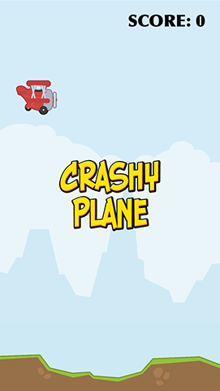

# Background music with SKAudioNode, an intro, plus game over

To make this a finished game – or at least as finished as it can be before getting into optimization – we're going to make four more changes: we're going to add background music, show an intro screen, show a game over screen, and let the player try again when they die. None of these things are difficult, but it's a chance to polish your skills while polishing the game so hopefully you won't skip this out!

First up: background music. SpriteKit has a special class called `SKAudioNode` that adds several useful features to audio in SpriteKit, such as the ability to pan your audio left and right. For our purposes, however, `SKAudioNode` is good because it lets us stop the audio whenever we want. 

One of the neat features of `SKAudioNode` is that it loops its audio by default. This makes it perfect for background music: we create the music, add it directly to the game scene as a child, and it plays our background music forever. It also has the happy side effect of starting the iOS Simulator's sound system as soon as the game begins, which means you won't have your game freeze the first time the player touches a red scoring rectangle.

Add a property for the background music now:

    var backgroundMusic: SKAudioNode!

Then add this to `didMove(to:)`:

    if let musicURL = Bundle.main.url(forResource: "music", withExtension: "m4a") {
        backgroundMusic = SKAudioNode(url: musicURL)
        addChild(backgroundMusic)
    }

Note: if you value your sanity, you'll probably want to run your game now to make sure the music works (yes, that code is all it takes!) then comment out those two lines so you don't have to listen to the music on repeat for the rest of the time you work on the game.

And yes, that's all it takes to add looping background music – hurray for `SKAudioNode`!

The next change we're going to make is to add an intro screen when the game starts. I'm just going to make mine show the game's logo – "Crashy Plane" – over the game screen, with the player's plane flying in the background. When the player taps the first time, the game will begin.

In a few minutes we're going to add a game over screen too, which means we have three possible game states: showing the logo, playing the game, and dead. We'll represent that with a dedicated enum, so add this just before the start of your `GameScene` class – i.e., just after the `import` lines:

    enum GameState {
        case showingLogo
        case playing
        case dead
    }

We need to create three more properties to make all this work: one to hold the logo sprite node, one to hold the game over sprite node, and one to keep track of the current game state. The game state will be `ShowingLogo` by default, which means the game won't start until the player is ready. Add these properties now:

    var logo: SKSpriteNode!
    var gameOver: SKSpriteNode!

    var gameState = GameState.showingLogo

Creating the logo and game over sprite nodes is nothing special: they are just simple pictures, and we can use the `midX` and `midY` properties to position them at the center of our game scene. As you might imagine, we need to set the `alpha` property of the game over sprite to be 0 to begin with otherwise it would be quite confusing!

Here's the `createLogos()` method:

    func createLogos() {
        logo = SKSpriteNode(imageNamed: "logo")
        logo.position = CGPoint(x: frame.midX, y: frame.midY)
        addChild(logo)

        gameOver = SKSpriteNode(imageNamed: "gameover")
        gameOver.position = CGPoint(x: frame.midX, y: frame.midY)
        gameOver.alpha = 0
        addChild(gameOver)
    }

That's not enough to make the game start in menu mode, though. First, add a call to `createLogos()` inside `didMove(to:)`. While you're there, *delete* the call to `startRocks()` because it's no longer needed – we don't want to start creating rocks before the game begins. Finally, do you remember this line of code in the `createPlayer()` method?

    player.physicsBody?.isDynamic = true

When I was explaining what it did, I said it "makes the plane respond to physics. This is the default, but I'm including it here because we'll change it later." Well, now it's time to change it: by changing that `true` to be `false` the player will stop responding to physics. It will still have physics attached to it ready to be used, but it won't actually do anything.

This is perfect for our game, because we want everything set up ready to go, but we *don't* want the player to start moving until we're ready. So, change that line to this:

    player.physicsBody?.isDynamic = false

If you run the game now you'll see it looks pretty good: the player no longer moves (even when you tap the screen) and the logo floats over the game nicely. Now we're going to rewrite `touchesBegan()` so that it distinguishes between a touch when in `showingLogo` mode and a touch when in `playing` mode.

The code for touches while playing hasn't changed, so I'm not going to discuss it further, but the code for `showingLogo` mode is new. This needs to change the game state to be `playing` (so that further touches move the plane), make the logo fade out and get removed from the game, wait a tiny amount, then activate the player. It also needs to call `startRocks()` so that rocks start being created at random intervals.

Because the `GameState` enum has three possible cases, and Swift likes all your switch/case statements to be exhaustive, we're going to add an empty case for `dead` that we'll fill in shortly. Here's the new code for `touchesBegan()`:

    override func touchesBegan(_ touches: Set<UITouch>, with event: UIEvent?) {
        switch gameState {
        case .showingLogo:
            gameState = .playing

            let fadeOut = SKAction.fadeOut(withDuration: 0.5)
            let remove = SKAction.removeFromParent()
            let wait = SKAction.wait(forDuration: 0.5)
            let activatePlayer = SKAction.run { [unowned self] in
                self.player.physicsBody?.isDynamic = true
                self.startRocks()
            }

            let sequence = SKAction.sequence([fadeOut, wait, activatePlayer, remove])
            logo.run(sequence)

        case .playing:
            player.physicsBody?.velocity = CGVector(dx: 0, dy: 0)
            player.physicsBody?.applyImpulse(CGVector(dx: 0, dy: 20))

        case .dead:
            break
        }
    }

You might think that removing the logo from the game is going to cause problems when we add the ability for the player to start again, but don't worry – it will all make sense soon!

So, that's our game start sequence in place: all that's needed now is to end the game when the player dies. This is going to do three things: change the `alpha` of the game over sprite to be 1 (fully visible), change the game state to be `Dead` so we can respond to touches differently, and stop the background music to give an extra little sense of loss.

In `didBegin()`, add these three lines of code just before the call to `player.removeFromParent()`:

    gameOver.alpha = 1
    gameState = .dead
    backgroundMusic.run(SKAction.stop())

Once the game state is `dead` the player's taps stop doing anything, which is lucky because the player is dead! However, what we really want is for player taps to start the game afresh, and the easiest way to do that is to present a whole new `GameScene` scene. This causes the whole game to be reset: a new score, a new player, a new logo sprite, no more rocks, etc, and it's significantly easier than trying to reset everything by hand.

Right now in `touchesBegan()` there is a simple `break` line for the `dead` game state. Change it to this:

    if let scene = GameScene(fileNamed: "GameScene") {
        scene.scaleMode = .aspectFill
        let transition = SKTransition.moveIn(with: SKTransitionDirection.right, duration: 1)
        view?.presentScene(scene, transition: transition)
    }

That creates a fresh `GameScene` scene, gives it the same `aspectFill` resizing as our original game scene, then makes it transition in with a simple animation.

But wait! Before you run the game – and I'm sure you're eager – there is one tiny further gameplay tweak to make. You see, we have an `update()` method that adjusts the rotation of the player every frame, but we also don't create the player until `didMove(to:)` is called. If the update method is called first (and it can be!) then Swift will try to adjust the rotation of a nil property because the player hasn't been created yet, which will make your game crash.

The solution is simple, thanks to the `guard` keyword – just add this line to the start of the `update()` method:

    guard player != nil else { return }

Translated, that single line means "ensure that player is not nil, otherwise exit the method."

That's it! The main part of our game is done. I hope you agree it looks good, although I can't take any credit for that – it's the [marvelous art of Kenney](http://kenney.itch.io/kenney-donation) that should take all the credit, and I do encourage you again to check out his complete pack of public domain game assets.

As final touches, you should set the score rectangles to have the color `UIColor.clear` so they are invisible, then go to GameViewController.swift and turn off `showsFPS`, `showsNodeCount` and `showsPhysics`.
