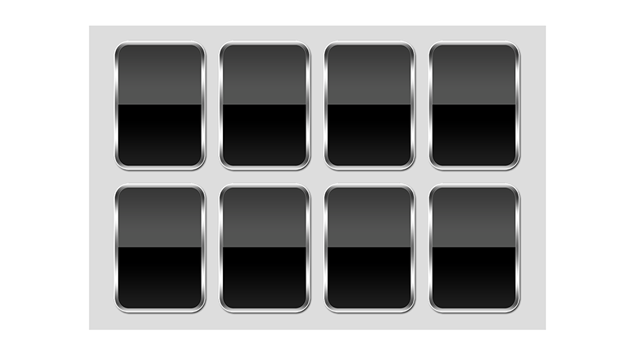

# Laying out the cards: addChildViewController()

The first step in our project will be to lay eight cards out on the screen so that the user can tap on one. We'll be doing most of this in code, but there is a small amount of storyboard work required.

Open up Main.storyboard in Interface Builder, then click “View As” to change it to landscape orientation. Draw out a large `UIView` inside the view controller that was made by the template. Set its size to be 480x320 using explicit width and height constraints, then make it centered inside its parent view. This explicit sizing makes it easy to support the full range of iPhones: we'll place the cards inside this container at exact positions, and the container will be moved depending on the size of the device.

We'll be placing something behind this view later on, so please set its background color to be Clear Color. Later on, we’ll be hand-positioning views in there using code, so we don’t want iOS to resize those child views for us – it will all be placed by hand. So, please uncheck the “Autoresize Subviews” box for the view. Finally, using the Assistant Editor, please make an outlet connection between your new view and the ViewController class, naming it `cardContainer`.

That's it: we're done with Interface Builder for now; the rest of this chapter will all be done using code.

In the screenshot below you can see how your interface should look – note that I've temporarily colored my inner view gray so you can see it more clearly!

To help isolate functionality, we'll be creating a special `UIViewController` subclass to handle each card. We'll then add this view controller to an array of all card view controllers, and add them all to our main view controller so the player can see them.

So, add a new file to the project and choose iOS > Source > Cocoa Touch Class then click Next. For "Subclass of" please enter “UIViewController” and for the class name enter “CardViewController”.

To make things nice and easy, each card view controller will contain two child image views: one for its card back and one for its card front. We're also going to give them two extra properties: one to mark whether the card is correct (i.e. a star) and one to hold a weak reference to the main `ViewController` class so we can send messages back.

Add these four properties to the `CardViewController` class now:

    weak var delegate: ViewController!

    var front: UIImageView!
    var back: UIImageView!

    var isCorrect = false

The basic Xcode class has a `viewDidLoad()` stub provided for us, but it doesn't do anything interesting. We need to upgrade this method to do the following:

1. Give the view a precise size of 100x140.
2. Add two image views, one for the card back and one for the front.
3. Set the front image view to be hidden by default.
4. Set the back image view to have an alpha value of 0 by default, fading up to 1 with an animation.

That last point isn't strictly needed, but it does make the whole application look nicer.

None of the code to accomplish this is difficult, but I'm going to draw on a particular feature of `UIImageView` to make things easier. The feature is this: if you create an image view using a `UIImage`, the image view gets set to the size of that image automatically. This is perfect, because all our card images are sized at 100x140, so our view and its card contents will all line up.

Here's the new `viewDidLoad()` method for the `CardViewController` class:

    override func viewDidLoad() {
        super.viewDidLoad()

        view.bounds = CGRect(x: 0, y: 0, width: 100, height: 140)
        front = UIImageView(image: UIImage(named: "cardBack"))
        back = UIImageView(image: UIImage(named: "cardBack"))

        view.addSubview(front)
        view.addSubview(back)

        front.isHidden = true
        back.alpha = 0

        UIView.animate(withDuration: 0.2) {
            self.back.alpha = 1
        }
    }

You'll note that I'm using the "cardBack" for both the front and the back image views. This is just for sizing purposes: the actual front image will be assigned later. Helpfully, `UIImage` shares image data across image views very efficiently, so there's no extra cost to this approach.

That's all the code required to make each card work, but it doesn't actually display them in the view. To do that, we need to return to ViewController.swift and create a new property to hold all the card view controllers, plus a new method to create them all. This creation method will also be responsible for clearing any existing cards, so that with a single method call we can wipe the slate clean and start again.

First, the new property: please add this to the `ViewController` class:

    var allCards = [CardViewController]()

Now for the new method, `loadCards()`. This needs to assemble an array of positions where cards can go (I've made some rough estimates, but you're welcome to be more precise in your own code if you want to), load the various Zener card shapes (one for each of the eight cards), then create one card view controller for each position.

So far, so easy. But this time there is going to be one extra step, because I want to introduce to you the concept of *view controller containment*. When you place one view controller inside another, it can cause problems with system events (think appearing, disappearing, rotating, etc.) because iOS wasn't originally designed to have multiple view controllers visible at the same time.

View controller containment is a simple solution where you use the methods `addChildViewController()` and `didMove(toParentViewController:)` to place one view controller inside another. It's extremely easy to do, and it means iOS can keep track of all the view controllers correctly, so it is very much recommended.

Please add the new method below to your `ViewController` class. I've added comments just in case you're not sure what everything does:

    @objc func loadCards() {
        // create an array of card positions
        let positions = [
            CGPoint(x: 75, y: 85),
            CGPoint(x: 185, y: 85),
            CGPoint(x: 295, y: 85),
            CGPoint(x: 405, y: 85),
            CGPoint(x: 75, y: 235),
            CGPoint(x: 185, y: 235),
            CGPoint(x: 295, y: 235),
            CGPoint(x: 405, y: 235)
        ]

        // load and unwrap our Zener card images
        let circle = UIImage(named: "cardCircle")!
        let cross = UIImage(named: "cardCross")!
        let lines = UIImage(named: "cardLines")!
        let square = UIImage(named: "cardSquare")!
        let star = UIImage(named: "cardStar")!

        // create an array of the images, one for each card, then shuffle it
        var images = [circle, circle, cross, cross, lines, lines, square, star]
        images.shuffle()

        for (index, position) in positions.enumerated() {
            // loop over each card position and create a new card view controller
            let card = CardViewController()
            card.delegate = self

            // use view controller containment and also add the card's view to our cardContainer view
            addChild(card)
            cardContainer.addSubview(card.view)
            card.didMove(toParent: self)

            // position the card appropriately, then give it an image from our array
            card.view.center = position
            card.front.image = images[index]

            // if we just gave the new card the star image, mark this as the correct answer
            if card.front.image == star {
                card.isCorrect = true
            }

            // add the new card view controller to our array for easier tracking
            allCards.append(card)
        }
    }

**Important:** I’ve marked the `loadCards()` method using `@objc` because we’ll be using it with `#selector` in the very next chapter.

Now you just need to add a call to that method inside `viewDidLoad()` like this:

    override func viewDidLoad() {
        super.viewDidLoad()

        loadCards()
    }

There's one last thing we need to add before we're done with card loading: we need to make `loadCards()` remove any existing cards. This will allow us to call `loadCards()` repeatedly and have it do the right thing.

Please add this code at the start of `loadCards()`:

    for card in allCards {
        card.view.removeFromSuperview()
        card.removeFromParent()
    }

    allCards.removeAll(keepingCapacity: true)

That just acts as an "undo" for the rest of the method: it loops through all the card view controllers we stored in the `allCards` array, removes the view then removes the view controller containment, then clears the whole array.

Go ahead and run your project now, and you should see eight cards neatly lined up in two rows like the screenshot below – albeit without the gray background. They don't do anything yet, but it's a good start.

