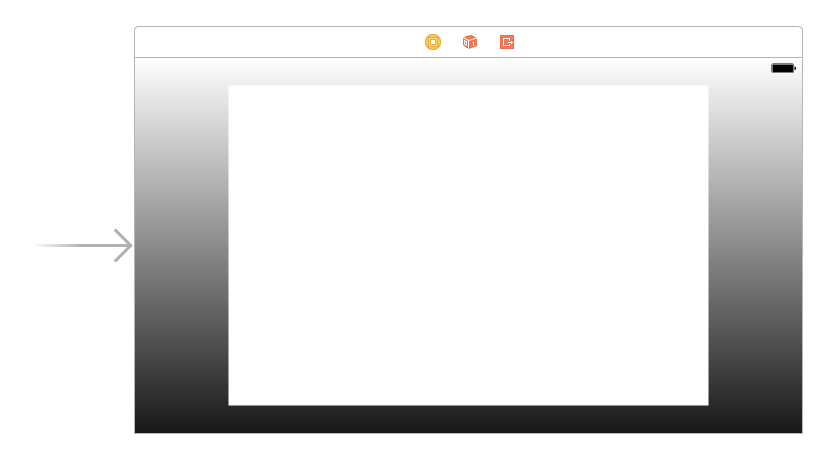

# Adding a CAGradientLayer with IBDesignable and IBInspectable

Magic is really the art of misdirection: making people focus their attention on one thing in order to stop them focusing on something else. In our case, we don't want users to suspect that your Apple Watch is helping you find the star, so we're going to overload them with misdirection so that they suspect everything else before they think of your watch.

The first thing we're going to do is add a background to our view. This is going to be a simple gradient, but we're going to make the gradient change color slowly between red and blue. This has no impact on your ability to find the star, but if it makes your friends suspect that the trick is to tap a card when the background is red then it has fulfilled its job of misdirection.

Making gradients in iOS isn't hard thanks to a special `CALayer` subclass called `CAGradientLayer`. That being said, working with layers directly isn't pleasant, because they can't take part in things like Auto Layout and they can't be used inside Interface Builder.

So, I'm going to teach you how to wrap a gradient inside a `UIView`, while also adding the benefits of letting you control the gradient right from within Interface Builder. What's more, you'll be amazed at how easy it is.

Add a new Cocoa Touch class to your project. Make it a subclass of `UIView` then name it `GradientView`. We need this class to have a top and bottom color for our gradient, but we also want those values to be visible (and editable) inside Interface Builder. This is done using two new keywords: `@IBDesignable` and `@IBInspectable`.

The first of those, `@IBDesignable`, means that Xcode should build the class and make it draw inside Interface Builder whenever changes are made. This means any custom drawing you do will be reflected inside Interface Builder, just like it would when your app runs for real.

The second new keyword, `@IBInspectable`, exposes a property from your class as an editable value inside Interface Builder. Xcode knows how to handle various data types in meaningful ways, so strings will have an editable text box, booleans will have a checkbox, and colors will have a color selection palette.

Other than defining properties for the top and bottom colors of the gradient, the `GradientView` class needs to do only two other things to be complete: when iOS asks it what kind of layer to use for drawing it should return `CAGradientLayer`, and when iOS tells the view to layout its subviews it should apply the colors to the gradient.

Using this approach means the entire class is just 12 lines of code, *including* whitespace and closing braces. Here's the code for the `GradientView` class:

    @IBDesignable class GradientView: UIView {
        @IBInspectable var topColor: UIColor = UIColor.white
        @IBInspectable var bottomColor: UIColor = UIColor.black

        override class var layerClass: AnyClass {
            return CAGradientLayer.self
        }

        override func layoutSubviews() {
            (layer as! CAGradientLayer).colors = [topColor.cgColor, bottomColor.cgColor]
        }
    }

With that new class in place, it's time to return to Interface Builder and add it to our layout. To do this, draw out another `UIView`, but make sure it stretches from edge to edge this time and add some Auto Layout rules to make sure it stays edge to edge. Finally, go to the Editor menu and choose Arrange > Send To Back to make sure the new view sits behind the card container.

For iPhones with rectangular screens, what we’ve done is good enough – that gradient view will now fill the screen. But the iPhone X has rounded screen edges, so the safe area insets will automatically kick in, pushing our gradient view away from the edges. This isn’t what we want, and we need to fix this right here in IB.

So, select the main view for the view controller – the one that contains the gradient view – and uncheck Safe Area Relative Margins and Safe Area Layout Guide in the size inspector. That should make the gradient view run edge to edge nicely!

We want this new view to be a `GradientView`, which is done by changing its class. Press Alt+Cmd+3 to bring up the identity inspector on the right, then look at the very top for a dropdown list of classes you can use for the new view. Look in there for "GradientView", and you'll see "Designables: Updating" appear.

After a few seconds, you should see a white to black gradient appear in Interface Builder, which shows the default colors we set. But we made those colors inspectable, so if you press Alt+Cmd+4 to go to the Attributes Inspector you should see "Top Color" and "Bottom Color" ready for you to choose – yes, Xcode has correctly converted `topColor` into "Top Color" thanks to our property naming convention.

We'll be applying red and blue colors separately to the gradient, so please set "Top Color" to be "Dark Gray Color", and "Bottom Color" to be "Black Color". Finally, set the alpha value for the gradient view to be 0.9, so a little bit of the background view shows through.

Before we're done with Interface Builder (for real this time!) please use the Assistant Editor to create an outlet for this new gradient view called `gradientView`. We don't need this just now, but it's important in the next chapter.

If everything is correct, your interface should look like the screenshot below. As before, I've colored my container view so you can see it, but yours should have Clear Color for its background color.

With all those interface changes in place, we can animate the background color of the main view in just a handful of lines of code. To make this work, we'll be using three animation options: `.allowUserInteraction` (so the user can tap cards), `.autoreverse` to make the view go back to its original color, and `.repeat` to make the animation loop back and forward forever.

Place this animation code somewhere in `viewDidLoad()`:

    view.backgroundColor = UIColor.red

    UIView.animate(withDuration: 20, delay: 0, options: [.allowUserInteraction, .autoreverse, .repeat], animations: {
        self.view.backgroundColor = UIColor.blue
    })

Note that we need to give the view an initial red color to make the animation smooth, but you can put that in Interface Builder if you prefer.
