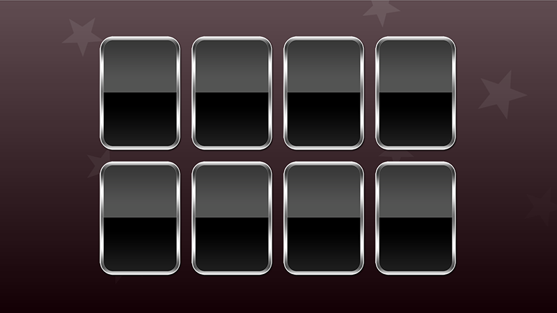

# Creating a particle system using CAEmitterLayer

Let's take our misdirection up a notch by adding some falling, spinning stars behind the cards. Again, these do nothing other than misdirect your friends while also giving me a chance to squeeze some new learning into you.

We first met particle systems [in project 11](https://www.hackingwithswift.com/read/11/overview) when we covered `SKEmitterNode`. That's a fast and easy way to create particle systems in SpriteKit, but we're not in SpriteKit now so we need an alternative.

Fortunately, iOS has one, and in fact it even predates `SKEmitterNode`: `CAEmitterLayer`. From its name you should already be able to tell that it's a subclass of `CALayer`, which in turn means you need to use `CGColor` rather than `UIColor` and `CGImage` rather than `UIImage`. However, I should add that `CAEmitterLayer` isn't quite a beautifully polished as `SKEmitterNode` – it has no WYSIWYG editor, for example, so you need to do everything in code.

Each `CAEmitterLayer` defines the position, shape, size and rendering mode of a particle system, but it doesn't actually define any particles – that's handled by a separate class, called `CAEmitterCell`. You can create as many emitter cells as you want, then assign them to your emitter layer to have them all fire from the same position.

There are *lots* of properties you can set on emitter cells, and without a WYSIWYG editor you're basically stuck reading the documentation to find them all. To give you a jump start, I'm going to use quite a few to make our particle system:

- The `birthRate` property sets how many particles to create every second.
- The `lifetime` property sets how long each particle should live, in seconds.
- The `velocity` property sets the base movement speed for each particle.
- The `velocityRange` property sets how much velocity variation there can be.
- The `emissionLongitude` property sets the direction particles are fired.
- The `spinRange` property sets how much spin variation there can be between particles.
- The `scale` property sets how large particles should be, where 1.0 is full size.
- The `scaleRange` property sets how much size variation there can be between particles.
- The `color` property sets the color to be applied to each particle.
- The `alphaSpeed` property sets how fast particles should be faded out (or in) over their lifetime.
- The `contents` property assigns a `CGImage` to be used as the image.

Broadly speaking, each property has "Speed" and "Range" counterparts, where "speed" dictates how much the value changes over time, and "range" dictates how much variation there is in the initial value. So, `scale` also has `scaleSpeed` and `scaleRange` alongside it.

Alongside those cell properties, we're also going to give the particle system some basic properties: we want to position it at the horizontal center of our view and just off the top, we want it to be shaped like a line so that particles are created across the width of the view, we want it to be as wide as the view but only one point high, and, as a bonus, we want it to use additive rendering so that overlapping particles get brighter.

Now that you know how it all works, please add this method to the `ViewController` class:

    func createParticles() {
        let particleEmitter = CAEmitterLayer()

        particleEmitter.emitterPosition = CGPoint(x: view.frame.width / 2.0, y: -50)
        particleEmitter.emitterShape = .line
        particleEmitter.emitterSize = CGSize(width: view.frame.width, height: 1)
        particleEmitter.renderMode = .additive

        let cell = CAEmitterCell()
        cell.birthRate = 2
        cell.lifetime = 5.0
        cell.velocity = 100
        cell.velocityRange = 50
        cell.emissionLongitude = .pi
        cell.spinRange = 5
        cell.scale = 0.5
        cell.scaleRange = 0.25
        cell.color = UIColor(white: 1, alpha: 0.1).cgColor
        cell.alphaSpeed = -0.025
        cell.contents = UIImage(named: "particle")?.cgImage
        particleEmitter.emitterCells = [cell]

        gradientView.layer.addSublayer(particleEmitter)
    }

Note that I'm adding the particle emitter as a sublayer of the `gradientView` view. This is important, because it ensures the stars always go behind the cards. You will also need to a call to `createParticles()` to the view controller's `viewDidLoad()` method, just before the call to `loadCards()`.

Go ahead and run the project now and I think you'll find the effect quite pleasing – it's subtle, yes, but again it's just enough to distract users into thinking maybe, just maybe, the position of the stars tells you where the green star card is.

