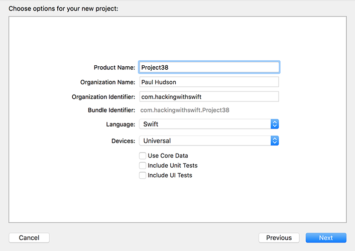
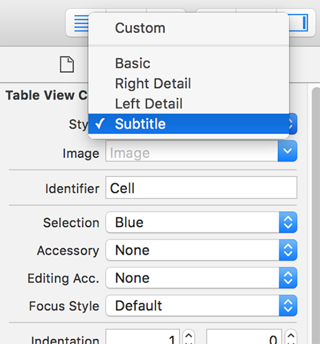

# Setting up

In this project you'll learn how to use Core Data while building an app that fetches GitHub commit data for the Swift project. Core Data is Apple's object graph and persistence framework, which is a fancy way of saying it reads, writes and queries collections of related objects while also being able to save them to disk.

Core Data is undoubtedly useful, which is why about 500,000 apps in the App Store build on top of it. But it's also rather complicated to learn, which is why I left it so late in this tutorial series – despite my repeated attempts to simplify the topic, this tutorial is still going to be the hardest one in the whole of Hacking with Swift, and indeed I might have missed it out altogether were it not by far the most requested topic from readers!

So, strap in, because you're going to learn a lot: we'll be covering Core Data, which will encompass `NSFetchRequest`, `NSManagedObject`, `NSPredicate`, `NSSortDescriptor`, and `NSFetchedResultsController`. We'll also touch on `ISO8601DateFormatter` for the first time, which is one of Apple's ways to convert `Date` objects to and from strings.

As always, I like to teach new topics while giving you a real-world project to work with, and in our case we're going to be using the GitHub API to fetch information about Apple's open-source Swift project. The GitHub API is simple, fast, and outputs JSON, but most importantly it's public. Be warned, though: you get to make only 60 requests an hour without an API key, so while you're testing your app make sure you don't refresh too often!

If you weren't sure, a "Git commit" is a set of changes a developer made to source code that is stored in a source control repository. For example, if you spot a bug in the Swift compiler and contribute your changes, those changes will form one commit. And before I get emails from random internet pedants, *yes I know* things are more complicated than that, but it's more than enough of an explanation for the purposes of this tutorial.

Before we start, it's important I reiterate that Core Data can be a bit overwhelming at first. It has a lot of unique terminology, so if you find yourself struggling to understand it all, that's perfectly normal – it's not you, it's just Core Data.

Over the next four chapters, we will implement the four pieces of Core Data boilerplate. We're going to use Xcode's built-in Single View App template, but we're not *not* going to have it generate Core Data code for us because I want you to understand it from the ground up.

So, please go ahead and create a new Single View App project named Project38. Select Swift for your language, then make sure you *uncheck* Core Data otherwise the rest of this tutorial will be very confusing indeed.

We need to parse the JSON coming from GitHub's API, and the easiest way to do that isn’t using the `Codable` protocol that we’ve looked at before. You see, `Codable` is great at converting JSON into objects that we create and manage, but it’s less great when working with Core Data because *Core Data* wants to manage the objects itself as you’ll see.

So, instead we’re going to use a popular JSON parsing library called SwiftyJSON. If you haven't already downloaded the content for this project, please get it from GitHub now: <https://github.com/twostraws/HackingWithSwift>. You'll see SwiftyJSON is there, so please drag that into your project now.

We’re going to use a table view controller rather than a regular view controller, so we need to do the same conversion job we’ve done several times before. So:

1. Open ViewController.swift and make it inherit from `UITableViewController`.
2. Open Main.storyboard and delete the view controller that’s there right now.
3. Drag in a new table view controller and set its class to be “ViewController”.
4. Make it the initial view controller for the storyboard.
5. Embed it inside a navigation controller.
6. Select its prototype cell, give it the style Subtitle, the identifier “Commit”, and a disclosure indicator for its accessory.

We also need a detail view controller, but it doesn’t need to do much – it’s just there to show that everything works correctly. So, drag out a new view controller from the object library, and give it the storyboard ID “Detail”. Drag a label out onto it so that it fills the view controller, then set Auto Layout rules so that it always stays edge to edge. Center its text, then give it 0 for its number of lines property.

The main table view controller class and interface are done for now, but we need to create a new class to handle the detail view controller. So, go to File > New > File and choose iOS > Source > Cocoa Touch Class. Name it “DetailViewController”, make it a subclass of “UIViewController”, then click Finish and Create.

Back in Main.storyboard, change the class of the detail view controller to be “DetailViewController”, then switch to the assistant editor and create an outlet for the label called “detailLabel”.

That's it: the project is cleaned up and ready for Core Data. Remember, there are four steps to implementing Core Data in your app, so let's start with the very first step: designing a Core Data model.
