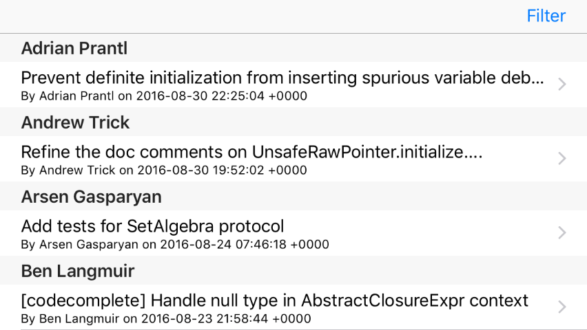

# Optimizing Core Data Performance using NSFetchedResultsController

You've already seen how Core Data takes a huge amount of work away from you, which is great because it means you can focus on writing the interesting parts of your app rather than data management. But, while our current project certainly works, it's not going to scale well. To find out why open the Commit+CoreDataClass.swift file and modify its class to this:

    public class Commit: NSManagedObject {
        override init(entity: NSEntityDescription, insertInto context: NSManagedObjectContext?) {
            super.init(entity: entity, insertInto: context)
            print("Init called!")
        }
    }

When you run the program now you'll see "Init called!" in the Xcode log at least a hundred times - once for every `Commit` object that gets pulled out in our `loadSavedData()` method. So what if there are 1000 objects? Or 10,000? Clearly it's inefficient to create a new object for everything in our object graph just to load the app, particularly when our table view can only show a handful at a time.

Core Data has a brilliant solution to this problem, and it's called `NSFetchedResultsController`. It takes over our existing `NSFetchRequest` to load data, replaces our `commits` array with its own storage, and even works to ensure the user interface stays in sync with changes to the data by controlling the way objects are inserted and deleted.

No tutorial on Core Data would be complete without teaching `NSFetchedResultsController`, so that's the last thing we'll be doing in this project. I left it until the end because, although it's very clever and certainly very efficient, `NSFetchedResultsController` is entirely optional: if you're happy with the project as it is, you're welcome to skip over this last chapter.

First, add a new property to `ViewController` that will hold the fetched results controller for commits:

    var fetchedResultsController: NSFetchedResultsController<Commit>!

We now need to rewrite our `loadSavedData()` method so that the existing `NSFetchRequest` is wrapped inside a `NSFetchedResultsController`. We want to create that fetched results controller only once, but retain the ability to change the predicate when the method is called again.

Before I show you the code, there are three new things to learn. First, we're going to be using the `fetchBatchSize` property of our fetch request so that only 20 objects are loaded at a time. Second, we'll be setting the view controller as the delegate for the fetched results controller – you'll see why soon. Third, we need to use the `performFetch()` method on our fetched results controller to make it load its data.

Here's the revised `loadSavedData()` method:

    func loadSavedData() {
        if fetchedResultsController == nil {
            let request = Commit.createFetchRequest()
            let sort = NSSortDescriptor(key: "date", ascending: false)
            request.sortDescriptors = [sort]
            request.fetchBatchSize = 20

            fetchedResultsController = NSFetchedResultsController(fetchRequest: request, managedObjectContext: container.viewContext, sectionNameKeyPath: nil, cacheName: nil)
            fetchedResultsController.delegate = self
        }

        fetchedResultsController.fetchRequest.predicate = commitPredicate

        do {
            try fetchedResultsController.performFetch()
            tableView.reloadData()
        } catch {
            print("Fetch failed")
        }
    }

Because we're setting `delegate`, you'll also need to make `ViewController` conform to the `NSFetchedResultsControllerDelegate` protocol, like this:

    class ViewController: UITableViewController, NSFetchedResultsControllerDelegate {

That was the easy part. However, when you use `NSFetchedResultsController`, you need to use it everywhere: that means it tells you how many sections and rows you have, it keeps track of all the objects, and it is the single source of truth when it comes to inserting or deleting objects.

You can get an idea of what work needs to be done by deleting the `commits` property: we don't need it any more, because the fetched results controller stores our results. Immediately you'll see five errors appear wherever that property was being touched, and we need to rewrite all those instances to use the fetched results controller.

Second, replace the `numberOfSections(in:)` and `numberOfRowsInSection` methods with these two new implementations:

    override func numberOfSections(in tableView: UITableView) -> Int {
        return fetchedResultsController.sections?.count ?? 0
    }

    override func tableView(_ tableView: UITableView, numberOfRowsInSection section: Int) -> Int {
        let sectionInfo = fetchedResultsController.sections![section]
        return sectionInfo.numberOfObjects
    }

As you can see, we can read the `sections` array, each of which contains an array of `NSFetchedResultsSectionInfo` objects describing the items in that section. For now, we're just going to use that for the number of objects in the section.

Third, find this line inside the `cellForRowAt` method:

    let commit = commits[indexPath.row]

And replace it with this instead:

    let commit = fetchedResultsController.object(at: indexPath)

As you can see, fetched results controllers use index paths (i.e., sections as well as rows) rather than just a flat array; more on that soon!

You’ll get another error inside the `didSelectRowAt` method, because that was reading from the `commits` array. Replace the offending line with this:

    vc.detailItem = fetchedResultsController.object(at: indexPath)

The final two errors are in the `commit` method, where deleting items happens. And this is where things get more complicated: we can't just delete items from the fetched results controller, and neither can we use `deleteRows(at:)` on the table view. Instead, Core Data is much more clever: we just delete the object from the managed object context directly.

You see, when we created our `NSFetchedResultsController`, we hooked it up to our existing managed object context, and we also made our current view controller its delegate. So when the managed object context detects an object being deleted, it will inform our fetched results controller, which will in turn automatically notify our view controller if needed.

So, to delete objects using fetched results controllers you need to rewrite the `commit` method to this:

    override func tableView(_ tableView: UITableView, commit editingStyle: UITableViewCellEditingStyle, forRowAt indexPath: IndexPath) {
        if editingStyle == .delete {
            let commit = fetchedResultsController.object(at: indexPath)
            container.viewContext.delete(commit)
            saveContext()
        }
    }

As you can see, that code pulls the object to delete out from the fetched results controller, deletes it, then saves the changes – we no longer touch the table view here.

That being said, we do need to add one new method that gets called by the fetched results controller when an object changes. We'll get told the index path of the object that got changed, and all we need to do is pass that on to the `deleteRows(at:)` method of our table view:

    func controller(_ controller: NSFetchedResultsController<NSFetchRequestResult>, didChange anObject: Any, at indexPath: IndexPath?, for type: NSFetchedResultsChangeType, newIndexPath: IndexPath?) {
        switch type {
        case .delete:
            tableView.deleteRows(at: [indexPath!], with: .automatic)

        default:
            break
        }
    }

Now, you might wonder why this approach is an improvement – haven't we just basically written the same code only in a different place? Well, no. That new delegate method we just wrote could be called from anywhere: if we delete an object in any other way, for example in the detail view, that method will now automatically get called and the table will update. In short, it means our data is driving our user interface, rather than our user interface trying to control our data.

Previously, I said "Using attribute constraints can cause problems with `NSFetchedResultsController`, but in this tutorial we're always doing a full save and load of our objects because it's an easy way to avoid problems later." It's time for me to explain the problem: attribute constraints are only enforced as unique when a save happens, which means if you're inserting data then an NSFetchedResultsController may contain duplicates until a save takes place. This won't happen for us because I've made the project perform a save before a load to make things easier, but it's something you need to watch out for in your own code.

If you run the app now, you'll see "Init called!" appears far less frequently because the fetched results controller lazy loads its data – a significant performance optimization.

Before we're done with `NSFetchedResultsController`, I want to show you one more piece of its magic. You've seen how it has sections as well as rows, right? Well, try changing its constructor in `loadSavedData()` to be this:

    fetchedResultsController = NSFetchedResultsController(fetchRequest: request, managedObjectContext: container.viewContext, sectionNameKeyPath: "author.name", cacheName: nil)

The only change there is that I've provided a value for `sectionNameKeyPath` rather than `nil`. Now try adding this new method to `ViewController`:

    override func tableView(_ tableView: UITableView, titleForHeaderInSection section: Int) -> String? {
        return fetchedResultsController.sections![section].name
    }

If you run the app now, you'll see the table view has sections as well as rows, although the commits inside each section won’t match the author name you can see. The reason for this discrepancy is that we’re still sorting by date – go to `loadSavedData()` and change its sort descriptor to this:

    let sort = NSSortDescriptor(key: "author.name", ascending: true)

Much better!

So, `NSFetchedResultsController` is not only faster, but it even adds powerful functionality with a tiny amount of code – what's not to like?

