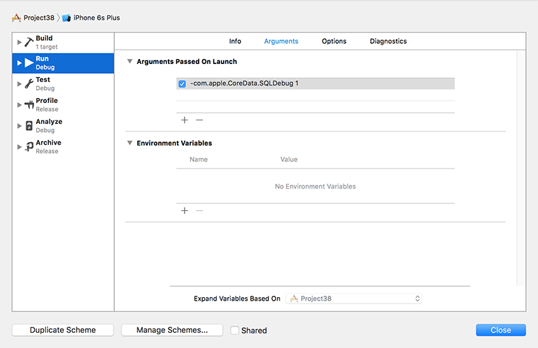

# Wrap up

Core Data is *complicated*. It really is. So if you've made it this far, you deserve a pat on the back because you've learned a huge amount in this one project – good job! You've learned about model design, relationships, predicates, sort descriptors, persistent stores, managed object contexts, fetch requests, fetched results controllers, indexes, hashes and more, and I hope you're pleased with the final project.

But I'm afraid I have some bad news: even with everything you've learned, there's still a lot more to go if you really want to master Core Data. Migrating data models, multiple managed object contexts, delete rules, query generations, and thread safety should be top of that list, but at the very least I hope I've managed to give you a firm foundation on the technology – and perhaps even get you a bit excited about what it can do for you!

Before you're done, I have two small tips for you. First, go to the Product menu and choose Scheme > Edit Scheme. In the window that appears, choose your Run target and select the Arguments tab. Now click + and enter the text `-com.apple.CoreData.SQLDebug 1`. Once that's done, running your app will print debug SQL into the Xcode log pane, allowing you to see what Core Data is up to behind the scenes.

**Warning:** when this option is enabled, you will see scary language like "fault fulfilled from database." No, there isn't really a fault in your code – it's Core Data's way of saying that the objects it lazy loaded need to be loaded for real, so it's going back to the database to read them. You'll get into this more when you explore Core Data further, but for now relax: it's just a poor choice of phrasing from Apple.

Second, if you make changes to your model, watch out for the message "The model used to open the store is incompatible with the one used to create the store." If you intend to turn this into a production app, you should ensure that you handle such errors gracefully – just printing something to the log isn’t good enough, because users won’t see it. While you're testing, don't be afraid to reset the iOS simulator as often as you need to in order to clean out old models.

If you want to take the app further, here are some suggestions for homework:

- **Fun:** Try creating a new Xcode project using the Master-Detail Application template, but enable the Core Data checkbox. You should be able to read through most of the code and understand how it works.
- **Tricky:** Use the "url" attribute of Commit in the detail view controller to show the GitHub page in a `WKWebView` rather than just a label.
- **Taxing:** Rewrite the `getNewestCommitDate()` method so that it uses `UserDefaults` rather than a fetch request in order to fix the bug in the current implementation. (Didn't spot the bug? If users delete the most recent commit message, we also lose our most recent date!)
- **Mayhem:** Complete the `showAuthorCommits()` method in the detail view controller. This should show a new table view controller listing other commits by the same author. To make your life easier, you might want to try going to the Author entity, choosing its "commits" relationship, then checking the "Ordered" box and recreating the `NSManagedObject` subclass. Don't forget to remove the optionality from the properties that get generated!

For extra credit: what happens when you delete the last row from a particular section? See if you can experiment with using `deleteSections()` rather than `deleteRows()` to fix that!
