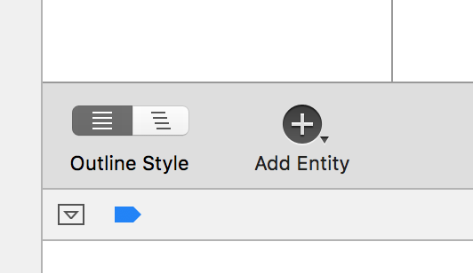
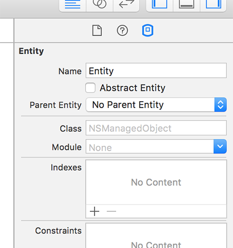
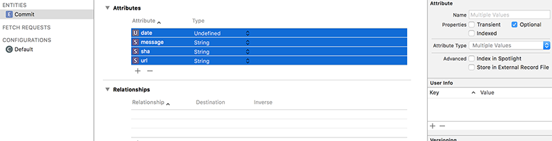

# Designing a Core Data model

A data model is a description of the data you want Core Data to store, and is a bit like creating a class in Swift: you define entities (like classes) and give them attributes (like properties). But Core Data takes it a step further by allowing you to describe how its entities relate to other entities, as well as adding rules for validation and uniqueness.

We're going to create a data model for our app that will store a list of all the GitHub commits for the Swift library. Take a look at the raw GitHub JSON now by loading this URL in a web browser: <https://api.github.com/repos/apple/swift/commits?per_page=100>. You'll see that each commit has a "sha" identifier, committer details, a message describing what changed, and a lot more. In our initial data model, we're going to track the "date", "message", "sha", and "url" fields, but you're welcome to add more if you want to.

To create a data model, choose File > New > File and select iOS > Core Data > Data Model. Name it Project38, then make sure the "Group" option near the bottom of the screen has a yellow folder to it rather than a blue project icon.

This will create a new file called Project38.xcdatamodeld, and when you select that you'll see a new editing display: the Data Model Editor. At the bottom you'll see a button with the title "Add Entity": please click that now.

A Core Data "entity" is like a Swift class in that it is just a description of what an object is going to look like. By default, new entities are called "Entity", but you can change that in the Data Model inspector in the right-hand pane of Xcode – press Alt+Cmd+3 if it's not already visible. With your new entity selected, you should see a field named "Name", so please change "Entity" to be "Commit".

To the right of the Add Entity button is another button, Add Attribute. Click that four times now to add four attributes, then name them "date", "message", "sha" and "url". These attributes are just like properties on a Swift class, including the need to have a data type. You'll see they each have "Undefined" for their type right now, but that's easily changed: set them all to have the String data type, except for "date", which should be Date.

The final change we're going to make is to mark each of these four property as non-optional. Click "date" then hold down Shift and click "url" to select all four attributes, then look in the Data Model inspector for the Optional checkbox and deselect it. **Note:** the Data Model inspector can be a bit buggy sometimes – if you find it's completely blank, you might need to try selecting one of the other files in your project and/or deselecting then re-selecting your entity to make things work.

Now, you might be forgiven for thinking, "at last! All that time spent mastering Swift optionals is paying off – I know what this checkbox does!" But I have some bad news for you. Or, more specifically, Core Data has some bad news for you: this Optional checkbox has nothing at all to do with Swift optionals, it just determines whether the objects that Core Data stores are required to have a value or not.

That's the first step of Core Data completed: the app now knows what kind of data we want to store. We'll be coming back to add to our model later, but first it's time for step two: adding the base Core Data functionality to our app so we can load the model we just defined and save any changes we make.

**Warning:** When you make *any* changes to the Core Data editor in Xcode, you should press Cmd+S to save your changes. At the time of writing – and indeed for some time now – Xcode has not saved Core Data model changes when you build your app, so if you don’t save the changes yourself you’ll find they haven’t been applied and you’ll spend hours investigating ghost bugs.
