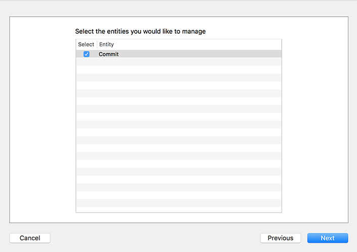
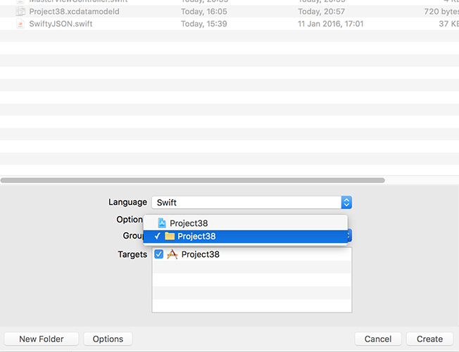

# Creating an NSManagedObject subclass with Xcode

In our app, Core Data is responsible for reading data from a persistent store (the SQLite database) and making it available for us to use as objects. After changing those objects, we can save them back to the persistent store, which is when Core Data converts them back from objects to database records.

All this is done using a special data type called `NSManagedObject`. This is a Core Data subclass of `NSObject` that uses a unique keyword, `@NSManaged`, to provide lots of functionality for its properties. For example, you already saw the `hasChanges` property of a managed object context – that automatically gets set to true when you make changes to your objects, because Core Data tracks when you change properties that are marked `@NSManaged`.

Behind the scenes, `@NSManaged` effectively means "extra code will automatically be provided when the program runs." It's a bit like functionality injection: when you say "this property is `@NSManaged`" then Core Data will add getters and setters to it when the app runs so that it handles things like change tracking.

If this sounds complicated, relax: Xcode can do quite a bit of work for us. It's not perfect, as you'll see shortly, but it's certainly a head start. So, it's time for step three: creating objects in Core Data so that we can fetch and store data from GitHub.

There are two ways Xcode can help, one of which isn’t good enough for this project but is slowly getting better – maybe when I update this project next it will be update to scratch. Let’s look at it briefly now: open Project38.xcdatamodeld, select the Commit entity again, then look in the data model inspector for the “Codegen” option. Change it to “Class Definition”, press Cmd+S to save the change, then press Cmd+B to have Xcode build the project.

What just changed might look small, but it’s remarkably smart. Open ViewController.swift and add this code at the end of `viewDidLoad()`:

    let commit = Commit()
    commit.message = "Woo"
    commit.url = "http://www.example.com"

Can you figure out what Xcode has done for us? The Codegen value is short for “code generation” – when you pressed Cmd+B to build your project, Xcode converted the Commit Core Data entity into a Commit Swift class. You can’t see it in the project – it’s dynamically generated when the Swift code is being built – but it’s there for you to use, as you just saw. You get access to its attributes as properties that you can read and write, and any changes you make will get written back to the database when you call our `saveContext()` method.

However, this feature is imperfect, at least right now – although that might change at any point in the future as Apple updates Xcode. First, try adding this line below the previous three:

    commit.date = Date()

That means “set the `date` property to the current date.” But it won’t work – right now Xcode generates its classes using the old Swift 2.2 `NSDate` class rather than the shiny new Swift `Date` struct. This means you need to use `NSDate` in your own Swift code, or add conversions everywhere, neither of which are pleasant.

Xcode’s auto-generated class also has one more annoyance, and you’ll see it if you try using code completion to view its properties: all four of the properties it made for us are optional, so `name` is a `String?`, `date` is an `NSDate?` and so on. Yes, even though we marked all the attributes as non-optional in the Core Data editor, that just means they need to have values by the time they get saved – Xcode will quite happily let them be nil at other times.

Sometimes that’s OK, but usually it’s not. So, let’s put the codegen feature to one side for now – go back to the Core Data editor, change Codegen back to “Manual/None”, then press Cmd+S to save and Cmd+B to rebuild your app. You’ll get compiler errors now because the `Commit` class no longer exists, but that’s OK.

You’ve seen codegen, which is the first way Xcode can help us create objects in Core Data. The *second* way is to create our own custom `NSManagedObject` subclass, which right now is the preferred way forward because it lets us take the dynamically generated class and customize it.

Still inside the Core Data editor, go to the Editor menu and choose Create NSManagedObject Subclass. Make sure your data model is selected then click Next. Make sure the Commit entity is checked then click Next again.

Finally, look next to Group and make sure you see a yellow folder next to "Project 38" rather than a blue project icon, and click Create.

When this process completes, two new files are created: Commit+CoreDataClass.swift and Commit+CoreDataProperties.swift. If you examine them you'll see the first one is almost empty, whereas the second one looks something like this:

    import Foundation
    import CoreData

    extension Commit {
        @nonobjc public class func fetchRequest() -> NSFetchRequest<Commit> {
            return NSFetchRequest<Commit>(entityName: "Commit")
        }

        @NSManaged public var date: NSDate?
        @NSManaged public var message: String?
        @NSManaged public var sha: String?
        @NSManaged public var url: String?
    }

First, there's that `@NSManaged` keyword I mentioned to you. Second, notice that the code says `extension Commit` rather than `class Commit`, which is Xcode being clever: Commit+CoreDataClass.swift is an empty class that you can fill with your own functionality, and Commit+CoreDataProperties.swift is an *extension* to that class where Core Data writes *its* properties. This means if you ever add attributes to the Commit entity and regenerate the `NSManagedObject` subclass, Xcode will overwrite only Commit+CoreDataProperties.swift, leaving your own changes in Commit+CoreDataClass.swift untouched.

There’s one more thing in there, which is a bit of syntactic sugar. It’s this bit:

    @nonobjc public class func fetchRequest() -> NSFetchRequest<Commit> {
        return NSFetchRequest<Commit>(entityName: "Commit")
    }

We’ll come on fetch requests later on, but to satisfy your curiosity that line means we can write this:

    Commit.fetchRequest()

Rather than this:

    NSFetchRequest<Commit>(entityName: "Commit")

Like I said, it’s syntactic sugar – it’s a piece of syntax that makes your code nicer.

This Core Data code generation is a head start, but not perfect: it has given us exactly what Xcode was dynamically generating before. Now, though, it’s flattened to real Swift code, which means we can change it. You can see for yourself how Xcode is using `NSDate` for the `date` property, and how it’s made everything optional.

Now that we have real Swift code to work with, we can go ahead and make changes. However, I should remind you that if you recreate the subclass using the Create NSManaged Subclass menu option, these changes will be lost and you will need to remove the optionality again. We'll be doing exactly this later on, so prepare yourself!

Working with optionals when they aren't needed adds an extra layer of annoyance, so I want you to go ahead and remove all the question marks from Commit+CoreDataProperties.swift. I also want you to change the old `NSDate` data type to the shiny new `Date` data type.

I’d also like you to change the `fetchRequest()` syntactic sugar because it has an annoying flaw right now: it uses the same name as a different method that comes from `NSManagedObject`, and Xcode can’t tell which one you mean. So, I prefer to rename it to `createFetchRequest()` to avoid the ambiguity. So, change the method to this:

    @nonobjc public class func createFetchRequest() -> NSFetchRequest<Commit> {
        return NSFetchRequest<Commit>(entityName: "Commit")
    }

When you're finished with these changes, it should look like this:

    import Foundation
    import CoreData

    extension Commit {
        @nonobjc public class func createFetchRequest() -> NSFetchRequest<Commit> {
            return NSFetchRequest<Commit>(entityName: "Commit")
        }

        @NSManaged public var date: Date
        @NSManaged public var message: String
        @NSManaged public var sha: String
        @NSManaged public var url: String
    }

If you build your code now, it should work again because we have a `Commit` class again. Before we continue, delete the testing code we had in `viewDidLoad()` – it’s time for real Core Data work!

## Time for some useful code

Now that we have Core Data objects defined, we can start to write our very first useful Core Data code: we can fetch some data from GitHub and convert it into our `Commit` objects. To make things easier to follow, I want to split this up into smaller steps: fetching the JSON, and converting the JSON into Core Data objects.

First, fetching the JSON. This needs to be a background operation because network requests are slow and we don't want the user interface to freeze up when data is loading This operation needs to go to the GitHub URL, <https://api.github.com/repos/apple/swift/commits?per_page=100> and convert the result into a SwiftyJSON object ready for conversion.

To push all this into the background, we're going to use `performSelector(inBackground:)` to call `fetchCommits()` – a method we haven't written yet. Put this just before the end of `viewDidLoad()`:

    performSelector(inBackground: #selector(fetchCommits), with: nil)

What the new `fetchCommits()` method will do is download the URL into a `String` object then pass it to SwiftyJSON to convert into an array of objects. In [project 10](/read/10/overview) we looked at using GCD’s `async()` method so that once the JSON was ready to be used we did the important work on the main thread.

We're not going to process the JSON just yet, but we can do everything else: download the data, create a SwiftyJSON object from it, then go back to the main thread to loop over the array of GitHub commits and save the managed object context when we're done. To make things easier to debug, I've added a `print()` statement so you can see how many commits were received from GitHub each time.

Here's our first draft of the `fetchCommits()` method:

    @objc func fetchCommits() {
        if let data = try? String(contentsOf: URL(string: "https://api.github.com/repos/apple/swift/commits?per_page=100")!) {
            // give the data to SwiftyJSON to parse
            let jsonCommits = JSON(parseJSON: data)
            
            // read the commits back out
            let jsonCommitArray = jsonCommits.arrayValue

            print("Received \(jsonCommitArray.count) new commits.")

            DispatchQueue.main.async { [unowned self] in
                for jsonCommit in jsonCommitArray {
                    // more code to go here!
                }

                self.saveContext()
            }
        }
    }

There's nothing too surprising there – in fact right now it won't even do anything, because `saveContext()` will detect no Core Data changes have happened, so the `save()` call won't happen.

The second of our smaller steps is to replace `// more code to go here!` with, well, *actual code.* Here's the revised version, with a few extra lines either side so you can see where it should go:

    DispatchQueue.main.async { [unowned self] in
        for jsonCommit in jsonCommitArray {
            // the following three lines are new
            let commit = Commit(context: self.container.viewContext)
            self.configure(commit: commit, usingJSON: jsonCommit)
        }

        self.saveContext()
    }

So, there are three new lines of code, of which one is just a closing brace by itself. Of course, it's so short only because I've cheated a bit by calling another method that we haven't written yet, `configure(commit:)`, so to make your code build add this for now:

    func configure(commit: Commit, usingJSON json: JSON) {
    }

Now let's take a look at the two new lines of code above. First is `Commit(context: self.container.viewContext)`, which creates a `Commit` object inside the managed object context given to us by the `NSPersistentContainer` we created. This means its data will get saved back to the SQLite database when we call `saveContext()`. If you remember, in the introduction I said that Core Data likes to manage its objects, and here you can see that in action!

Once we have a new `Commit` object, we pass it onto the `configure(commit:)` method, along with the JSON data for the matching commit. That `Commit` object is our `NSManagedObject` subclass, so it has all sorts of magic behind the scenes, but to our Swift code is just a normal object with properties we can read and write. This would make the `configure(commit:)` method straightforward if it were not for dates.

Yes, dates. Not the sweet fruity kind, but the `Date` kind. Make sure you have the GitHub API URL open in a web browser window so you can see exactly what it returns, and you'll notice that dates are sent back like "2016-01-26T19:46:18Z". That format is known as ISO-8601 format, we need to parse that into an `Date` in order to put it inside our `Commit` object.

To convert "2016-01-26T19:46:18Z" into a `Date` we're going to use a new class called `ISO8601DateFormatter`. This is designed to convert `Date` objects to and from strings like "2016-01-26T19:46:18Z”.

Before I show you the new `configure(commit:)` method, there are two more things you need to know.

First, one of the advantages of SwiftyJSON is that it makes parsing JSON really easy: you just write the names of the keys you want to read, such as `json["sha"]` or `json["commit"]["message"]`, then end with whatever kind of type you want, such as `stringValue`.

Second, getting a `Date` out of a string might fail, for example if the string isn’t in ISO-8601 format. In this case, we'll get `nil` back, which isn't much good for our app, so I'm going to use the nil coalescing operator to use a new `Date` instance if the date failed to parse.

Here's the new `configure(commit:)` method:

    func configure(commit: Commit, usingJSON json: JSON) {
        commit.sha = json["sha"].stringValue
        commit.message = json["commit"]["message"].stringValue
        commit.url = json["html_url"].stringValue

        let formatter = ISO8601DateFormatter()
        commit.date = formatter.date(from: json["commit"]["committer"]["date"].stringValue) ?? Date()
    }

I love how easy SwiftyJSON makes JSON parsing! It automatically ensures a safe value gets returned even if the data is missing or broken. For example, `json["commit"]["message"].stringValue` will either return the commit message as a string or an empty string, regardless of what the JSON contains. So if "commit" or "message" don't exist, or if they do exist but actually contains an integer for some reason, we'll get back an empty string – it makes JSON parsing extremely safe while being easy to read and write.

That completes step three of our Core Data code: we now create lots of objects when we download data from GitHub, and the finishing collection gets saved back to SQLite. That just leaves one final step before we have the full complement of fundamental Core Data code: we need to be able to load and use all those `Commit` objects we just saved!
